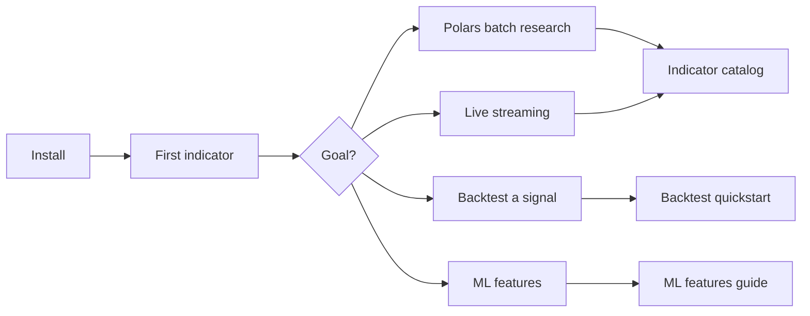

# Getting Started

Your first **10 minutes** with QuantWave — install, run one indicator, then pick where to go next.

!!! tip "Evaluating vs TA-Lib or pandas-ta?"
    Read [QuantWave vs alternatives](../comparison.md) first if you are comparing stacks.

## The funnel



## 1 — Install (2 min)

=== "Python (recommended)"

```bash
pip install "quantwave[polars]"
quantwave doctor
quantwave list --category "Classic"
```

→ [Python guide](python.md) — Polars `.ta`, streaming, TA-Lib migration, backtest hooks.

=== "Rust"

```toml
[dependencies]
quantwave-core = "0.1"
quantwave-polars = "0.1"
```

→ [Rust guide](rust.md) — `Next<T>` streaming and Polars `.ta()` in native crates.

## 2 — First indicator (3 min)

=== "Python"

```python
import polars as pl
import quantwave  # registers pl.col().ta

df = pl.DataFrame({
    "high":  [101, 102, 103, 102, 104],
    "low":   [99, 100, 101, 100, 102],
    "close": [100, 101, 102, 101, 103],
})

out = (
    df.lazy()
    .with_columns(
        pl.col("close").ta.rsi(timeperiod=14).alias("rsi"),
        pl.col("close").ta.supertrend("high", "low", period=10, multiplier=3.0).alias("st"),
    )
    .collect()
)
print(out.tail())
```

=== "Rust (streaming)"

```rust
use quantwave_core::indicators::supertrend::SuperTrend;
use quantwave_core::Next;

let mut st = SuperTrend::new(10, 3.0);
let v = st.next((100.0, 105.0, 95.0, 102.0));
```

## 3 — Pick your path

<div class="qw-grid" markdown="1">

<div class="qw-card" markdown="1">

### Polars batch research
Build feature columns on `LazyFrame`, then backtest.

[Batch & streaming guide](../examples/batch-streaming.md) → [Plugin vs `.ta`](../guides/plugin_vs_ta.md)

</div>

<div class="qw-card" markdown="1">

### Live / streaming
Same math as batch — `streaming_class` + `wrap_streaming`.

[Python streaming section](python.md#batch-vs-streaming) · `qw.assert_parity()`

</div>

<div class="qw-card" markdown="1">

### Backtest a strategy
`.bt` namespace — sweeps, walk-forward, tear sheets.

[Backtest quickstart](../guides/backtest/quickstart.md) → [Strategy notebook](../examples/notebooks/strategy_backtest.md)

</div>

<div class="qw-card" markdown="1">

### Explore indicators
217 native tools — search, gallery, or full catalog.

[Indicators overview](../guides/indicators/index.md) · [Gallery](../guides/indicators/gallery.md)

</div>

<div class="qw-card" markdown="1">

### Migrate from TA-Lib
Drop-in `quantwave.talib` shim, then move to `.ta`.

[TA-Lib migration](python.md#ta-lib-migration) · [Comparison](../comparison.md)

</div>

<div class="qw-card" markdown="1">

### ML feature pipelines
Hurst, frac-diff, `build_feature_matrix()`, regime gates.

[ML features guide](../guides/ml_features.md) → [E2E notebook](../examples/notebooks/ml_feature_backtest_parity.md)

</div>

</div>

## 4 — Conventions worth knowing early

| Topic | Where it lives |
|-------|----------------|
| Warmup / NaN rules | `qw.warmup_bars()`, `qw.boundary_info()` — [Python guide](python.md#warmup-and-nan-semantics) |
| Batch vs streaming parity | `qw.assert_parity()` — same `Next<T>` core |
| Indicator discovery | `qw.indicators()`, `qw.metadata("rsi")` |
| Performance claims | [Benchmarks](../benchmarks.md) |

## Next documentation

- [QuantWave vs TA-Lib & pandas-ta](../comparison.md)
- [Indicator learning paths](../guides/indicators/index.md)
- [Full catalog](../guides/indicators/native/)
- [Python API](../api/)