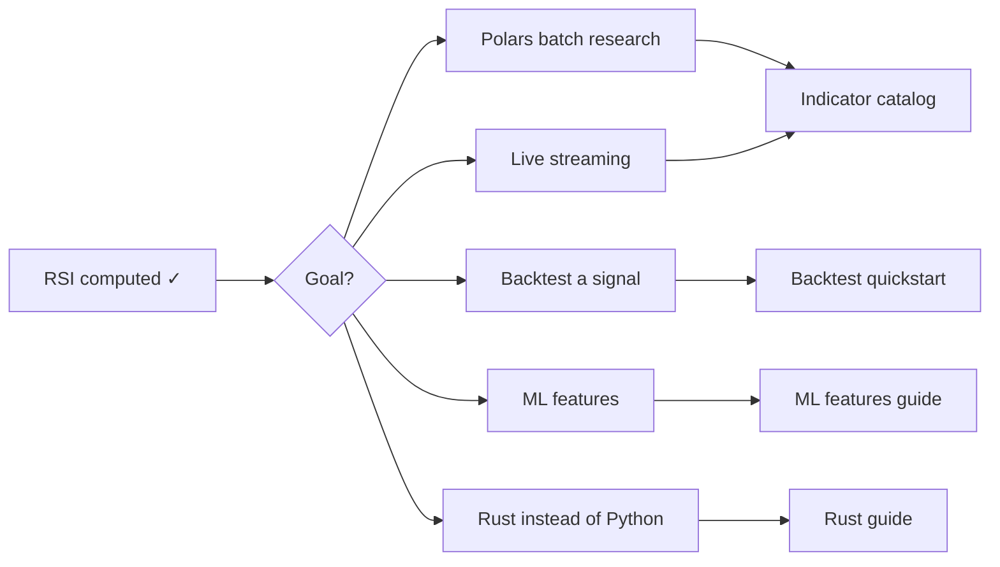

# Getting Started

!!! tip "Short answer"
    Install `pip install "quantwave[polars]"`, then copy-paste the 5 commands
    below — no external files needed, sample data is bundled. You'll have a
    real RSI column printed to your terminal in under 5 minutes.

!!! tip "Evaluating vs TA-Lib or pandas-ta?"
    Read [QuantWave vs alternatives](../comparison.md) first if you are comparing stacks.

## Zero to RSI in 5 commands

Every command below was run against a real `quantwave` install and the output
blocks are pasted verbatim — copy-paste the whole thing and you should see
the same numbers.

### 1. Install

```bash
pip install "quantwave[polars]"
```

### 2. Verify the install

```bash
quantwave doctor
```

```text
quantwave 0.7.0
  ✓ core extension (_quantwave)
  ✓ metadata registry
  ✓ streaming (RSI)
  ✓ polars installed
  ✓ backtest native (_backtest)
  ✓ Polars .bt namespace
  ✓ Polars expression plugins (pl.col().ta)

All checks passed.
```

If any line shows `✗` instead of `✓`, jump to [Troubleshooting](#troubleshooting)
before continuing — the rest of this walkthrough assumes a clean `doctor` run.

### 3. Load data — no external file needed

QuantWave ships a small, bundled, deterministic sample dataset
(`quantwave.datasets.load_sample()`) so this tutorial needs **zero** network
access and **zero** files of your own. It's synthetic (a NIFTY-like index
plus two stock-like instruments, ~10 years of daily bars) — not real
exchange data — but it exercises the exact same code path your own OHLCV
Parquet file would.

```python
import polars as pl
from quantwave import datasets

df = datasets.load_sample().filter(pl.col("symbol") == "NIFTY")
print(df.shape)
print(df.head())
```

```text
(2520, 7)
shape: (5, 7)
┌────────────────┬──────────────┬──────────────┬──────────────┬──────────────┬────────────┬────────┐
│ ts             ┆ open         ┆ high         ┆ low          ┆ close        ┆ volume     ┆ symbol │
│ ---            ┆ ---          ┆ ---          ┆ ---          ┆ ---          ┆ ---        ┆ ---    │
│ datetime[μs,   ┆ f64          ┆ f64          ┆ f64          ┆ f64          ┆ f64        ┆ str    │
│ Asia/Kolkata]  ┆              ┆              ┆              ┆              ┆            ┆        │
╞════════════════╪══════════════╪══════════════╪══════════════╪══════════════╪════════════╪════════╡
│ 2015-01-01     ┆ 20078.36675  ┆ 20226.917751 ┆ 19948.022175 ┆ 20096.573176 ┆ 787001.0   ┆ NIFTY  │
│ 09:15:00 IST   ┆              ┆              ┆              ┆              ┆            ┆        │
│ 2015-01-02     ┆ 19817.560137 ┆ 20011.255661 ┆ 19616.134524 ┆ 19809.830047 ┆ 2.509591e6 ┆ NIFTY  │
│ 09:15:00 IST   ┆              ┆              ┆              ┆              ┆            ┆        │
│ 2015-01-03     ┆ 19969.396569 ┆ 20040.00522  ┆ 19897.539828 ┆ 19968.148478 ┆ 639508.0   ┆ NIFTY  │
│ 09:15:00 IST   ┆              ┆              ┆              ┆              ┆            ┆        │
│ 2015-01-04     ┆ 20024.939546 ┆ 20206.715656 ┆ 19657.051393 ┆ 19838.827503 ┆ 1.594052e6 ┆ NIFTY  │
│ 09:15:00 IST   ┆              ┆              ┆              ┆              ┆            ┆        │
│ 2015-01-05     ┆ 19578.928615 ┆ 19737.498442 ┆ 19407.807979 ┆ 19566.377805 ┆ 1.59632e6  ┆ NIFTY  │
│ 09:15:00 IST   ┆              ┆              ┆              ┆              ┆            ┆        │
└────────────────┴──────────────┴──────────────┴──────────────┴──────────────┴────────────┴────────┘
```

Already have your own OHLCV data? `pl.read_parquet("ohlcv.parquet")` drops
in wherever `datasets.load_sample()` is used below, as long as it has
`open`/`high`/`low`/`close`/`volume` columns.

### 4. Compute RSI

```python
import quantwave  # registers pl.col().ta and LazyFrame.bt

df = df.lazy().with_columns(
    pl.col("close").ta.rsi(timeperiod=14).alias("rsi"),
).collect()

print(df.select("ts", "close", "rsi").head())
```

```text
shape: (5, 3)
┌────────────────────────────┬──────────────┬─────┐
│ ts                         ┆ close        ┆ rsi │
│ ---                        ┆ ---          ┆ --- │
│ datetime[μs, Asia/Kolkata] ┆ f64          ┆ f64 │
╞════════════════════════════╪══════════════╪═════╡
│ 2015-01-01 09:15:00 IST    ┆ 20096.573176 ┆ NaN │
│ 2015-01-02 09:15:00 IST    ┆ 19809.830047 ┆ NaN │
│ 2015-01-03 09:15:00 IST    ┆ 19968.148478 ┆ NaN │
│ 2015-01-04 09:15:00 IST    ┆ 19838.827503 ┆ NaN │
│ 2015-01-05 09:15:00 IST    ┆ 19566.377805 ┆ NaN │
└────────────────────────────┴──────────────┴─────┘
```

Don't panic about the `NaN` — that's expected. RSI needs 14 bars of warmup
before its first real value; see [Warmup and NaN semantics](python.md#warmup-and-nan-semantics)
for why `NaN` (not `null`) is the convention and why it matters for backtests.

### 5. See the real output

```python
print(df.select("ts", "close", "rsi").tail())
```

```text
shape: (5, 3)
┌────────────────────────────┬──────────────┬───────────┐
│ ts                         ┆ close        ┆ rsi       │
│ ---                        ┆ ---          ┆ ---       │
│ datetime[μs, Asia/Kolkata] ┆ f64          ┆ f64       │
╞════════════════════════════╪══════════════╪═══════════╡
│ 2021-11-20 09:15:00 IST    ┆ 37635.8664   ┆ 47.160391 │
│ 2021-11-21 09:15:00 IST    ┆ 37924.793503 ┆ 51.783841 │
│ 2021-11-22 09:15:00 IST    ┆ 37514.078853 ┆ 45.666771 │
│ 2021-11-23 09:15:00 IST    ┆ 37131.884029 ┆ 40.832963 │
│ 2021-11-24 09:15:00 IST    ┆ 37075.538921 ┆ 40.158096 │
└────────────────────────────┴──────────────┴───────────┘
```

That's it — a real, warmup-correct RSI column, computed on a Polars
`LazyFrame`, from a clean install, with no external files. Everything past
this point is about where to go **deeper**, not how to get started.

## Troubleshooting

Quick answers for the two failure modes people hit before they've even seen
output. Full list (import errors, platform/wheel matrix, `doctor` output
reference) lives in the [Python guide](python.md#troubleshooting).

- **`quantwave doctor` shows a `✗`** — see [Interpreting `doctor` output](python.md#interpreting-doctor-output).
- **`ImportError` / `ModuleNotFoundError: quantwave`** — see [Import failures](python.md#import-failures).
- **`AttributeError: 'LazyFrame' object has no attribute 'ta'` / `'bt'`** — you
  imported `polars` but never `import quantwave` (registration is a side
  effect of the import — see step 4 above).

## Now go deeper

You've already run your first indicator. From here, pick where you want to
go next:



<div class="qw-grid" markdown="1">

<div class="qw-card" markdown="1">

### Polars batch research
Build feature columns on `LazyFrame`, then backtest.

[Batch & streaming guide](../examples/batch-streaming.md) → [Plugin vs `.ta`](../guides/plugin_vs_ta.md)

</div>

<div class="qw-card" markdown="1">

### Live / streaming
Same math as batch — `streaming_class` + `wrap_streaming`.

[Python streaming section](python.md#batch-vs-streaming) · `qw.assert_parity()`

</div>

<div class="qw-card" markdown="1">

### Backtest a strategy
`.bt` namespace — sweeps, walk-forward, tear sheets.

[Backtest quickstart](../guides/backtest/quickstart.md) → [Strategy notebook](../examples/notebooks/strategy_backtest.md)

</div>

<div class="qw-card" markdown="1">

### Explore indicators
221 native tools — search, gallery, or full catalog.

[Indicators overview](../guides/indicators/index.md) · [Gallery](../guides/indicators/gallery.md)

</div>

<div class="qw-card" markdown="1">

### Migrate from TA-Lib
Drop-in `quantwave.talib` shim, then move to `.ta`.

[TA-Lib migration](python.md#ta-lib-migration) · [Comparison](../comparison.md)

</div>

<div class="qw-card" markdown="1">

### ML feature pipelines
Hurst, frac-diff, `build_feature_matrix()`, regime gates.

[ML features guide](../guides/ml_features.md) → [E2E notebook](../examples/notebooks/ml_feature_backtest_parity.md)

</div>

<div class="qw-card" markdown="1">

### Rust instead of Python
`Next<T>` streaming and Polars `.ta()` in native crates.

```toml
[dependencies]
quantwave-core = "0.1"
quantwave-polars = "0.1"
```

[Rust guide](rust.md)

</div>

</div>

## Conventions worth knowing early

| Topic | Where it lives |
|-------|----------------|
| Warmup / NaN rules | `qw.warmup_bars()`, `qw.boundary_info()` — [Python guide](python.md#warmup-and-nan-semantics) |
| Batch vs streaming parity | `qw.assert_parity()` — same `Next<T>` core |
| Indicator discovery | `qw.indicators()`, `qw.metadata("rsi")` |
| Performance claims | [Benchmarks](../benchmarks.md) |

## Next documentation

- [QuantWave vs TA-Lib & pandas-ta](../comparison.md)
- [Indicator learning paths](../guides/indicators/index.md)
- [Full catalog](../guides/indicators/native/)
- [Python API](../api/)
