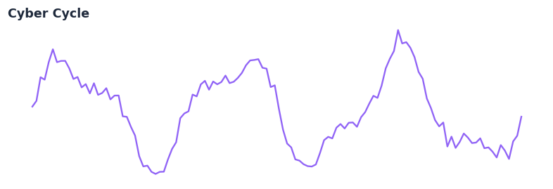
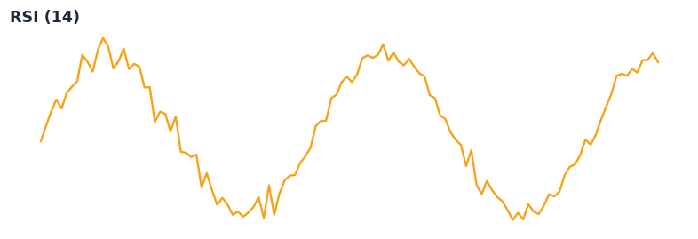

# Indicator Gallery

Explore the wide range of technical indicators available in QuantWave. Every indicator is optimized for both Polars batch processing and real-time streaming.

> **Prototype Preview Generator (quantwave-7x1 spike)** — This section shows the first automated static previews generated during development. These are synthetic for the spike but demonstrate the visual direction (small, clean, consistent thumbnails that will later be produced from real QuantWave calculations during `mkdocs build`).

  

    { width="220" }
    
SuperTrend

  

  

    { width="220" }
    
Cyber Cycle (Ehlers)

  

  

    { width="220" }
    
RSI (14)

  

## Interactive Gallery

[Placeholder for interactive gallery component]

> **Future-proof**: We plan to auto-generate preview charts via `docs/gen_python_api.py` or a Rust script so this gallery always stays in sync with the 150+ indicators.

## Categories

### Native Indicators
Classic indicators like SMA, EMA, RSI, and MACD, re-implemented in high-performance Rust.

### Ehlers DSP Suite
Advanced digital signal processing indicators by John Ehlers, including CyberCycle, Laguerre RSI, and more.

### Trend & Volatility
Indicators designed to identify market trends and measure volatility, such as SuperTrend and ATR.

---

*Explore individual guides for detailed formulas and usage.*
