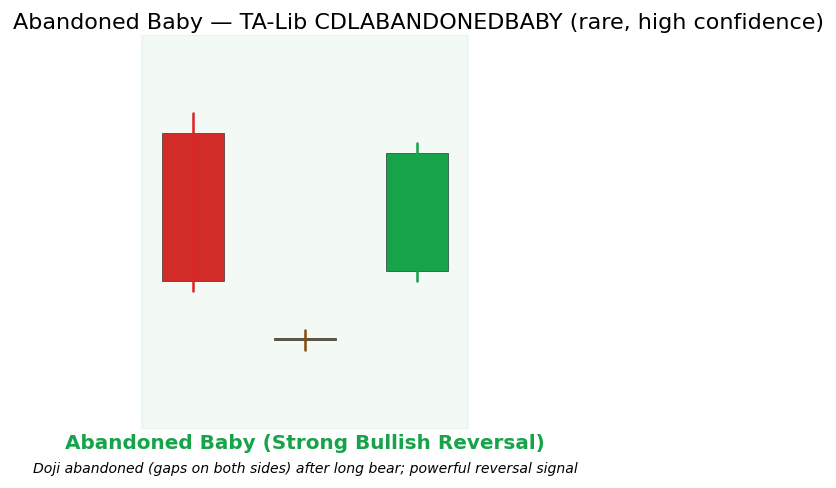

# Abandoned Baby

Patterns candlestick reversal rare

A rare and high-confidence three-candle reversal pattern. A long candle is followed by a Doji that gaps away from it ("abandoned"), which is itself gapped away from a strong reversal candle in the opposite direction. The isolated Doji visually demonstrates a complete vacuum of conviction.

## Visual Example

*Synthetic ideal satisfying TA-Lib CDLABANDONEDBABY gap + Doji isolation rules. Generated 2026-05-31 IST via `docs/gen_candle_previews.py`.*

## Description

The Abandoned Baby is the candlestick equivalent of a "blow-off" or capitulation followed by immediate rejection. Because two gaps are required, it is statistically rare but carries significant weight when it appears.

Practitioners treat confirmed Abandoned Baby events as high-conviction regime-shift signals suitable for larger position sizing or as premium labels in ML datasets. It pairs exceptionally well with Market Structure BOS flips.

## Formula / Specification

**Recognition Rules (exact implementation in QuantWave / TA-Lib CDLABANDONEDBABY)**:

1. Candle 1: long body in the direction of the prior trend.
2. Candle 2: Doji that gaps away from Candle 1 (no overlap in ranges).
3. Candle 3: strong opposite-color body that gaps away from the Doji.
4. The Doji is "abandoned" on both sides.
5. Pattern completes on bar 3; TA-Lib sign convention.

## Parameters

| Parameter | Default | Description |
|-----------|---------|-------------|
| (none) | — | Pattern recognition only; no tunable parameters. |

## Usage Examples

Streaming (Rust/Python) and Polars examples follow the three-bar multi-input pattern (use `CDLABANDONEDBABY` / `.ta.cdl_abandonedbaby(...)`). Full parity across surfaces.

## Edge Cases & Limitations

- Warm-up: first 14 bars may return NaN or partial state per implementation.
- Parameter sensitivity: smaller periods increase noise; larger periods increase lag.
- Sudden gaps or bad ticks can distort rolling windows — consider pre-filtering.
- Single-series indicators ignore volume unless otherwise documented.
- Validated via proptests against gold-standard vectors where available.
- No look-ahead bias; streaming and Polars batch paths are bit-identical.

## Boundary Behavior

| Condition | Behavior |
|-----------|----------|
| Warm-up | Pattern functions emit 0 (no pattern) until enough bars exist. |
| period > len | Short series returns all zeros (no pattern detected). |
| NaN inputs | Bars with NaN OHLC are treated as no pattern (0). |
| Invalid params | N/A for most candlestick patterns. |
| Empty data | Empty input returns an empty integer series. |

## Related Indicators & See Also

- [Morning Star](morning_star.md), [Evening Star](evening_star.md), [Doji Star](doji_star.md)
- [Market Structure](market_structure.md) — the ideal confluence partner for this rare event
- Gallery, native index, PA notebook

## Sources & References

**Primary Source**: TA-Lib CDLABANDONEDBABY via `quantwave-core/src/indicators/pattern.rs`.

**Visual**: `docs/gen_candle_previews.py`, 2026-05-31 IST.

**Context**: Nison (1991) for "abandoned" psychology (no duplication). MQL5 PA series.

**Provenance**: Next<T> + Polars parity.
