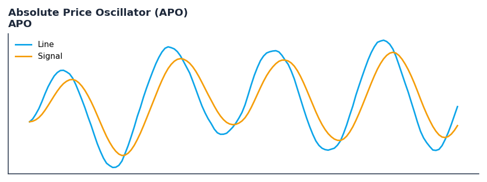

# Absolute Price Oscillator (APO)

<div class="indicator-meta"><span class="category-badge">Classic</span> <span class="kw-badge">trend</span> <span class="kw-badge">momentum</span> <span class="kw-badge">moving-average</span> <span class="kw-badge">classic</span></div>

Shows the absolute difference between two moving averages of different periods.

## Visual Example



*Synthetic ideal per library logic. Generated 2026-06-25 IST via `docs/generate_all_previews.py` (reproducible; maps to core `Next<T>` implementation).*

## Description

The Absolute Price Oscillator (APO) indicator is a technical analysis tool that shows the absolute difference between two moving averages of different periods.

This indicator is primarily used for identifying key market conditions. It provides a robust signal that can be easily integrated into both simple strategies and more complex machine learning feature pipelines. Compared to its alternatives, it offers a distinct balance of responsiveness and stability.

Traders often combine this with other metrics to confirm signals and avoid false positives during sideways market regimes. It remains a standard tool for systematic trading models.

Use to identify trend crossovers and momentum. It is essentially a MACD without the signal line, showing the raw distance between fast and slow averages.

The Absolute Price Oscillator (APO) is based on the difference between two exponential moving averages. It is a trend-following indicator that signals a change in direction when the fast EMA crosses the slow EMA, providing a clear visual of trend development. — TA-Lib Documentation

QuantWave implements this indicator via the universal `Next<T>` trait, guaranteeing bit-identical results between Rust streaming, Python streaming, and Polars batch (`.ta()` / `map_batches`) surfaces.


## Formula / Specification

**Implementation** (`quantwave-core/src/indicators/momentum.rs`):

\[
APO = EMA(fast) - EMA(slow)
\]

Gold-standard parity vectors: `quantwave-core/tests/gold_standard/apo.json`.


## Parameters

| Parameter | Default | Description |
|-----------|---------|-------------|
| `fastperiod` | 12 | Fast period |
| `slowperiod` | 26 | Slow period |


## Usage Examples

**Streaming (Rust)**

```rust
use quantwave_core::indicators::APO;
use quantwave_core::traits::Next;

let mut ind = APO::new(12);
for price in &prices {
    let value = ind.next(price);
}
```

**Streaming (Python)**

```python
from quantwave import APO

ind = APO(12)
for price in prices:
    value = ind.next(price)
```

**Polars Batch (Python)**

```python
import polars as pl
import quantwave as qw

def apply_absolute_price_oscillator_apo(series: pl.Series) -> pl.Series:
    ind = qw.APO(12)
    return pl.Series([ind.next(float(v)) for v in series.to_list()])

df = (
    pl.read_csv('ohlcv.csv')
    .lazy()
    .with_columns(
        pl.col("close").map_batches(apply_absolute_price_oscillator_apo, return_dtype=pl.Float64).alias("absolute_price_oscillator_apo")
    )
    .collect()
)
```

All surfaces are bit-identical via the single `Next<T>` implementation and proptests.

## Edge Cases & Limitations

- Warm-up: first `12` bars may return NaN or partial state per implementation.
- Parameter sensitivity: smaller periods increase noise; larger periods increase lag.
- Sudden gaps or bad ticks can distort rolling windows — consider pre-filtering.
- Single-series indicators ignore volume unless otherwise documented.
- Validated via proptests against gold-standard vectors where available.
- No look-ahead bias; streaming and Polars batch paths are bit-identical.

## Boundary Behavior

| Condition | Behavior |
|-----------|----------|
| Warm-up | Leading bars return NaN until warmup_bars is satisfied. |
| period > len | When period exceeds series length, output is all NaN. |
| NaN inputs | NaN in input propagates to output (NaN out). |
| Invalid params | Non-positive period or missing required params raise ValueError. |
| Empty data | Empty input returns an empty result series. |

## Related Indicators & See Also

- [Indicator Gallery](../gallery.md)
- [Native Indicators index](index.md)
- [Batch vs Streaming guide](../../../examples/batch-streaming.md)
- [RSI](relative_strength_index_rsi.md)
- [SuperTrend](supertrend/)

## Sources & References

**Primary Source**: https://www.tradingview.com/support/solutions/43000501826-absolute-price-oscillator-apo/

**Implementation**: `quantwave-core/src/indicators/momentum.rs` (`APO` / `APO_METADATA`).
**Parity**: `quantwave-core/tests/gold_standard/apo.json`

**Provenance**: Standards bulk upgrade 2026-06-25 IST — see `docs/DOCUMENTATION_STANDARDS.md`.
