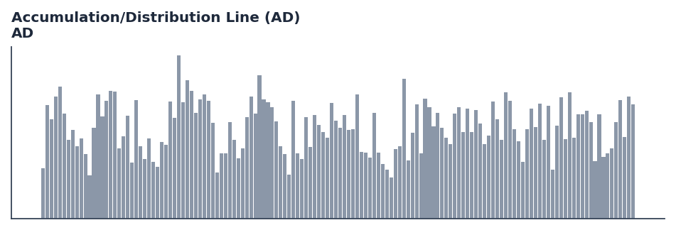

# Accumulation/Distribution Line (AD)

<div class="indicator-meta"><span class="category-badge">Classic</span> <span class="kw-badge">volume</span> <span class="kw-badge">momentum</span> <span class="kw-badge">classic</span> <span class="kw-badge">accumulation</span> <span class="kw-badge">distribution</span></div>

A volume-based indicator designed to measure the cumulative flow of money into and out of a security.

## Visual Example



*Synthetic ideal per library logic. Generated 2026-06-25 IST via `docs/generate_all_previews.py` (reproducible; maps to core `Next<T>` implementation).*

## Description

The Accumulation/Distribution Line (AD) indicator is a technical analysis tool that a volume-based indicator designed to measure the cumulative flow of money into and out of a security.

This indicator is primarily used for identifying key market conditions. It provides a robust signal that can be easily integrated into both simple strategies and more complex machine learning feature pipelines. Compared to its alternatives, it offers a distinct balance of responsiveness and stability.

Traders often combine this with other metrics to confirm signals and avoid false positives during sideways market regimes. It remains a standard tool for systematic trading models.

Use to confirm price trends or identify potential reversals through divergences. Rising AD confirms an uptrend; falling AD confirms a downtrend.

Developed by Marc Chaikin, the AD line uses the relationship between price and volume to determine whether a security is being accumulated or distributed. It is calculated by multiplying the Money Flow Multiplier by the period's volume and adding it to a cumulative total. — StockCharts ChartSchool

QuantWave implements this indicator via the universal `Next<T>` trait, guaranteeing bit-identical results between Rust streaming, Python streaming, and Polars batch (`.ta()` / `map_batches`) surfaces.


## Formula / Specification

**Implementation** (`quantwave-core/src/indicators/volume.rs`):

\[
\text{MFM} = \frac{(Close - Low) - (High - Close)}{High - Low} \\ \text{MFV} = \text{MFM} \times Volume \\ AD_t = AD_{t-1} + \text{MFV}
\]

Gold-standard parity vectors: `quantwave-core/tests/gold_standard/ad.json`.


## Parameters

| Parameter | Default | Description |
|-----------|---------|-------------|
| (none) | — | No tunable parameters for this detector. |

## Usage Examples

**Streaming (Rust)**

```rust
use quantwave_core::indicators::AD;
use quantwave_core::traits::Next;

let mut ind = AD::new(14);
for price in &prices {
    let value = ind.next(price);
}
```

**Streaming (Python)**

```python
from quantwave import AD

ind = AD(14)
for price in prices:
    value = ind.next(price)
```

**Polars Batch (Python)**

```python
import polars as pl

df = (
    pl.read_csv('ohlcv.csv')
    .lazy()
    .with_columns(
        pl.col("open").ta.ad("open", "high", "low", "close").alias("accumulation_distribution_line_ad")
    )
    .collect()
)
```

All surfaces are bit-identical via the single `Next<T>` implementation and proptests.

## Edge Cases & Limitations

- Warm-up: first `N` bars may return NaN or partial state per implementation.
- Parameter sensitivity: smaller periods increase noise; larger periods increase lag.
- Sudden gaps or bad ticks can distort rolling windows — consider pre-filtering.
- Single-series indicators ignore volume unless otherwise documented.
- Validated via proptests against gold-standard vectors where available.
- No look-ahead bias; streaming and Polars batch paths are bit-identical.

## Boundary Behavior

| Condition | Behavior |
|-----------|----------|
| Warm-up | Output starts from bar 1; warmup_bars marks period-stability, not NaN. |
| period > len | Cumulative sum continues; period only affects smoothed variants. |
| NaN inputs | NaN inputs may produce NaN or skip depending on indicator. |
| Invalid params | Invalid params raise ValueError. |
| Empty data | Empty input returns an empty result series. |

## Related Indicators & See Also

- [Indicator Gallery](../gallery.md)
- [Native Indicators index](index.md)
- [Batch vs Streaming guide](../../../examples/batch-streaming.md)
- [RSI](relative_strength_index_rsi.md)
- [SuperTrend](supertrend.md)

## Sources & References

**Primary Source**: https://www.investopedia.com/terms/a/accumulationdistributioncurve.asp

**Implementation**: `quantwave-core/src/indicators/volume.rs` (`AD` / `AD_METADATA`).
**Parity**: `quantwave-core/tests/gold_standard/ad.json`

**Provenance**: Standards bulk upgrade 2026-06-25 IST — see `docs/DOCUMENTATION_STANDARDS.md`.
