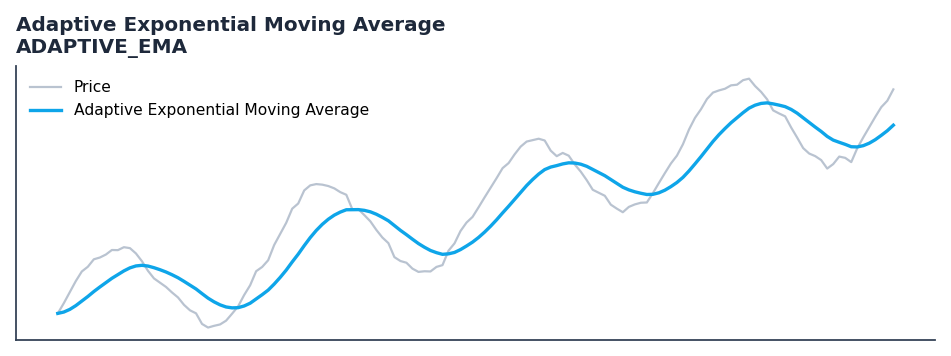

# Adaptive Exponential Moving Average

<div class="indicator-meta"><span class="category-badge">Moving Averages</span> <span class="kw-badge">moving-average</span> <span class="kw-badge">adaptive</span> <span class="kw-badge">volatility</span> <span class="kw-badge">trend</span></div>

An adaptive moving average that adjusts its smoothing factor based on volatility.

## Visual Example



*Synthetic ideal per library logic. Generated 2026-06-25 IST via `docs/generate_all_previews.py` (reproducible; maps to core `Next<T>` implementation).*

## Description

The Adaptive Exponential Moving Average indicator is a technical analysis tool that an adaptive moving average that adjusts its smoothing factor based on volatility.

This indicator is primarily used for identifying key market conditions. It provides a robust signal that can be easily integrated into both simple strategies and more complex machine learning feature pipelines. Compared to its alternatives, it offers a distinct balance of responsiveness and stability.

Traders often combine this with other metrics to confirm signals and avoid false positives during sideways market regimes. It remains a standard tool for systematic trading models.

Use to identify overall trends. AEMA reacts faster to large price movements by adapting the smoothing factor using the highest high and lowest low of a lookback period.

Introduced by Vitali Apirine in TASC April 2019, AEMA alters the EMA's alpha (smoothing factor) by comparing the distance of the close from the lowest low and highest high. This amplifies the smoothing factor during strong price moves while reducing it during sideways chop, yielding a moving average with less lag when it matters most.

QuantWave implements this indicator via the universal `Next<T>` trait, guaranteeing bit-identical results between Rust streaming, Python streaming, and Polars batch (`.ta()` / `map_batches`) surfaces.


## Formula / Specification

**Implementation** (`quantwave-core/src/indicators/adaptive_ema.rs`):

\[
Rate = \frac{2}{P+1} \times \left(1 + \frac{|(C - L_{min}) - (H_{max} - C)|}{H_{max} - L_{min}}\right) \\ AEMA_t = AEMA_{t-1} + Rate \times (C - AEMA_{t-1})
\]


## Parameters

| Parameter | Default | Description |
|-----------|---------|-------------|
| `period` | 10 | Smoothing period |
| `pds` | 10 | Lookback period for volatility |


## Usage Examples

**Streaming (Rust)**

```rust
use quantwave_core::indicators::ADAPTIVE_EMA;
use quantwave_core::traits::Next;

let mut ind = ADAPTIVE_EMA::new(10);
for price in &prices {
    let value = ind.next(price);
}
```

**Streaming (Python)**

```python
from quantwave import ADAPTIVE_EMA

ind = ADAPTIVE_EMA(10)
for price in prices:
    value = ind.next(price)
```

**Polars Batch (Python)**

```python
import polars as pl
import quantwave as qw

def apply_adaptive_exponential_moving_average(series: pl.Series) -> pl.Series:
    ind = qw.ADAPTIVE_EMA(10)
    return pl.Series([ind.next(float(v)) for v in series.to_list()])

df = (
    pl.read_csv('ohlcv.csv')
    .lazy()
    .with_columns(
        pl.col("close").map_batches(apply_adaptive_exponential_moving_average, return_dtype=pl.Float64).alias("adaptive_exponential_moving_average")
    )
    .collect()
)
```

All surfaces are bit-identical via the single `Next<T>` implementation and proptests.

## Edge Cases & Limitations

- Warm-up: first `10` bars may return NaN or partial state per implementation.
- Parameter sensitivity: smaller periods increase noise; larger periods increase lag.
- Sudden gaps or bad ticks can distort rolling windows — consider pre-filtering.
- Single-series indicators ignore volume unless otherwise documented.
- Validated via proptests against gold-standard vectors where available.
- No look-ahead bias; streaming and Polars batch paths are bit-identical.

## Boundary Behavior

| Condition | Behavior |
|-----------|----------|
| Warm-up | Leading bars return NaN until warmup_bars is satisfied. |
| period > len | When period exceeds series length, output is all NaN. |
| NaN inputs | NaN in input propagates to output (NaN out). |
| Invalid params | Non-positive period or missing required params raise ValueError. |
| Empty data | Empty input returns an empty result series. |

## Related Indicators & See Also

- [Indicator Gallery](../gallery.md)
- [Native Indicators index](index.md)
- [Batch vs Streaming guide](../../../examples/batch-streaming.md)
- [RSI](relative_strength_index_rsi.md)
- [SuperTrend](supertrend/)

## Sources & References

**Primary Source**: Technical Analysis of Stocks & Commodities, April 2019

**Implementation**: `quantwave-core/src/indicators/adaptive_ema.rs` (`ADAPTIVE_EMA` / `ADAPTIVE_EMA_METADATA`).

**Provenance**: Standards bulk upgrade 2026-06-25 IST — see `docs/DOCUMENTATION_STANDARDS.md`.
