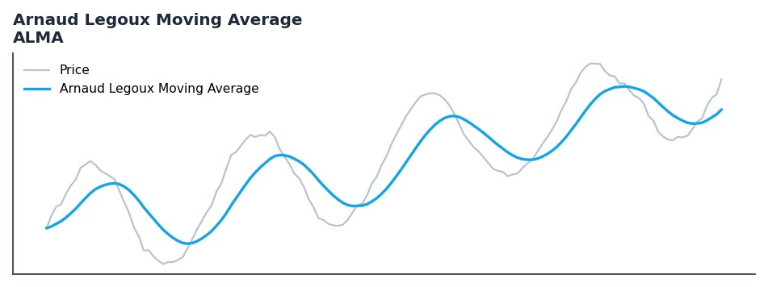

# Arnaud Legoux Moving Average

<div class="indicator-meta"><span class="category-badge">Classic</span> <span class="kw-badge">moving-average</span> <span class="kw-badge">smoothing</span> <span class="kw-badge">low-latency</span> <span class="kw-badge">adaptive</span></div>

ALMA is designed to reduce lag while providing high smoothness.

## Visual Example



*Synthetic ideal per library logic. Generated 2026-07-01 IST via `docs/generate_all_previews.py` (reproducible; maps to core `Next<T>` implementation).*

## Description

ALMA is designed to reduce lag while providing high smoothness.

Use as a low-latency moving average that reduces lag compared to EMA while controlling overshoot through the Gaussian offset parameter. Well-suited for momentum systems.

Native Rust implementation with gold-standard or TA-Lib parity tests where applicable.

The Arnaud Legoux Moving Average applies a Gaussian-shaped weight distribution offset toward the recent end of the lookback window. The sigma parameter controls weight spread and the offset parameter controls how far the Gaussian peak is positioned from the current bar, enabling a lag-accuracy trade-off unavailable in standard MAs.

**Typical applications:**

- Trend filter or signal line for systematic entries
- Default lookback `9` — tune per asset volatility
- Cross with faster oscillator for entry timing
- Streaming and Polars paths are bit-identical for production parity

QuantWave implements this via the universal `Next<T>` trait — bit-identical across Rust streaming, Python streaming, and Polars `.ta()` batch plugins.

## Formula / Specification

**Implementation** (`quantwave-core/src/indicators/alma.rs`):

\[
ALMA = \sum (W_i \times P_i) / \sum W_i
\]

Gold-standard parity vectors: `quantwave-core/tests/gold_standard/alma.json`.


## Parameters

| Parameter | Default | Description |
|-----------|---------|-------------|
| `period` | 9 | Period |
| `offset` | 0.85 | Offset |
| `sigma` | 6.0 | Sigma |


## Usage Examples

**Streaming (Rust)**

```rust
use quantwave_core::indicators::ALMA;
use quantwave_core::traits::Next;

let mut ind = ALMA::new(9);
for price in &prices {
    let value = ind.next(price);
}
```

**Streaming (Python)**

```python
from quantwave import ALMA

ind = ALMA(9)
for price in prices:
    value = ind.next(price)
```

**Polars Batch (Python)**

```python
import polars as pl
import quantwave as qw

def apply_arnaud_legoux_moving_average(series: pl.Series) -> pl.Series:
    ind = qw.ALMA(9)
    return pl.Series([ind.next(float(v)) for v in series.to_list()])

df = (
    pl.read_csv('ohlcv.csv')
    .lazy()
    .with_columns(
        pl.col("close").map_batches(apply_arnaud_legoux_moving_average, return_dtype=pl.Float64).alias("arnaud_legoux_moving_average")
    )
    .collect()
)
```

All surfaces are bit-identical via the single `Next<T>` implementation and proptests.

## Edge Cases & Limitations

- Warm-up: first `9` bars may return NaN or partial state per implementation.
- Parameter sensitivity: smaller periods increase noise; larger periods increase lag.
- Sudden gaps or bad ticks can distort rolling windows — consider pre-filtering.
- Single-series indicators ignore volume unless otherwise documented.
- Validated via proptests against gold-standard vectors where available.
- No look-ahead bias; streaming and Polars batch paths are bit-identical.

## Boundary Behavior

| Condition | Behavior |
|-----------|----------|
| Warm-up | Leading bars return NaN until warmup_bars is satisfied. |
| period > len | When period exceeds series length, output is all NaN. |
| NaN inputs | NaN in input propagates to output (NaN out). |
| Invalid params | Non-positive period or missing required params raise ValueError. |
| Empty data | Empty input returns an empty result series. |

## Related Indicators & See Also

- [Indicator Gallery](../gallery.md)
- [Native Indicators index](index.md)
- [Batch vs Streaming guide](../../../examples/batch-streaming.md)
- [RSI](relative_strength_index_rsi.md)
- [SuperTrend](../supertrend/)

## Sources & References

**Primary Source**: https://www.prorealcode.com/prorealtime-indicators/arnaud-legoux-moving-average-alma/

**Implementation**: `quantwave-core/src/indicators/alma.rs` (`ALMA` / `ALMA_METADATA`).
**Parity**: `quantwave-core/tests/gold_standard/alma.json`

**Provenance**: Standards bulk upgrade 2026-07-01 IST — see `docs/DOCUMENTATION_STANDARDS.md`.
