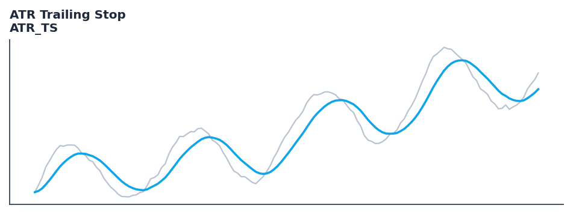

# ATR Trailing Stop

<div class="indicator-meta"><span class="category-badge">Classic</span> <span class="kw-badge">volatility</span> <span class="kw-badge">trend</span> <span class="kw-badge">stop-loss</span> <span class="kw-badge">atr</span> <span class="kw-badge">classic</span></div>

!!! warning "Uses the EMA-smoothed `Atr`, not Wilder's ATR"

    This trailing stop is built on QuantWave's `Atr`, which smooths true range with an EMA
    (`alpha = 2/(period+1)`) rather than Wilder's RMA (`alpha = 1/period`, SMA-seeded)
    used by TA-Lib and TradingView Pine's `ta.atr`. Stop distances differ from a TradingView-equivalent ATR trailing stop. Review this before wiring it into live risk sizing.

    No source has been recorded for the EMA smoothing — the `formula_source` recorded
    for this indicator describes the Wilder-based construction. See [Average True Range](average_true_range.md) for the full
    surface-by-surface breakdown, and `quantwave.conventions("atr_ts")` to read the
    divergence programmatically.

A trailing stop based on Average True Range to keep trades in a trend.

## Visual Example



*Synthetic ideal per library logic. Generated 2026-07-01 IST via `docs/generate_all_previews.py` (reproducible; maps to core `Next<T>` implementation).*

## Description

A trailing stop based on Average True Range to keep trades in a trend.

Use as a dynamic trailing stop that widens in volatile markets and tightens in calm ones, automatically adjusting stop distance to current market conditions.

Native Rust implementation with gold-standard or TA-Lib parity tests where applicable.

ATR Trailing Stop uses Average True Range to set a stop distance that scales with market volatility. During high-volatility regimes the stop moves further from price to avoid premature exit; during low-volatility regimes it tightens to lock in more profit. It is one of the most robust mechanical stop methods in systematic trading.

**Typical applications:**

- Size stops and position risk from band width or ATR expansion
- Detect squeeze conditions (narrow bands) before breakout systems
- Warm-up: first `10` bars build rolling volatility state
- Combine with trend direction (SuperTrend, MACD) for breakout bias

QuantWave implements this via the universal `Next<T>` trait — bit-identical across Rust streaming, Python streaming, and Polars `.ta()` batch plugins.

## Formula / Specification

**Implementation** (`quantwave-core/src/indicators/atr_ts.rs`):

\[
Stop = P_{high} - (Multiplier \times ATR)
\]

Gold-standard parity vectors: `quantwave-core/tests/gold_standard/atr_ts.json`.


## Parameters

| Parameter | Default | Description |
|-----------|---------|-------------|
| `period` | 10 | ATR period |
| `multiplier` | 3.0 | ATR Multiplier |


## Usage Examples

**Streaming (Rust)**

```rust
use quantwave_core::indicators::ATR_TS;
use quantwave_core::traits::Next;

let mut ind = ATR_TS::new(10);
for price in &prices {
    let value = ind.next(price);
}
```

**Streaming (Python)**

```python
from quantwave import ATR_TS

ind = ATR_TS(10)
for price in prices:
    value = ind.next(price)
```

**Polars Batch (Python)**

```python
import polars as pl
import quantwave as qw

def apply_atr_trailing_stop(series: pl.Series) -> pl.Series:
    ind = qw.ATR_TS(10)
    return pl.Series([ind.next(float(v)) for v in series.to_list()])

df = (
    pl.read_csv('ohlcv.csv')
    .lazy()
    .with_columns(
        pl.col("close").map_batches(apply_atr_trailing_stop, return_dtype=pl.Float64).alias("atr_trailing_stop")
    )
    .collect()
)
```

All surfaces are bit-identical via the single `Next<T>` implementation and proptests.

## Edge Cases & Limitations

- Warm-up: first `10` bars may return NaN or partial state per implementation.
- Parameter sensitivity: smaller periods increase noise; larger periods increase lag.
- Sudden gaps or bad ticks can distort rolling windows — consider pre-filtering.
- Single-series indicators ignore volume unless otherwise documented.
- Validated via proptests against gold-standard vectors where available.
- No look-ahead bias; streaming and Polars batch paths are bit-identical.

## Boundary Behavior

| Condition | Behavior |
|-----------|----------|
| Warm-up | Leading bars return NaN until warmup_bars is satisfied. |
| period > len | When period exceeds series length, output is all NaN. |
| NaN inputs | NaN in input propagates to output (NaN out). |
| Invalid params | Non-positive period or missing required params raise ValueError. |
| Empty data | Empty input returns an empty result series. |

## Related Indicators & See Also

- [Indicator Gallery](../gallery.md)
- [Native Indicators index](index.md)
- [Batch vs Streaming guide](../../../examples/batch-streaming.md)
- [RSI](relative_strength_index_rsi.md)
- [SuperTrend](../supertrend/)

## Sources & References

**Primary Source**: https://www.tradingview.com/support/solutions/43000589105-average-true-range-atr/

**Implementation**: `quantwave-core/src/indicators/atr_ts.rs` (`ATR_TS` / `ATR_TS_METADATA`).
**Parity**: `quantwave-core/tests/gold_standard/atr_ts.json`

**Provenance**: Standards bulk upgrade 2026-07-01 IST — see `docs/DOCUMENTATION_STANDARDS.md`.
