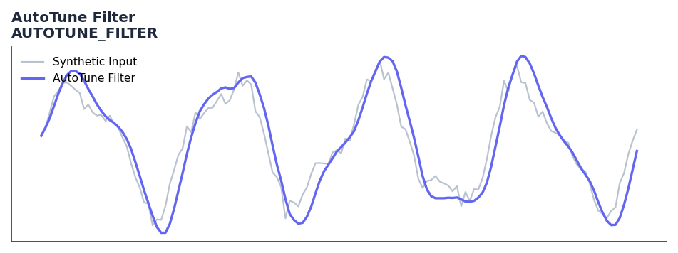

# AutoTune Filter

<div class="indicator-meta"><span class="category-badge">Ehlers DSP</span> <span class="kw-badge">adaptive</span> <span class="kw-badge">filter</span> <span class="kw-badge">cycle</span> <span class="kw-badge">ehlers</span> <span class="kw-badge">dsp</span> <span class="kw-badge">autotune</span></div>

An adaptive BandPass filter that dynamically tunes itself to the market's dominant cycle.

## Visual Example



*Synthetic ideal per library logic. Generated 2026-07-01 IST via `docs/generate_all_previews.py` (reproducible; maps to core `Next<T>` implementation).*

## Description

An adaptive BandPass filter that dynamically tunes itself to the market's dominant cycle.

Use to isolate the cyclical component of price while automatically adapting to changes in cycle length. Zero crossings of the output or its rate of change can be used as trading signals.

Part of QuantWave's Ehlers digital signal processing suite. Designed for low-lag cycle and trend work — pair with Roofing Filter or SuperSmoother on noisy inputs.

The AutoTune filter provides a bridge between the time domain and frequency domain by using a rolling autocorrelation function to measure the Dominant Cycle in real time. By dynamically tuning a Bandpass filter to twice the lag at which autocorrelation is minimized, it maintains consistent performance and avoids the destructive phase shifts typical of fixed-tuned filters.

**Typical applications:**

- Use for cycle timing in mean-reverting regimes
- Gate with Hurst exponent or ADX before taking cycle signals
- Allow `20`+ bars warm-up for filter state to stabilise
- Chain with Roofing Filter when input is noisy

QuantWave implements this via the universal `Next<T>` trait — bit-identical across Rust streaming, Python streaming, and Polars `.ta()` batch plugins.

## Formula / Specification

**Implementation** (`quantwave-core/src/indicators/autotune.rs`):

\[
R(lag) = \frac{n \sum X_i Y_i - \sum X_i \sum Y_i}{\sqrt{(n \sum X_i^2 - (\sum X_i)^2)(n \sum Y_i^2 - (\sum Y_i)^2)}}
\]
\[
DC = 2 \times \text{argmin}_{lag} R(lag)
\]
\[
BP = \text{BandPass}(Price, DC, BW)
\]

Gold-standard parity vectors: `quantwave-core/tests/gold_standard/autotune_filter.json`.


## Parameters

| Parameter | Default | Description |
|-----------|---------|-------------|
| `window` | 20 | Window length for autocorrelation and HighPass filter |
| `bandwidth` | 0.25 | Bandwidth of the tuned BandPass filter |


## Usage Examples

**Streaming (Rust)**

```rust
use quantwave_core::indicators::AUTOTUNE_FILTER;
use quantwave_core::traits::Next;

let mut ind = AUTOTUNE_FILTER::new(20);
for price in &prices {
    let value = ind.next(price);
}
```

**Streaming (Python)**

```python
from quantwave import AUTOTUNE_FILTER

ind = AUTOTUNE_FILTER(20)
for price in prices:
    value = ind.next(price)
```

**Polars Batch (Python)**

```python
import polars as pl
import quantwave as qw

def apply_autotune_filter(series: pl.Series) -> pl.Series:
    ind = qw.AUTOTUNE_FILTER(20)
    return pl.Series([ind.next(float(v)) for v in series.to_list()])

df = (
    pl.read_csv('ohlcv.csv')
    .lazy()
    .with_columns(
        pl.col("close").map_batches(apply_autotune_filter, return_dtype=pl.Float64).alias("autotune_filter")
    )
    .collect()
)
```

All surfaces are bit-identical via the single `Next<T>` implementation and proptests.

## Edge Cases & Limitations

- Recursive DSP filters require a warm-up period; first N bars may be unstable or raw-pass-through.
- Designed for cyclic/mean-reverting regimes; trending markets can produce lag or drift.
- Parameter `period` (or equivalent) controls cutoff — too small adds noise, too large adds lag.
- Prefer chaining with other Ehlers tools (Roofing Filter, SuperSmoother) on noisy inputs.
- Validated via proptests against gold-standard vectors where available.
- No look-ahead bias; suitable for live streaming and batch feature pipelines.

## Boundary Behavior

| Condition | Behavior |
|-----------|----------|
| Warm-up | Leading bars return NaN until warmup_bars is satisfied. |
| period > len | When period exceeds series length, output is all NaN. |
| NaN inputs | NaN in input propagates to output (NaN out). |
| Invalid params | Non-positive period or missing required params raise ValueError. |
| Empty data | Empty input returns an empty result series. |

## Related Indicators & See Also

- [Indicator Gallery](../gallery.md)
- [Native Indicators index](index.md)
- [Ehlers DSP guide](../ehlers/index.md)
- [Cyber Cycle](cyber_cycle.md)
- [SuperSmoother](supersmoother.md)

## Sources & References

**Primary Source**: references/Ehlers Papers/The AutoTune Filter.pdf

**Implementation**: `quantwave-core/src/indicators/autotune.rs` (`AUTOTUNE_FILTER` / `AUTOTUNE_FILTER_METADATA`).
**Parity**: `quantwave-core/tests/gold_standard/autotune_filter.json`

**Provenance**: Standards bulk upgrade 2026-07-01 IST — see `docs/DOCUMENTATION_STANDARDS.md`.
