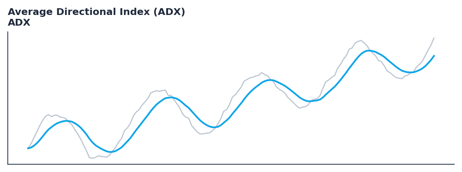

# Average Directional Index (ADX)

<div class="indicator-meta"><span class="category-badge">Classic</span> <span class="kw-badge">trend</span> <span class="kw-badge">volatility</span> <span class="kw-badge">classic</span> <span class="kw-badge">wilder</span></div>

An indicator used to quantify trend strength without regard to trend direction.

## Visual Example



*Synthetic ideal per library logic. Generated 2026-06-25 IST via `docs/generate_all_previews.py` (reproducible; maps to core `Next<T>` implementation).*

## Description

The Average Directional Index (ADX) indicator is a technical analysis tool that an indicator used to quantify trend strength without regard to trend direction.

This indicator is primarily used for identifying key market conditions. It provides a robust signal that can be easily integrated into both simple strategies and more complex machine learning feature pipelines. Compared to its alternatives, it offers a distinct balance of responsiveness and stability.

Traders often combine this with other metrics to confirm signals and avoid false positives during sideways market regimes. It remains a standard tool for systematic trading models.

Use to determine if the market is trending or ranging. ADX values above 25 indicate a strong trend, while values below 20 indicate a weak or non-trending market.

Developed by J. Welles Wilder, the ADX is derived from two other indicators, also developed by Wilder: the Positive Directional Indicator (+DI) and the Negative Directional Indicator (-DI). While +DI and -DI indicate trend direction, ADX measures the strength of that trend. — StockCharts ChartSchool

QuantWave implements this indicator via the universal `Next<T>` trait, guaranteeing bit-identical results between Rust streaming, Python streaming, and Polars batch (`.ta()` / `map_batches`) surfaces.


## Formula / Specification

**Implementation** (`quantwave-core/src/indicators/momentum.rs`):

\[
ADX = 100 \times \frac{\text{EMA}(|(+DI) - (-DI)| / |(+DI) + (-DI)|, n)}{n}
\]

Gold-standard parity vectors: `quantwave-core/tests/gold_standard/adx.json`.


## Parameters

| Parameter | Default | Description |
|-----------|---------|-------------|
| `timeperiod` | 14 | Lookback period |


## Usage Examples

**Streaming (Rust)**

```rust
use quantwave_core::indicators::ADX;
use quantwave_core::traits::Next;

let mut ind = ADX::new(14);
for price in &prices {
    let value = ind.next(price);
}
```

**Streaming (Python)**

```python
from quantwave import ADX

ind = ADX(14)
for price in prices:
    value = ind.next(price)
```

**Polars Batch (Python)**

```python
import polars as pl
import quantwave as qw

def apply_average_directional_index_adx(series: pl.Series) -> pl.Series:
    ind = qw.ADX(14)
    return pl.Series([ind.next(float(v)) for v in series.to_list()])

df = (
    pl.read_csv('ohlcv.csv')
    .lazy()
    .with_columns(
        pl.col("close").map_batches(apply_average_directional_index_adx, return_dtype=pl.Float64).alias("average_directional_index_adx")
    )
    .collect()
)
```

All surfaces are bit-identical via the single `Next<T>` implementation and proptests.

## Edge Cases & Limitations

- Warm-up: first `14` bars may return NaN or partial state per implementation.
- Parameter sensitivity: smaller periods increase noise; larger periods increase lag.
- Sudden gaps or bad ticks can distort rolling windows — consider pre-filtering.
- Single-series indicators ignore volume unless otherwise documented.
- Validated via proptests against gold-standard vectors where available.
- No look-ahead bias; streaming and Polars batch paths are bit-identical.

## Boundary Behavior

| Condition | Behavior |
|-----------|----------|
| Warm-up | Leading bars return NaN until warmup_bars is satisfied. |
| period > len | When period exceeds series length, output is all NaN. |
| NaN inputs | NaN in input propagates to output (NaN out). |
| Invalid params | Non-positive period or missing required params raise ValueError. |
| Empty data | Empty input returns an empty result series. |

## Related Indicators & See Also

- [Indicator Gallery](../gallery.md)
- [Native Indicators index](index.md)
- [Batch vs Streaming guide](../../../examples/batch-streaming.md)
- [RSI](relative_strength_index_rsi.md)
- [SuperTrend](supertrend/)

## Sources & References

**Primary Source**: https://www.investopedia.com/terms/a/adx.asp

**Implementation**: `quantwave-core/src/indicators/momentum.rs` (`ADX` / `ADX_METADATA`).
**Parity**: `quantwave-core/tests/gold_standard/adx.json`

**Provenance**: Standards bulk upgrade 2026-06-25 IST — see `docs/DOCUMENTATION_STANDARDS.md`.
