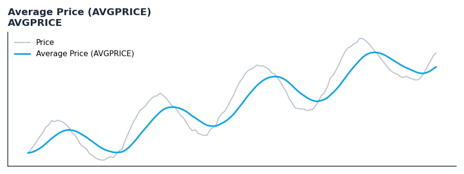

# Average Price (AVGPRICE)

<div class="indicator-meta"><span class="category-badge">Classic</span> <span class="kw-badge">price-transform</span> <span class="kw-badge">classic</span> <span class="kw-badge">smoothing</span></div>

The simple average of the Open, High, Low, and Close prices for a given period.

## Visual Example



*Synthetic ideal per library logic. Generated 2026-07-01 IST via `docs/generate_all_previews.py` (reproducible; maps to core `Next<T>` implementation).*

## Description

The simple average of the Open, High, Low, and Close prices for a given period.

Use as a smoothed price input for other indicators. It provides a more balanced view of the period's price action than the Close price alone.

Native Rust implementation with gold-standard or TA-Lib parity tests where applicable.

Average Price is the arithmetic mean of the four key price points in a bar. In technical analysis, using Average Price instead of Close can help filter out erratic price spikes and provide a more stable foundation for trend-following algorithms. — TA-Lib Documentation

**Typical applications:**

- See Parameters — default period/length `N`
- Validated via proptests and gold-standard vectors where available
- Use Polars `.ta` plugins for batch; `streaming_class()` for live

QuantWave implements this via the universal `Next<T>` trait — bit-identical across Rust streaming, Python streaming, and Polars `.ta()` batch plugins.

## Formula / Specification

**Implementation** (`quantwave-core/src/indicators/price_transform.rs`):

\[
AVGPRICE = \frac{Open + High + Low + Close}{4}
\]

Gold-standard parity vectors: `quantwave-core/tests/gold_standard/avgprice.json`.


## Parameters

| Parameter | Default | Description |
|-----------|---------|-------------|
| (none) | — | No tunable parameters for this detector. |

## Usage Examples

**Streaming (Rust)**

```rust
use quantwave_core::indicators::AVGPRICE;
use quantwave_core::traits::Next;

let mut ind = AVGPRICE::new(14);
for price in &prices {
    let value = ind.next(price);
}
```

**Streaming (Python)**

```python
from quantwave import AVGPRICE

ind = AVGPRICE(14)
for price in prices:
    value = ind.next(price)
```

**Polars Batch (Python)**

```python
import polars as pl
import quantwave  # registers pl.col().ta

df = (
    pl.read_csv('ohlcv.csv')
    .lazy()
    .with_columns(
        pl.col("open").ta.avgprice("open", "high", "low", "close").alias("average_price_avgprice")
    )
    .collect()
)
```

All surfaces are bit-identical via the single `Next<T>` implementation and proptests.

## Edge Cases & Limitations

- Warm-up: first `N` bars may return NaN or partial state per implementation.
- Parameter sensitivity: smaller periods increase noise; larger periods increase lag.
- Sudden gaps or bad ticks can distort rolling windows — consider pre-filtering.
- Single-series indicators ignore volume unless otherwise documented.
- Validated via proptests against gold-standard vectors where available.
- No look-ahead bias; streaming and Polars batch paths are bit-identical.

## Boundary Behavior

| Condition | Behavior |
|-----------|----------|
| Warm-up | Leading bars return NaN until warmup_bars is satisfied. |
| period > len | When period exceeds series length, output is all NaN. |
| NaN inputs | NaN in input propagates to output (NaN out). |
| Invalid params | Non-positive period or missing required params raise ValueError. |
| Empty data | Empty input returns an empty result series. |

## Related Indicators & See Also

- [Indicator Gallery](../gallery.md)
- [Native Indicators index](index.md)
- [Batch vs Streaming guide](../../../examples/batch-streaming.md)
- [RSI](relative_strength_index_rsi.md)
- [SuperTrend](supertrend/)

## Sources & References

**Primary Source**: https://www.tradingview.com/support/solutions/43000502588-average-price-avgprice/

**Implementation**: `quantwave-core/src/indicators/price_transform.rs` (`AVGPRICE` / `AVGPRICE_METADATA`).
**Parity**: `quantwave-core/tests/gold_standard/avgprice.json`

**Provenance**: Standards bulk upgrade 2026-07-01 IST — see `docs/DOCUMENTATION_STANDARDS.md`.
