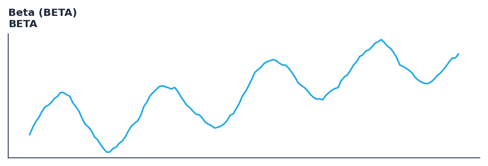

# Beta (BETA)

<div class="indicator-meta"><span class="category-badge">Classic</span> <span class="kw-badge">statistics</span> <span class="kw-badge">risk</span> <span class="kw-badge">classic</span> <span class="kw-badge">volatility</span></div>

A measure of a security's volatility in relation to the overall market.

## Visual Example



*Synthetic ideal per library logic. Generated 2026-07-01 IST via `docs/generate_all_previews.py` (reproducible; maps to core `Next<T>` implementation).*

## Description

A measure of a security's volatility in relation to the overall market.

Use to understand the systematic risk of an asset. A beta of 1.0 indicates the asset moves with the market; >1.0 means it is more volatile, and <1.0 means it is less volatile.

Native Rust implementation with gold-standard or TA-Lib parity tests where applicable.

Beta is a measure of the volatility—or systematic risk—of a security or portfolio compared to the market as a whole. It is used in the Capital Asset Pricing Model (CAPM) to calculate the expected return of an asset based on its beta and expected market returns. — Investopedia

**Typical applications:**

- Size stops and position risk from band width or ATR expansion
- Detect squeeze conditions (narrow bands) before breakout systems
- Warm-up: first `30` bars build rolling volatility state
- Combine with trend direction (SuperTrend, MACD) for breakout bias

QuantWave implements this via the universal `Next<T>` trait — bit-identical across Rust streaming, Python streaming, and Polars `.ta()` batch plugins.

## Formula / Specification

**Implementation** (`quantwave-core/src/indicators/statistics.rs`):

\[
\beta = \frac{\text{Cov}(R_i, R_m)}{\text{Var}(R_m)}
\]

Gold-standard parity vectors: `quantwave-core/tests/gold_standard/beta.json`.


## Parameters

| Parameter | Default | Description |
|-----------|---------|-------------|
| `timeperiod` | 30 | Lookback period |


## Usage Examples

**Streaming (Rust)**

```rust
use quantwave_core::indicators::BETA;
use quantwave_core::traits::Next;

let mut ind = BETA::new(30);
for price in &prices {
    let value = ind.next(price);
}
```

**Streaming (Python)**

```python
from quantwave import BETA

ind = BETA(30)
for price in prices:
    value = ind.next(price)
```

**Polars Batch (Python)**

```python
import polars as pl
import quantwave as qw

def apply_beta_beta(series: pl.Series) -> pl.Series:
    ind = qw.BETA(30)
    return pl.Series([ind.next(float(v)) for v in series.to_list()])

df = (
    pl.read_csv('ohlcv.csv')
    .lazy()
    .with_columns(
        pl.col("close").map_batches(apply_beta_beta, return_dtype=pl.Float64).alias("beta_beta")
    )
    .collect()
)
```

All surfaces are bit-identical via the single `Next<T>` implementation and proptests.

## Edge Cases & Limitations

- Warm-up: first `30` bars may return NaN or partial state per implementation.
- Parameter sensitivity: smaller periods increase noise; larger periods increase lag.
- Sudden gaps or bad ticks can distort rolling windows — consider pre-filtering.
- Single-series indicators ignore volume unless otherwise documented.
- Validated via proptests against gold-standard vectors where available.
- No look-ahead bias; streaming and Polars batch paths are bit-identical.

## Boundary Behavior

| Condition | Behavior |
|-----------|----------|
| Warm-up | Leading bars return NaN until warmup_bars is satisfied. |
| period > len | When period exceeds series length, output is all NaN. |
| NaN inputs | NaN in input propagates to output (NaN out). |
| Invalid params | Non-positive period or missing required params raise ValueError. |
| Empty data | Empty input returns an empty result series. |

## Related Indicators & See Also

- [Indicator Gallery](../gallery.md)
- [Native Indicators index](index.md)
- [Batch vs Streaming guide](../../../examples/batch-streaming.md)
- [RSI](relative_strength_index_rsi.md)
- [SuperTrend](../supertrend/)

## Sources & References

**Primary Source**: https://www.investopedia.com/terms/b/beta.asp

**Implementation**: `quantwave-core/src/indicators/statistics.rs` (`BETA` / `BETA_METADATA`).
**Parity**: `quantwave-core/tests/gold_standard/beta.json`

**Provenance**: Standards bulk upgrade 2026-07-01 IST — see `docs/DOCUMENTATION_STANDARDS.md`.
