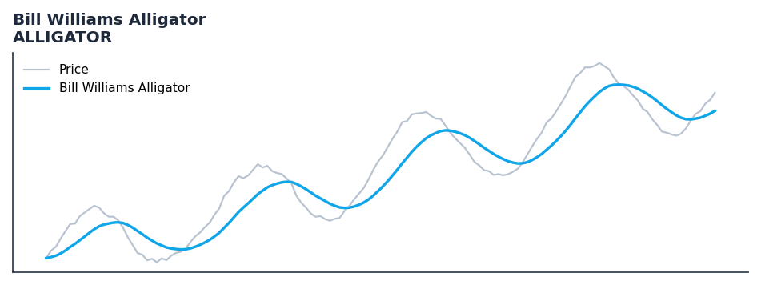

# Bill Williams Alligator

<div class="indicator-meta"><span class="category-badge">Classic</span> <span class="kw-badge">trend</span> <span class="kw-badge">moving-average</span> <span class="kw-badge">classic</span> <span class="kw-badge">williams</span></div>

Trend-following indicator using three delayed smoothed moving averages.

## Visual Example



*Synthetic ideal per library logic. Generated 2026-06-25 IST via `docs/generate_all_previews.py` (reproducible; maps to core `Next<T>` implementation).*

## Description

The Bill Williams Alligator indicator is a technical analysis tool that trend-following indicator using three delayed smoothed moving averages.

This indicator is primarily used for identifying key market conditions. It provides a robust signal that can be easily integrated into both simple strategies and more complex machine learning feature pipelines. Compared to its alternatives, it offers a distinct balance of responsiveness and stability.

Traders often combine this with other metrics to confirm signals and avoid false positives during sideways market regimes. It remains a standard tool for systematic trading models.

Use to identify trend presence and direction. When the three Alligator lines are separated and fanning, the market is trending; when they converge or intertwine, the market is ranging.

Bill Williams introduced the Alligator in Trading Chaos (1995) as three offset SMAs with periods 13, 8, and 5 and offsets of 8, 5, and 3 bars. The three lines represent the Jaw, Teeth, and Lips of the Alligator. When the Alligator is sleeping (lines intertwined) no trade is taken; when it wakes and opens its mouth a trend trade is entered. — StockCharts ChartSchool

QuantWave implements this indicator via the universal `Next<T>` trait, guaranteeing bit-identical results between Rust streaming, Python streaming, and Polars batch (`.ta()` / `map_batches`) surfaces.


## Formula / Specification

**Implementation** (`quantwave-core/src/indicators/alligator.rs`):

\[
\text{Jaw} = \text{SMMA}(13, 8), \text{Teeth} = \text{SMMA}(8, 5), \text{Lips} = \text{SMMA}(5, 3)
\]

Gold-standard parity vectors: `quantwave-core/tests/gold_standard/alligator.json`.


## Parameters

| Parameter | Default | Description |
|-----------|---------|-------------|
| (none) | — | No tunable parameters for this detector. |

## Usage Examples

**Streaming (Rust)**

```rust
use quantwave_core::indicators::ALLIGATOR;
use quantwave_core::traits::Next;

let mut ind = ALLIGATOR::new(14);
for price in &prices {
    let value = ind.next(price);
}
```

**Streaming (Python)**

```python
from quantwave import ALLIGATOR

ind = ALLIGATOR(14)
for price in prices:
    value = ind.next(price)
```

**Polars Batch (Python)**

```python
import polars as pl
import quantwave as qw

def apply_bill_williams_alligator(series: pl.Series) -> pl.Series:
    ind = qw.ALLIGATOR(14)
    return pl.Series([ind.next(float(v)) for v in series.to_list()])

df = (
    pl.read_csv('ohlcv.csv')
    .lazy()
    .with_columns(
        pl.col("close").map_batches(apply_bill_williams_alligator, return_dtype=pl.Float64).alias("bill_williams_alligator")
    )
    .collect()
)
```

All surfaces are bit-identical via the single `Next<T>` implementation and proptests.

## Edge Cases & Limitations

- Warm-up: first `N` bars may return NaN or partial state per implementation.
- Parameter sensitivity: smaller periods increase noise; larger periods increase lag.
- Sudden gaps or bad ticks can distort rolling windows — consider pre-filtering.
- Single-series indicators ignore volume unless otherwise documented.
- Validated via proptests against gold-standard vectors where available.
- No look-ahead bias; streaming and Polars batch paths are bit-identical.

## Boundary Behavior

| Condition | Behavior |
|-----------|----------|
| Warm-up | Leading bars return NaN until warmup_bars is satisfied. |
| period > len | When period exceeds series length, output is all NaN. |
| NaN inputs | NaN in input propagates to output (NaN out). |
| Invalid params | Non-positive period or missing required params raise ValueError. |
| Empty data | Empty input returns an empty result series. |

## Related Indicators & See Also

- [Indicator Gallery](../gallery.md)
- [Native Indicators index](index.md)
- [Batch vs Streaming guide](../../../examples/batch-streaming.md)
- [RSI](relative_strength_index_rsi.md)
- [SuperTrend](supertrend.md)

## Sources & References

**Primary Source**: https://chartschool.stockcharts.com/table-of-contents/technical-indicators-and-overlays/alligator

**Implementation**: `quantwave-core/src/indicators/alligator.rs` (`ALLIGATOR` / `ALLIGATOR_METADATA`).
**Parity**: `quantwave-core/tests/gold_standard/alligator.json`

**Provenance**: Standards bulk upgrade 2026-06-25 IST — see `docs/DOCUMENTATION_STANDARDS.md`.
