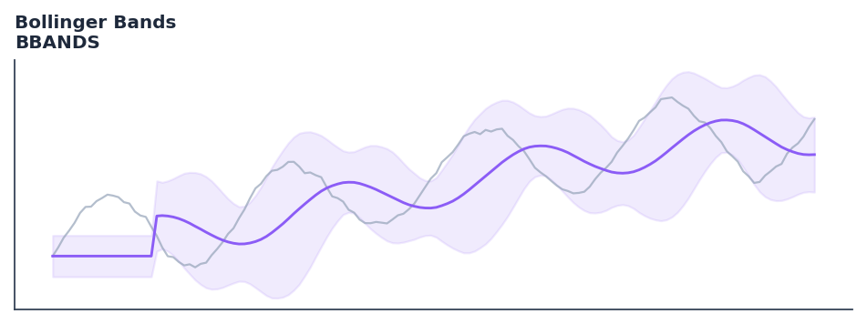

# Bollinger Bands

<div class="indicator-meta"><span class="category-badge">Classic</span> <span class="kw-badge">volatility</span> <span class="kw-badge">trend</span> <span class="kw-badge">classic</span> <span class="kw-badge">bands</span></div>

A volatility indicator consisting of a middle SMA and two outer bands based on standard deviation.

## Visual Example



*Synthetic ideal per library logic. Generated 2026-06-25 IST via `docs/generate_all_previews.py` (reproducible; maps to core `Next<T>` implementation).*

## Description

A volatility indicator consisting of a middle SMA and two outer bands based on standard deviation.

Use to identify overbought/oversold levels and volatility breakouts. Prices near the upper band suggest overbought conditions, while prices near the lower band suggest oversold conditions. Narrowing bands (The Squeeze) often precede large price moves.

Developed by John Bollinger in the 1980s, Bollinger Bands adapt to volatility by using standard deviation. The middle band is typically a 20-period SMA, and the outer bands are set 2 standard deviations away. This ensures that 95% of price action typically stays within the bands, making escapes highly significant. — BollingerOnBollingerBands.com

QuantWave implements this indicator via the universal `Next<T>` trait, guaranteeing bit-identical results between Rust streaming, Python streaming, and Polars batch (`.ta()` / `map_batches`) surfaces.

## Formula / Specification

**Implementation** (`quantwave-core/src/indicators/overlap.rs`):

\[
Middle = SMA(n) \\ Upper = Middle + (k \times \sigma) \\ Lower = Middle - (k \times \sigma)
\]

Gold-standard parity vectors: `quantwave-core/tests/gold_standard/bbands.json`.


## Parameters

| Parameter | Default | Description |
|-----------|---------|-------------|
| `timeperiod` | 20 | SMA period |
| `nbdevup` | 2.0 | Upper deviation multiplier |
| `nbdevdn` | 2.0 | Lower deviation multiplier |


## Usage Examples

**Streaming (Rust)**

```rust
use quantwave_core::indicators::BBANDS;
use quantwave_core::traits::Next;

let mut ind = BBANDS::new(20);
for price in &prices {
    let value = ind.next(price);
}
```

**Streaming (Python)**

```python
from quantwave import BBANDS

ind = BBANDS(20)
for price in prices:
    value = ind.next(price)
```

**Polars Batch (Python)**

```python
import polars as pl
import quantwave as qw

def apply_bollinger_bands(series: pl.Series) -> pl.Series:
    ind = qw.BBANDS(20)
    return pl.Series([ind.next(float(v)) for v in series.to_list()])

df = (
    pl.read_csv('ohlcv.csv')
    .lazy()
    .with_columns(
        pl.col("close").map_batches(apply_bollinger_bands, return_dtype=pl.Float64).alias("bollinger_bands")
    )
    .collect()
)
```

All surfaces are bit-identical via the single `Next<T>` implementation and proptests.

## Edge Cases & Limitations

- Warm-up: first `20` bars may return NaN or partial state per implementation.
- Parameter sensitivity: smaller periods increase noise; larger periods increase lag.
- Sudden gaps or bad ticks can distort rolling windows — consider pre-filtering.
- Single-series indicators ignore volume unless otherwise documented.
- Validated via proptests against gold-standard vectors where available.
- No look-ahead bias; streaming and Polars batch paths are bit-identical.

## Related Indicators & See Also

- [Indicator Gallery](../gallery.md)
- [Native Indicators index](index.md)
- [Batch vs Streaming guide](../../../examples/batch-streaming.md)
- [RSI](relative_strength_index_rsi.md)
- [SuperTrend](supertrend.md)

## Sources & References

**Primary Source**: https://www.investopedia.com/terms/b/bollingerbands.asp

**Implementation**: `quantwave-core/src/indicators/overlap.rs` (`BBANDS` / `BBANDS_METADATA`).
**Parity**: `quantwave-core/tests/gold_standard/bbands.json`

**Provenance**: Standards bulk upgrade 2026-06-25 IST — see `docs/DOCUMENTATION_STANDARDS.md`.
