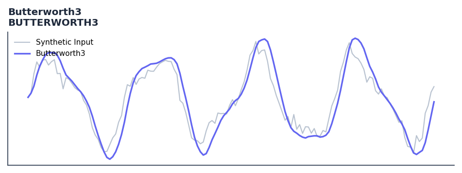

# Butterworth3

<div class="indicator-meta"><span class="category-badge">Ehlers DSP</span> <span class="kw-badge">filter</span> <span class="kw-badge">ehlers</span> <span class="kw-badge">dsp</span> <span class="kw-badge">smoothing</span> <span class="kw-badge">low-pass</span></div>

3-pole Butterworth low-pass filter.

## Visual Example



*Synthetic ideal per library logic. Generated 2026-06-25 IST via `docs/generate_all_previews.py` (reproducible; maps to core `Next<T>` implementation).*

## Description

3-pole Butterworth low-pass filter.

Use to smooth price or intermediate indicator values with a flat passband and sharp rolloff. The 3-pole version provides steeper attenuation at the cost of marginally more lag.

Butterworth filters are maximally flat in the passband, introducing no ripple. Ehlers implements 2-pole and 3-pole Butterworth IIR designs in Cycle Analytics for Traders, noting that the SuperSmoother is actually a critically-damped 2-pole Butterworth variant.

QuantWave implements this indicator via the universal `Next<T>` trait, guaranteeing bit-identical results between Rust streaming, Python streaming, and Polars batch (`.ta()` / `map_batches`) surfaces.

## Formula / Specification

**Implementation** (`quantwave-core/src/indicators/butterworth.rs`):

\[
a = \exp(-\pi/P)
\]
\[
b = 2a \cos(1.738\pi/P)
\]
\[
c = a^2
\]
\[
f = (b+c)f_{t-1} - (c+bc)f_{t-2} + c^2f_{t-3} + \frac{(1-b+c)(1-c)}{8}(g + 3g_{t-1} + 3g_{t-2} + g_{t-3})
\]

Gold-standard parity vectors: `quantwave-core/tests/gold_standard/butterworth3.json`.


## Parameters

| Parameter | Default | Description |
|-----------|---------|-------------|
| `period` | 14 | Critical period |


## Usage Examples

**Streaming (Rust)**

```rust
use quantwave_core::indicators::BUTTERWORTH3;
use quantwave_core::traits::Next;

let mut ind = BUTTERWORTH3::new(14);
for price in &prices {
    let value = ind.next(price);
}
```

**Streaming (Python)**

```python
from quantwave import BUTTERWORTH3

ind = BUTTERWORTH3(14)
for price in prices:
    value = ind.next(price)
```

**Polars Batch (Python)**

```python
import polars as pl
import quantwave as qw

def apply_butterworth3(series: pl.Series) -> pl.Series:
    ind = qw.BUTTERWORTH3(14)
    return pl.Series([ind.next(float(v)) for v in series.to_list()])

df = (
    pl.read_csv('ohlcv.csv')
    .lazy()
    .with_columns(
        pl.col("close").map_batches(apply_butterworth3, return_dtype=pl.Float64).alias("butterworth3")
    )
    .collect()
)
```

All surfaces are bit-identical via the single `Next<T>` implementation and proptests.

## Edge Cases & Limitations

- Recursive DSP filters require a warm-up period; first N bars may be unstable or raw-pass-through.
- Designed for cyclic/mean-reverting regimes; trending markets can produce lag or drift.
- Parameter `period` (or equivalent) controls cutoff — too small adds noise, too large adds lag.
- Prefer chaining with other Ehlers tools (Roofing Filter, SuperSmoother) on noisy inputs.
- Validated via proptests against gold-standard vectors where available.
- No look-ahead bias; suitable for live streaming and batch feature pipelines.

## Related Indicators & See Also

- [Indicator Gallery](../gallery.md)
- [Native Indicators index](index.md)
- [Ehlers DSP guide](../ehlers/index.md)
- [Cyber Cycle](cyber_cycle.md)
- [SuperSmoother](supersmoother.md)

## Sources & References

**Primary Source**: https://github.com/lavs9/quantwave/blob/main/references/Ehlers%20Papers/Poles.pdf

**Implementation**: `quantwave-core/src/indicators/butterworth.rs` (`BUTTERWORTH3` / `BUTTERWORTH3_METADATA`).
**Parity**: `quantwave-core/tests/gold_standard/butterworth3.json`

**Provenance**: Standards bulk upgrade 2026-06-25 IST — see `docs/DOCUMENTATION_STANDARDS.md`.
