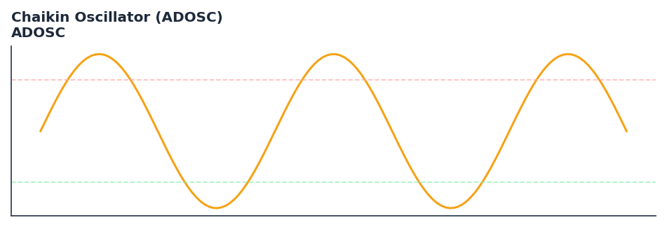

# Chaikin Oscillator (ADOSC)

<div class="indicator-meta"><span class="category-badge">Classic</span> <span class="kw-badge">volume</span> <span class="kw-badge">oscillator</span> <span class="kw-badge">momentum</span> <span class="kw-badge">classic</span></div>

An indicator that measures the momentum of the Accumulation/Distribution Line using the difference between two exponential moving averages.

## Visual Example



*Synthetic ideal per library logic. Generated 2026-07-01 IST via `docs/generate_all_previews.py` (reproducible; maps to core `Next<T>` implementation).*

## Description

An indicator that measures the momentum of the Accumulation/Distribution Line using the difference between two exponential moving averages.

Use to anticipate changes in the AD Line. Positive values indicate increasing buying pressure, while negative values indicate increasing selling pressure.

Native Rust implementation with gold-standard or TA-Lib parity tests where applicable.

Marc Chaikin developed this oscillator to identify momentum shifts in the AD Line. By applying EMAs of different lengths to the AD Line, it highlights changes in money flow before they become apparent in the cumulative total, providing an early warning system for trend exhaustion. — StockCharts ChartSchool

**Typical applications:**

- Fade extremes in ranges; trade with trend on recoveries from oversold/overbought
- Use divergences as early warning — confirm with structure or volume
- Parameter default `3` — shorten for sensitivity, lengthen for stability
- Drop into `build_feature_matrix()` for ML research

QuantWave implements this via the universal `Next<T>` trait — bit-identical across Rust streaming, Python streaming, and Polars `.ta()` batch plugins.

## Formula / Specification

**Implementation** (`quantwave-core/src/indicators/volume.rs`):

\[
ADOSC = EMA(AD, 3) - EMA(AD, 10)
\]

Gold-standard parity vectors: `quantwave-core/tests/gold_standard/adosc.json`.


## Parameters

| Parameter | Default | Description |
|-----------|---------|-------------|
| `fastperiod` | 3 | Fast EMA period |
| `slowperiod` | 10 | Slow EMA period |


## Usage Examples

**Streaming (Rust)**

```rust
use quantwave_core::indicators::ADOSC;
use quantwave_core::traits::Next;

let mut ind = ADOSC::new(3);
for price in &prices {
    let value = ind.next(price);
}
```

**Streaming (Python)**

```python
from quantwave import ADOSC

ind = ADOSC(3)
for price in prices:
    value = ind.next(price)
```

**Polars Batch (Python)**

```python
import polars as pl
import quantwave as qw

def apply_chaikin_oscillator_adosc(series: pl.Series) -> pl.Series:
    ind = qw.ADOSC(3)
    return pl.Series([ind.next(float(v)) for v in series.to_list()])

df = (
    pl.read_csv('ohlcv.csv')
    .lazy()
    .with_columns(
        pl.col("close").map_batches(apply_chaikin_oscillator_adosc, return_dtype=pl.Float64).alias("chaikin_oscillator_adosc")
    )
    .collect()
)
```

All surfaces are bit-identical via the single `Next<T>` implementation and proptests.

## Edge Cases & Limitations

- Warm-up: first `3` bars may return NaN or partial state per implementation.
- Parameter sensitivity: smaller periods increase noise; larger periods increase lag.
- Sudden gaps or bad ticks can distort rolling windows — consider pre-filtering.
- Single-series indicators ignore volume unless otherwise documented.
- Validated via proptests against gold-standard vectors where available.
- No look-ahead bias; streaming and Polars batch paths are bit-identical.

## Boundary Behavior

| Condition | Behavior |
|-----------|----------|
| Warm-up | Leading bars return NaN until warmup_bars is satisfied. |
| period > len | When period exceeds series length, output is all NaN. |
| NaN inputs | NaN in input propagates to output (NaN out). |
| Invalid params | Non-positive period or missing required params raise ValueError. |
| Empty data | Empty input returns an empty result series. |

## Related Indicators & See Also

- [Indicator Gallery](../gallery.md)
- [Native Indicators index](index.md)
- [Batch vs Streaming guide](../../../examples/batch-streaming.md)
- [RSI](relative_strength_index_rsi.md)
- [SuperTrend](../supertrend/)

## Sources & References

**Primary Source**: https://www.investopedia.com/terms/c/chaikinoscillator.asp

**Implementation**: `quantwave-core/src/indicators/volume.rs` (`ADOSC` / `ADOSC_METADATA`).
**Parity**: `quantwave-core/tests/gold_standard/adosc.json`

**Provenance**: Standards bulk upgrade 2026-07-01 IST — see `docs/DOCUMENTATION_STANDARDS.md`.
