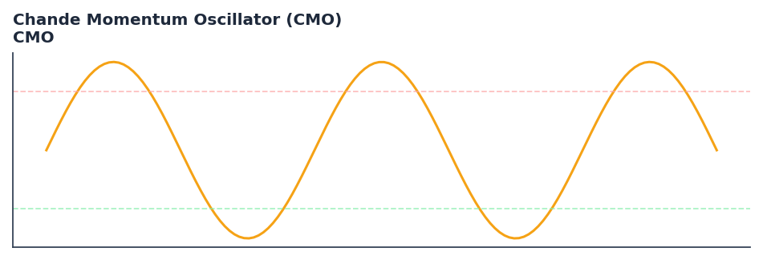

# Chande Momentum Oscillator (CMO)

<div class="indicator-meta"><span class="category-badge">Classic</span> <span class="kw-badge">momentum</span> <span class="kw-badge">oscillator</span> <span class="kw-badge">classic</span> <span class="kw-badge">overbought</span> <span class="kw-badge">oversold</span></div>

An advanced momentum oscillator developed by Tushar Chande that measures the difference between up and down days.

## Visual Example



*Synthetic ideal per library logic. Generated 2026-06-25 IST via `docs/generate_all_previews.py` (reproducible; maps to core `Next<T>` implementation).*

## Description

The Chande Momentum Oscillator (CMO) indicator is a technical analysis tool that an advanced momentum oscillator developed by tushar chande that measures the difference between up and down days.

This indicator is primarily used for identifying key market conditions. It provides a robust signal that can be easily integrated into both simple strategies and more complex machine learning feature pipelines. Compared to its alternatives, it offers a distinct balance of responsiveness and stability.

Traders often combine this with other metrics to confirm signals and avoid false positives during sideways market regimes. It remains a standard tool for systematic trading models.

Use to identify extreme overbought and oversold conditions. CMO is more sensitive to price action than RSI as it uses unsmoothed data in its internal calculations.

Developed by Tushar Chande in 1994, the CMO is similar to the RSI but uses the net sum of up and down moves in both the numerator and denominator. This makes it more sensitive to price movements and useful for identifying short-term overextensions in the market. — The New Technical Trader

QuantWave implements this indicator via the universal `Next<T>` trait, guaranteeing bit-identical results between Rust streaming, Python streaming, and Polars batch (`.ta()` / `map_batches`) surfaces.


## Formula / Specification

**Implementation** (`quantwave-core/src/indicators/momentum.rs`):

\[
CMO = 100 \times \frac{S_u - S_d}{S_u + S_d}
\]

Gold-standard parity vectors: `quantwave-core/tests/gold_standard/cmo.json`.


## Parameters

| Parameter | Default | Description |
|-----------|---------|-------------|
| `timeperiod` | 14 | Lookback period |


## Usage Examples

**Streaming (Rust)**

```rust
use quantwave_core::indicators::CMO;
use quantwave_core::traits::Next;

let mut ind = CMO::new(14);
for price in &prices {
    let value = ind.next(price);
}
```

**Streaming (Python)**

```python
from quantwave import CMO

ind = CMO(14)
for price in prices:
    value = ind.next(price)
```

**Polars Batch (Python)**

```python
import polars as pl

df = (
    pl.read_csv('ohlcv.csv')
    .lazy()
    .with_columns(
        pl.col("close").ta.cmo("close", 14).alias("chande_momentum_oscillator_cmo")
    )
    .collect()
)
```

All surfaces are bit-identical via the single `Next<T>` implementation and proptests.

## Edge Cases & Limitations

- Warm-up: first `14` bars may return NaN or partial state per implementation.
- Parameter sensitivity: smaller periods increase noise; larger periods increase lag.
- Sudden gaps or bad ticks can distort rolling windows — consider pre-filtering.
- Single-series indicators ignore volume unless otherwise documented.
- Validated via proptests against gold-standard vectors where available.
- No look-ahead bias; streaming and Polars batch paths are bit-identical.

## Boundary Behavior

| Condition | Behavior |
|-----------|----------|
| Warm-up | Leading bars return NaN until warmup_bars is satisfied. |
| period > len | When period exceeds series length, output is all NaN. |
| NaN inputs | NaN in input propagates to output (NaN out). |
| Invalid params | Non-positive period or missing required params raise ValueError. |
| Empty data | Empty input returns an empty result series. |

## Related Indicators & See Also

- [Indicator Gallery](../gallery.md)
- [Native Indicators index](index.md)
- [Batch vs Streaming guide](../../../examples/batch-streaming.md)
- [RSI](relative_strength_index_rsi.md)
- [SuperTrend](supertrend.md)

## Sources & References

**Primary Source**: https://www.investopedia.com/terms/c/chandemomentumoscillator.asp

**Implementation**: `quantwave-core/src/indicators/momentum.rs` (`CMO` / `CMO_METADATA`).
**Parity**: `quantwave-core/tests/gold_standard/cmo.json`

**Provenance**: Standards bulk upgrade 2026-06-25 IST — see `docs/DOCUMENTATION_STANDARDS.md`.
