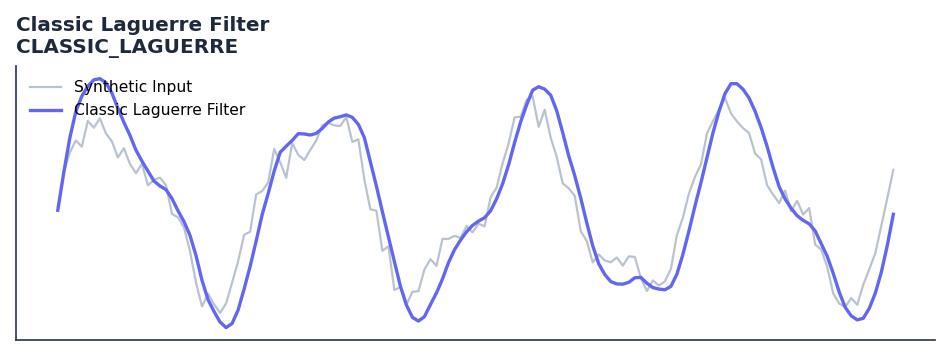

# Classic Laguerre Filter

<div class="indicator-meta"><span class="category-badge">Ehlers DSP</span> <span class="kw-badge">filter</span> <span class="kw-badge">ehlers</span> <span class="kw-badge">dsp</span> <span class="kw-badge">smoothing</span> <span class="kw-badge">laguerre</span></div>

The original Laguerre filter from John Ehlers' 2002 'Time Warp' paper.

## Visual Example



*Synthetic ideal per library logic. Generated 2026-06-25 IST via `docs/generate_all_previews.py` (reproducible; maps to core `Next<T>` implementation).*

## Description

The Classic Laguerre Filter indicator is a technical analysis tool that the original laguerre filter from john ehlers' 2002 'time warp' paper.

This indicator is primarily used for identifying key market conditions. It provides a robust signal that can be easily integrated into both simple strategies and more complex machine learning feature pipelines. Compared to its alternatives, it offers a distinct balance of responsiveness and stability.

Traders often combine this with other metrics to confirm signals and avoid false positives during sideways market regimes. It remains a standard tool for systematic trading models.

Use when a smooth trend estimate with controllable lag using only 4 state variables is needed. Preferred over long EMAs when computational memory is constrained.

The Classic Laguerre Filter uses four first-order IIR sections sharing the same gamma coefficient. In Cybernetic Analysis (2004) Ehlers shows gamma maps directly to an effective period, making it highly tunable with minimal computation.

QuantWave implements this indicator via the universal `Next<T>` trait, guaranteeing bit-identical results between Rust streaming, Python streaming, and Polars batch (`.ta()` / `map_batches`) surfaces.


## Formula / Specification

**Implementation** (`quantwave-core/src/indicators/classic_laguerre.rs`):

\[
L_0 = (1 - \gamma) \cdot Price + \gamma \cdot L_{0,t-1}
\]
\[
L_1 = -\gamma L_0 + L_{0,t-1} + \gamma L_{1,t-1}
\]
\[
L_2 = -\gamma L_1 + L_{1,t-1} + \gamma L_{2,t-1}
\]
\[
L_3 = -\gamma L_2 + L_{2,t-1} + \gamma L_{3,t-1}
\]
\[
Filt = \frac{L_0 + 2L_1 + 2L_2 + L_3}{6}
\]

Gold-standard parity vectors: `quantwave-core/tests/gold_standard/classic_laguerre.json`.


## Parameters

| Parameter | Default | Description |
|-----------|---------|-------------|
| `gamma` | 0.8 | Smoothing factor (0.0 to 1.0) |


## Usage Examples

**Streaming (Rust)**

```rust
use quantwave_core::indicators::CLASSIC_LAGUERRE;
use quantwave_core::traits::Next;

let mut ind = CLASSIC_LAGUERRE::new(0.8);
for price in &prices {
    let value = ind.next(price);
}
```

**Streaming (Python)**

```python
from quantwave import CLASSIC_LAGUERRE

ind = CLASSIC_LAGUERRE(0.8)
for price in prices:
    value = ind.next(price)
```

**Polars Batch (Python)**

```python
import polars as pl
import quantwave as qw

def apply_classic_laguerre_filter(series: pl.Series) -> pl.Series:
    ind = qw.CLASSIC_LAGUERRE(0.8)
    return pl.Series([ind.next(float(v)) for v in series.to_list()])

df = (
    pl.read_csv('ohlcv.csv')
    .lazy()
    .with_columns(
        pl.col("close").map_batches(apply_classic_laguerre_filter, return_dtype=pl.Float64).alias("classic_laguerre_filter")
    )
    .collect()
)
```

All surfaces are bit-identical via the single `Next<T>` implementation and proptests.

## Edge Cases & Limitations

- Recursive DSP filters require a warm-up period; first N bars may be unstable or raw-pass-through.
- Designed for cyclic/mean-reverting regimes; trending markets can produce lag or drift.
- Parameter `period` (or equivalent) controls cutoff — too small adds noise, too large adds lag.
- Prefer chaining with other Ehlers tools (Roofing Filter, SuperSmoother) on noisy inputs.
- Validated via proptests against gold-standard vectors where available.
- No look-ahead bias; suitable for live streaming and batch feature pipelines.

## Boundary Behavior

| Condition | Behavior |
|-----------|----------|
| Warm-up | Leading bars return NaN until warmup_bars is satisfied. |
| period > len | When period exceeds series length, output is all NaN. |
| NaN inputs | NaN in input propagates to output (NaN out). |
| Invalid params | Non-positive period or missing required params raise ValueError. |
| Empty data | Empty input returns an empty result series. |

## Related Indicators & See Also

- [Indicator Gallery](../gallery.md)
- [Native Indicators index](index.md)
- [Ehlers DSP guide](../ehlers/index.md)
- [Cyber Cycle](cyber_cycle.md)
- [SuperSmoother](supersmoother.md)

## Sources & References

**Primary Source**: https://github.com/lavs9/quantwave/blob/main/references/Ehlers%20Papers/TimeWarp.pdf

**Implementation**: `quantwave-core/src/indicators/classic_laguerre.rs` (`CLASSIC_LAGUERRE` / `CLASSIC_LAGUERRE_METADATA`).
**Parity**: `quantwave-core/tests/gold_standard/classic_laguerre.json`

**Provenance**: Standards bulk upgrade 2026-06-25 IST — see `docs/DOCUMENTATION_STANDARDS.md`.
