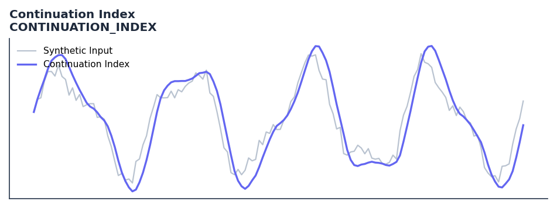

# Continuation Index

<div class="indicator-meta"><span class="category-badge">Ehlers DSP</span> <span class="kw-badge">trend</span> <span class="kw-badge">momentum</span> <span class="kw-badge">ehlers</span> <span class="kw-badge">cycle</span></div>

An oscillator that identifies trend onset and exhaustion by comparing a fast UltimateSmoother with a Generalized Laguerre filter.

## Visual Example



*Synthetic ideal per library logic. Generated 2026-06-25 IST via `docs/generate_all_previews.py` (reproducible; maps to core `Next<T>` implementation).*

## Description

An oscillator that identifies trend onset and exhaustion by comparing a fast UltimateSmoother with a Generalized Laguerre filter.

Use to measure whether a price move is likely to continue or reverse based on cycle analysis. High index values suggest trend continuation; low values suggest an impending cycle turn.

The Continuation Index measures the persistence of directional price movement relative to the dominant cycle. Ehlers derives it from the cycle phase velocity — when phase advances quickly in one direction, momentum is strong and continuation is likely; slow or reversing phase suggests the move is exhausting.

QuantWave implements this indicator via the universal `Next<T>` trait, guaranteeing bit-identical results between Rust streaming, Python streaming, and Polars batch (`.ta()` / `map_batches`) surfaces.

## Formula / Specification

**Implementation** (`quantwave-core/src/indicators/continuation_index.rs`):

\[
US = UltimateSmoother(Close, Length/2)
\]
\[
LG = Laguerre(Close, \gamma, Order, Length)
\]
\[
Variance = SMA(|US - LG|, Length)
\]
\[
Ref = 2 \times (US - LG) / Variance
\]
\[
CI = \tanh(Ref)
\]

Gold-standard parity vectors: `quantwave-core/tests/gold_standard/continuation_index.json`.


## Parameters

| Parameter | Default | Description |
|-----------|---------|-------------|
| `gamma` | 0.8 | Laguerre gamma parameter |
| `order` | 8 | Laguerre filter order |
| `length` | 40 | Base smoothing length |


## Usage Examples

**Streaming (Rust)**

```rust
use quantwave_core::indicators::CONTINUATION_INDEX;
use quantwave_core::traits::Next;

let mut ind = CONTINUATION_INDEX::new(0.8);
for price in &prices {
    let value = ind.next(price);
}
```

**Streaming (Python)**

```python
from quantwave import CONTINUATION_INDEX

ind = CONTINUATION_INDEX(0.8)
for price in prices:
    value = ind.next(price)
```

**Polars Batch (Python)**

```python
import polars as pl
import quantwave as qw

def apply_continuation_index(series: pl.Series) -> pl.Series:
    ind = qw.CONTINUATION_INDEX(0.8)
    return pl.Series([ind.next(float(v)) for v in series.to_list()])

df = (
    pl.read_csv('ohlcv.csv')
    .lazy()
    .with_columns(
        pl.col("close").map_batches(apply_continuation_index, return_dtype=pl.Float64).alias("continuation_index")
    )
    .collect()
)
```

All surfaces are bit-identical via the single `Next<T>` implementation and proptests.

## Edge Cases & Limitations

- Recursive DSP filters require a warm-up period; first N bars may be unstable or raw-pass-through.
- Designed for cyclic/mean-reverting regimes; trending markets can produce lag or drift.
- Parameter `period` (or equivalent) controls cutoff — too small adds noise, too large adds lag.
- Prefer chaining with other Ehlers tools (Roofing Filter, SuperSmoother) on noisy inputs.
- Validated via proptests against gold-standard vectors where available.
- No look-ahead bias; suitable for live streaming and batch feature pipelines.

## Related Indicators & See Also

- [Indicator Gallery](../gallery.md)
- [Native Indicators index](index.md)
- [Ehlers DSP guide](../ehlers/index.md)
- [Cyber Cycle](cyber_cycle.md)
- [SuperSmoother](supersmoother.md)

## Sources & References

**Primary Source**: https://github.com/lavs9/quantwave/blob/main/references/traderstipsreference/TRADERS%E2%80%99%20TIPS%20-%20SEPTEMBER%202025.html

**Implementation**: `quantwave-core/src/indicators/continuation_index.rs` (`CONTINUATION_INDEX` / `CONTINUATION_INDEX_METADATA`).
**Parity**: `quantwave-core/tests/gold_standard/continuation_index.json`

**Provenance**: Standards bulk upgrade 2026-06-25 IST — see `docs/DOCUMENTATION_STANDARDS.md`.
