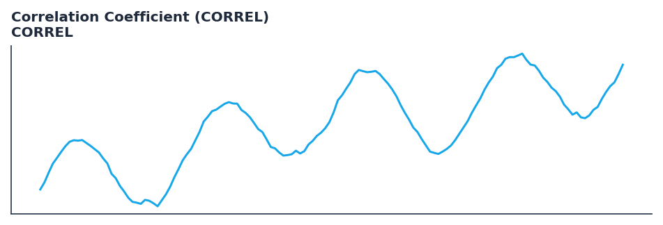

# Correlation Coefficient (CORREL)

<div class="indicator-meta"><span class="category-badge">Classic</span> <span class="kw-badge">statistics</span> <span class="kw-badge">correlation</span> <span class="kw-badge">classic</span></div>

A statistical measure that determines the degree to which two securities move in relation to each other.

## Visual Example



*Synthetic ideal per library logic. Generated 2026-07-01 IST via `docs/generate_all_previews.py` (reproducible; maps to core `Next<T>` implementation).*

## Description

A statistical measure that determines the degree to which two securities move in relation to each other.

Use to measure the strength and direction of the linear relationship between two assets. Values range from -1.0 (inverse correlation) to +1.0 (perfect correlation).

Native Rust implementation with gold-standard or TA-Lib parity tests where applicable.

The Pearson Correlation Coefficient measures the strength and direction of a linear relationship between two price series. It is a fundamental tool for pair trading and portfolio diversification, allowing traders to quantify how much of a security's movement is explained by another. — StockCharts ChartSchool

**Typical applications:**

- See Parameters — default period/length `30`
- Validated via proptests and gold-standard vectors where available
- Use Polars `.ta` plugins for batch; `streaming_class()` for live

QuantWave implements this via the universal `Next<T>` trait — bit-identical across Rust streaming, Python streaming, and Polars `.ta()` batch plugins.

## Formula / Specification

**Implementation** (`quantwave-core/src/indicators/statistics.rs`):

\[
\rho_{X,Y} = \frac{\text{cov}(X,Y)}{\sigma_X \sigma_Y}
\]

Gold-standard parity vectors: `quantwave-core/tests/gold_standard/correl.json`.


## Parameters

| Parameter | Default | Description |
|-----------|---------|-------------|
| `timeperiod` | 30 | Lookback period |


## Usage Examples

**Streaming (Rust)**

```rust
use quantwave_core::indicators::CORREL;
use quantwave_core::traits::Next;

let mut ind = CORREL::new(30);
for price in &prices {
    let value = ind.next(price);
}
```

**Streaming (Python)**

```python
from quantwave import CORREL

ind = CORREL(30)
for price in prices:
    value = ind.next(price)
```

**Polars Batch (Python)**

```python
import polars as pl
import quantwave as qw

def apply_correlation_coefficient_correl(series: pl.Series) -> pl.Series:
    ind = qw.CORREL(30)
    return pl.Series([ind.next(float(v)) for v in series.to_list()])

df = (
    pl.read_csv('ohlcv.csv')
    .lazy()
    .with_columns(
        pl.col("close").map_batches(apply_correlation_coefficient_correl, return_dtype=pl.Float64).alias("correlation_coefficient_correl")
    )
    .collect()
)
```

All surfaces are bit-identical via the single `Next<T>` implementation and proptests.

## Edge Cases & Limitations

- Warm-up: first `30` bars may return NaN or partial state per implementation.
- Parameter sensitivity: smaller periods increase noise; larger periods increase lag.
- Sudden gaps or bad ticks can distort rolling windows — consider pre-filtering.
- Single-series indicators ignore volume unless otherwise documented.
- Validated via proptests against gold-standard vectors where available.
- No look-ahead bias; streaming and Polars batch paths are bit-identical.

## Boundary Behavior

| Condition | Behavior |
|-----------|----------|
| Warm-up | Leading bars return NaN until warmup_bars is satisfied. |
| period > len | When period exceeds series length, output is all NaN. |
| NaN inputs | NaN in input propagates to output (NaN out). |
| Invalid params | Non-positive period or missing required params raise ValueError. |
| Empty data | Empty input returns an empty result series. |

## Related Indicators & See Also

- [Indicator Gallery](../gallery.md)
- [Native Indicators index](index.md)
- [Batch vs Streaming guide](../../../examples/batch-streaming.md)
- [RSI](relative_strength_index_rsi.md)
- [SuperTrend](supertrend/)

## Sources & References

**Primary Source**: https://www.investopedia.com/terms/c/correlationcoefficient.asp

**Implementation**: `quantwave-core/src/indicators/statistics.rs` (`CORREL` / `CORREL_METADATA`).
**Parity**: `quantwave-core/tests/gold_standard/correl.json`

**Provenance**: Standards bulk upgrade 2026-07-01 IST — see `docs/DOCUMENTATION_STANDARDS.md`.
