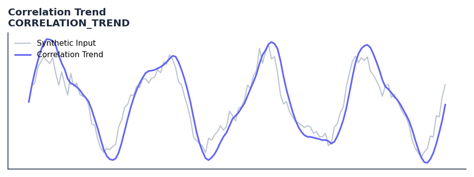

# Correlation Trend

<div class="indicator-meta"><span class="category-badge">Ehlers DSP</span> <span class="kw-badge">trend</span> <span class="kw-badge">correlation</span> <span class="kw-badge">ehlers</span> <span class="kw-badge">statistics</span></div>

Calculates the Pearson correlation between price and a linear time ramp to identify trends.

## Visual Example



*Synthetic ideal per library logic. Generated 2026-06-25 IST via `docs/generate_all_previews.py` (reproducible; maps to core `Next<T>` implementation).*

## Description

Calculates the Pearson correlation between price and a linear time ramp to identify trends.

Use to confirm whether price is trending or cycling before applying directional strategies. High correlation indicates a strong trend; low correlation indicates a cycling market.

In 'Correlation As A Trend Indicator' (2020), Ehlers uses the Pearson correlation coefficient between price and a linear ramp to identify trend strength. A coefficient near +1.0 indicates a consistent uptrend, while -1.0 indicates a consistent downtrend. Unlike standard moving averages, this approach is independent of price amplitude and focuses purely on the linearity of the move.

QuantWave implements this indicator via the universal `Next<T>` trait, guaranteeing bit-identical results between Rust streaming, Python streaming, and Polars batch (`.ta()` / `map_batches`) surfaces.

## Formula / Specification

**Implementation** (`quantwave-core/src/indicators/correlation_trend.rs`):

\[
X_i = Price_{t-i}, Y_i = -i
\]
\[
R = \frac{n \sum X_i Y_i - \sum X_i \sum Y_i}{\sqrt{(n \sum X_i^2 - (\sum X_i)^2)(n \sum Y_i^2 - (\sum Y_i)^2)}}
\]

Gold-standard parity vectors: `quantwave-core/tests/gold_standard/correlation_trend.json`.


## Parameters

| Parameter | Default | Description |
|-----------|---------|-------------|
| `length` | 20 | Correlation window length |


## Usage Examples

**Streaming (Rust)**

```rust
use quantwave_core::indicators::CORRELATION_TREND;
use quantwave_core::traits::Next;

let mut ind = CORRELATION_TREND::new(20);
for price in &prices {
    let value = ind.next(price);
}
```

**Streaming (Python)**

```python
from quantwave import CORRELATION_TREND

ind = CORRELATION_TREND(20)
for price in prices:
    value = ind.next(price)
```

**Polars Batch (Python)**

```python
import polars as pl
import quantwave as qw

def apply_correlation_trend(series: pl.Series) -> pl.Series:
    ind = qw.CORRELATION_TREND(20)
    return pl.Series([ind.next(float(v)) for v in series.to_list()])

df = (
    pl.read_csv('ohlcv.csv')
    .lazy()
    .with_columns(
        pl.col("close").map_batches(apply_correlation_trend, return_dtype=pl.Float64).alias("correlation_trend")
    )
    .collect()
)
```

All surfaces are bit-identical via the single `Next<T>` implementation and proptests.

## Edge Cases & Limitations

- Recursive DSP filters require a warm-up period; first N bars may be unstable or raw-pass-through.
- Designed for cyclic/mean-reverting regimes; trending markets can produce lag or drift.
- Parameter `period` (or equivalent) controls cutoff — too small adds noise, too large adds lag.
- Prefer chaining with other Ehlers tools (Roofing Filter, SuperSmoother) on noisy inputs.
- Validated via proptests against gold-standard vectors where available.
- No look-ahead bias; suitable for live streaming and batch feature pipelines.

## Related Indicators & See Also

- [Indicator Gallery](../gallery.md)
- [Native Indicators index](index.md)
- [Ehlers DSP guide](../ehlers/index.md)
- [Cyber Cycle](cyber_cycle.md)
- [SuperSmoother](supersmoother.md)

## Sources & References

**Primary Source**: https://github.com/lavs9/quantwave/blob/main/references/Ehlers%20Papers/CORRELATION%20AS%20A%20TREND%20INDICATOR.pdf

**Implementation**: `quantwave-core/src/indicators/correlation_trend.rs` (`CORRELATION_TREND` / `CORRELATION_TREND_METADATA`).
**Parity**: `quantwave-core/tests/gold_standard/correlation_trend.json`

**Provenance**: Standards bulk upgrade 2026-06-25 IST — see `docs/DOCUMENTATION_STANDARDS.md`.
