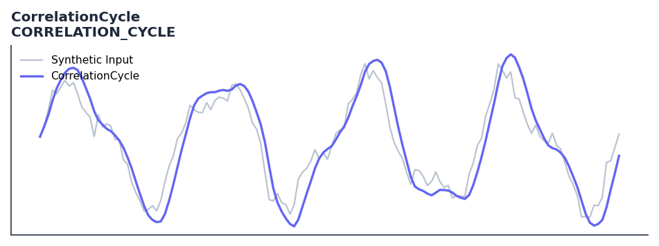

# CorrelationCycle

<div class="indicator-meta"><span class="category-badge">Ehlers DSP</span> <span class="kw-badge">cycle</span> <span class="kw-badge">dominant-cycle</span> <span class="kw-badge">ehlers</span> <span class="kw-badge">dsp</span> <span class="kw-badge">spectral</span></div>

Determines cycle phase angle by correlating price with orthogonal sinusoids.

## Visual Example



*Synthetic ideal per library logic. Generated 2026-06-25 IST via `docs/generate_all_previews.py` (reproducible; maps to core `Next<T>` implementation).*

## Description

Determines cycle phase angle by correlating price with orthogonal sinusoids.

Use to measure the dominant cycle period via autocorrelation in an amplitude-independent way. Prefer over DFT methods when price amplitude varies significantly across the measurement window.

Ehlers introduces Correlation Cycle measurement in Cycle Analytics for Traders (2013) as an improvement on DFT. By normalizing autocorrelation coefficients to unity variance, the resulting periodogram is independent of price amplitude variations, producing more consistent cycle period estimates.

QuantWave implements this indicator via the universal `Next<T>` trait, guaranteeing bit-identical results between Rust streaming, Python streaming, and Polars batch (`.ta()` / `map_batches`) surfaces.

## Formula / Specification

**Implementation** (`quantwave-core/src/indicators/correlation_cycle.rs`):

\[
R = \text{Corr}(Price, \cos(2\pi n/P)), I = \text{Corr}(Price, -\sin(2\pi n/P))
\]
\[
\text{Angle} = 90 + \arctan(R/I) \text{ (with quadrant resolution)}
\]

Gold-standard parity vectors: `quantwave-core/tests/gold_standard/correlation_cycle.json`.


## Parameters

| Parameter | Default | Description |
|-----------|---------|-------------|
| `period` | 20 | Correlation wavelength |


## Usage Examples

**Streaming (Rust)**

```rust
use quantwave_core::indicators::CORRELATION_CYCLE;
use quantwave_core::traits::Next;

let mut ind = CORRELATION_CYCLE::new(20);
for price in &prices {
    let value = ind.next(price);
}
```

**Streaming (Python)**

```python
from quantwave import CORRELATION_CYCLE

ind = CORRELATION_CYCLE(20)
for price in prices:
    value = ind.next(price)
```

**Polars Batch (Python)**

```python
import polars as pl
import quantwave as qw

def apply_correlationcycle(series: pl.Series) -> pl.Series:
    ind = qw.CORRELATION_CYCLE(20)
    return pl.Series([ind.next(float(v)) for v in series.to_list()])

df = (
    pl.read_csv('ohlcv.csv')
    .lazy()
    .with_columns(
        pl.col("close").map_batches(apply_correlationcycle, return_dtype=pl.Float64).alias("correlationcycle")
    )
    .collect()
)
```

All surfaces are bit-identical via the single `Next<T>` implementation and proptests.

## Edge Cases & Limitations

- Recursive DSP filters require a warm-up period; first N bars may be unstable or raw-pass-through.
- Designed for cyclic/mean-reverting regimes; trending markets can produce lag or drift.
- Parameter `period` (or equivalent) controls cutoff — too small adds noise, too large adds lag.
- Prefer chaining with other Ehlers tools (Roofing Filter, SuperSmoother) on noisy inputs.
- Validated via proptests against gold-standard vectors where available.
- No look-ahead bias; suitable for live streaming and batch feature pipelines.

## Related Indicators & See Also

- [Indicator Gallery](../gallery.md)
- [Native Indicators index](index.md)
- [Ehlers DSP guide](../ehlers/index.md)
- [Cyber Cycle](cyber_cycle.md)
- [SuperSmoother](supersmoother.md)

## Sources & References

**Primary Source**: https://github.com/lavs9/quantwave/blob/main/references/Ehlers%20Papers/CORRELATION%20AS%20A%20CYCLE%20INDICATOR.pdf

**Implementation**: `quantwave-core/src/indicators/correlation_cycle.rs` (`CORRELATION_CYCLE` / `CORRELATION_CYCLE_METADATA`).
**Parity**: `quantwave-core/tests/gold_standard/correlation_cycle.json`

**Provenance**: Standards bulk upgrade 2026-06-25 IST — see `docs/DOCUMENTATION_STANDARDS.md`.
