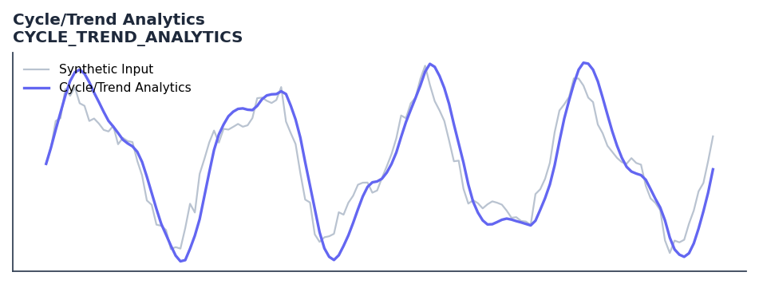

# Cycle/Trend Analytics

<div class="indicator-meta"><span class="category-badge">Ehlers DSP</span> <span class="kw-badge">cycle</span> <span class="kw-badge">trend</span> <span class="kw-badge">ehlers</span> <span class="kw-badge">classification</span> <span class="kw-badge">adaptive</span></div>

A set of oscillators (Price - SMA) with lengths from 5 to 30 used to visualize cycles and trends.

## Visual Example



*Synthetic ideal per library logic. Generated 2026-07-01 IST via `docs/generate_all_previews.py` (reproducible; maps to core `Next<T>` implementation).*

## Description

A set of oscillators (Price - SMA) with lengths from 5 to 30 used to visualize cycles and trends.

Use to classify the current market mode as trending or cycling before selecting your strategy. Apply trend-following systems in trend mode and mean-reversion systems in cycle mode.

Part of QuantWave's Ehlers digital signal processing suite. Designed for low-lag cycle and trend work — pair with Roofing Filter or SuperSmoother on noisy inputs.

Ehlers presents Cycle/Trend Analytics in Cycle Analytics for Traders as a framework for determining the dominant market mode. By measuring the correlation between price and the best-fit dominant cycle, the indicator classifies market behavior, enabling traders to switch between trend and cycle trading strategies dynamically.

**Typical applications:**

- Use for cycle timing in mean-reverting regimes
- Gate with Hurst exponent or ADX before taking cycle signals
- Allow `5`+ bars warm-up for filter state to stabilise
- Chain with Roofing Filter when input is noisy

QuantWave implements this via the universal `Next<T>` trait — bit-identical across Rust streaming, Python streaming, and Polars `.ta()` batch plugins.

## Formula / Specification

**Implementation** (`quantwave-core/src/indicators/cycle_trend_analytics.rs`):

\[
Osc(L) = Price - SMA(Price, L) \quad \text{for } L \in [min, max]
\]

Gold-standard parity vectors: `quantwave-core/tests/gold_standard/cycle_trend_analytics.json`.


## Parameters

| Parameter | Default | Description |
|-----------|---------|-------------|
| `min_length` | 5 | Minimum SMA length |
| `max_length` | 30 | Maximum SMA length |


## Usage Examples

**Streaming (Rust)**

```rust
use quantwave_core::indicators::CYCLE_TREND_ANALYTICS;
use quantwave_core::traits::Next;

let mut ind = CYCLE_TREND_ANALYTICS::new(5);
for price in &prices {
    let value = ind.next(price);
}
```

**Streaming (Python)**

```python
from quantwave import CYCLE_TREND_ANALYTICS

ind = CYCLE_TREND_ANALYTICS(5)
for price in prices:
    value = ind.next(price)
```

**Polars Batch (Python)**

```python
import polars as pl
import quantwave as qw

def apply_cycle_trend_analytics(series: pl.Series) -> pl.Series:
    ind = qw.CYCLE_TREND_ANALYTICS(5)
    return pl.Series([ind.next(float(v)) for v in series.to_list()])

df = (
    pl.read_csv('ohlcv.csv')
    .lazy()
    .with_columns(
        pl.col("close").map_batches(apply_cycle_trend_analytics, return_dtype=pl.Float64).alias("cycle_trend_analytics")
    )
    .collect()
)
```

All surfaces are bit-identical via the single `Next<T>` implementation and proptests.

## Edge Cases & Limitations

- Recursive DSP filters require a warm-up period; first N bars may be unstable or raw-pass-through.
- Designed for cyclic/mean-reverting regimes; trending markets can produce lag or drift.
- Parameter `period` (or equivalent) controls cutoff — too small adds noise, too large adds lag.
- Prefer chaining with other Ehlers tools (Roofing Filter, SuperSmoother) on noisy inputs.
- Validated via proptests against gold-standard vectors where available.
- No look-ahead bias; suitable for live streaming and batch feature pipelines.

## Boundary Behavior

| Condition | Behavior |
|-----------|----------|
| Warm-up | Leading bars return NaN until warmup_bars is satisfied. |
| period > len | When period exceeds series length, output is all NaN. |
| NaN inputs | NaN in input propagates to output (NaN out). |
| Invalid params | Non-positive period or missing required params raise ValueError. |
| Empty data | Empty input returns an empty result series. |

## Related Indicators & See Also

- [Indicator Gallery](../gallery.md)
- [Native Indicators index](index.md)
- [Ehlers DSP guide](../ehlers/index.md)
- [Cyber Cycle](cyber_cycle.md)
- [SuperSmoother](supersmoother.md)

## Sources & References

**Primary Source**: https://github.com/lavs9/quantwave/blob/main/references/traderstipsreference/TRADERS’ TIPS - OCTOBER 2021.html

**Implementation**: `quantwave-core/src/indicators/cycle_trend_analytics.rs` (`CYCLE_TREND_ANALYTICS` / `CYCLE_TREND_ANALYTICS_METADATA`).
**Parity**: `quantwave-core/tests/gold_standard/cycle_trend_analytics.json`

**Provenance**: Standards bulk upgrade 2026-07-01 IST — see `docs/DOCUMENTATION_STANDARDS.md`.
