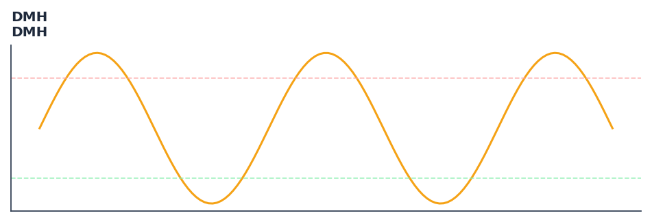

# DMH

<div class="indicator-meta"><span class="category-badge">Ehlers DSP</span> <span class="kw-badge">momentum</span> <span class="kw-badge">oscillator</span> <span class="kw-badge">ehlers</span> <span class="kw-badge">high-pass</span> <span class="kw-badge">dsp</span></div>

An improved Directional Movement indicator using Hann windowing for smoother signals and reduced lag.

## Visual Example



*Synthetic ideal per library logic. Generated 2026-06-25 IST via `docs/generate_all_previews.py` (reproducible; maps to core `Next<T>` implementation).*

## Description

An improved Directional Movement indicator using Hann windowing for smoother signals and reduced lag.

Use as a momentum oscillator with high-pass filtering to isolate cyclical momentum while removing the trend bias that corrupts standard momentum indicators.

Ehlers constructs the DMH by applying a high-pass filter to the momentum calculation, removing the low-frequency trend component that causes conventional momentum to drift. The result is a zero-centered momentum oscillator that oscillates cleanly around the cycle midpoint.

QuantWave implements this indicator via the universal `Next<T>` trait, guaranteeing bit-identical results between Rust streaming, Python streaming, and Polars batch (`.ta()` / `map_batches`) surfaces.

## Formula / Specification

**Implementation** (`quantwave-core/src/indicators/dmh.rs`):

\[
\text{PlusDM} = \text{High} - \text{High}_{t-1} \text{ if } > (\text{Low}_{t-1} - \text{Low}) \text{ and } > 0, \text{ else } 0
\]
\[
\text{MinusDM} = \text{Low}_{t-1} - \text{Low} \text{ if } > (\text{High} - \text{High}_{t-1}) \text{ and } > 0, \text{ else } 0
\]
\[
\text{EMA} = \frac{1}{L}(\text{PlusDM} - \text{MinusDM}) + (1 - \frac{1}{L})\text{EMA}_{t-1}
\]
\[
\text{DMH} = \frac{\sum_{i=1}^{L} w_i \text{EMA}_{t-i+1}}{\sum_{i=1}^{L} w_i}, \text{ where } w_i = 1 - \cos\left(\frac{2\pi i}{L+1}\right)
\]

Gold-standard parity vectors: `quantwave-core/tests/gold_standard/dmh.json`.


## Parameters

| Parameter | Default | Description |
|-----------|---------|-------------|
| `length` | 14 | Smoothing period |


## Usage Examples

**Streaming (Rust)**

```rust
use quantwave_core::indicators::DMH;
use quantwave_core::traits::Next;

let mut ind = DMH::new(14);
for price in &prices {
    let value = ind.next(price);
}
```

**Streaming (Python)**

```python
from quantwave import DMH

ind = DMH(14)
for price in prices:
    value = ind.next(price)
```

**Polars Batch (Python)**

```python
import polars as pl
import quantwave as qw

def apply_dmh(series: pl.Series) -> pl.Series:
    ind = qw.DMH(14)
    return pl.Series([ind.next(float(v)) for v in series.to_list()])

df = (
    pl.read_csv('ohlcv.csv')
    .lazy()
    .with_columns(
        pl.col("close").map_batches(apply_dmh, return_dtype=pl.Float64).alias("dmh")
    )
    .collect()
)
```

All surfaces are bit-identical via the single `Next<T>` implementation and proptests.

## Edge Cases & Limitations

- Recursive DSP filters require a warm-up period; first N bars may be unstable or raw-pass-through.
- Designed for cyclic/mean-reverting regimes; trending markets can produce lag or drift.
- Parameter `period` (or equivalent) controls cutoff — too small adds noise, too large adds lag.
- Prefer chaining with other Ehlers tools (Roofing Filter, SuperSmoother) on noisy inputs.
- Validated via proptests against gold-standard vectors where available.
- No look-ahead bias; suitable for live streaming and batch feature pipelines.

## Related Indicators & See Also

- [Indicator Gallery](../gallery.md)
- [Native Indicators index](index.md)
- [Ehlers DSP guide](../ehlers/index.md)
- [Cyber Cycle](cyber_cycle.md)
- [SuperSmoother](supersmoother.md)

## Sources & References

**Primary Source**: https://github.com/lavs9/quantwave/blob/main/references/traderstipsreference/implemented/TRADERS%E2%80%99%20TIPS%20-%20DECEMBER%202021.html

**Implementation**: `quantwave-core/src/indicators/dmh.rs` (`DMH` / `DMH_METADATA`).
**Parity**: `quantwave-core/tests/gold_standard/dmh.json`

**Provenance**: Standards bulk upgrade 2026-06-25 IST — see `docs/DOCUMENTATION_STANDARDS.md`.
