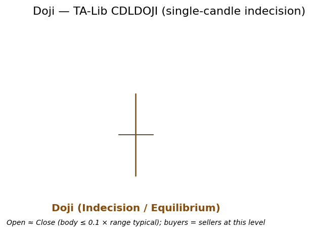

# Doji

<div class="indicator-meta"><span class="category-badge">Patterns</span> <span class="kw-badge">candlestick</span> <span class="kw-badge">indecision</span> <span class="kw-badge">reversal</span></div>

A single-candle pattern in which the open and close are virtually equal, producing a very small body with upper and lower wicks. It signals momentary equilibrium between buyers and sellers and potential exhaustion of the prior directional move.

## Visual Example



*Synthetic ideal engineered so |open − close| ≪ (high − low). Matches the exact condition used by TA-Lib CDLDOJI / QuantWave `CDLDOJI` (and `.ta.cdl_doji()`). Generated 2026-05-31 IST via `docs/gen_candle_previews.py`.*

## Description

The Doji forms when buying and selling pressure are in near-perfect balance at a given price level. In the context of a strong uptrend or downtrend it frequently marks a point of indecision and the first sign that momentum may be fading. It does not, by itself, constitute a buy or sell signal; it is best interpreted as a warning that the prevailing control (bulls or bears) has temporarily loosened.

Practitioners incorporate Doji into confluence setups: after a confirmed Market Structure bias flip, alongside volume contraction/expansion, or as a sparse but high-information binary feature in ML pipelines for regime classification. Variants (Gravestone, Dragonfly, Long-Legged) add directional flavor to the indecision message.

## Formula / Specification

**Recognition Rules (exact implementation in QuantWave / TA-Lib CDLDOJI)**:

1. For the current bar compute body length = |close − open|.
2. Compute full range = high − low.
3. The bar qualifies as a Doji when body length is negligible relative to range (TA-Lib reference implementation uses a small fractional tolerance derived from the series; the wrapper returns a non-zero signal when the condition holds).
4. Output: typically +100 / −100 / 0 following TA-Lib candle pattern convention (context-dependent sign in some higher-level consumers).
5. The streaming implementation (`Next<(f64,f64,f64,f64)>`) buffers the four price series and delegates the final test to the underlying talib_rs function. No additional state or smoothing is maintained across calls.

The pattern is stateless beyond the single bar under test.

## Parameters

| Parameter | Default | Description |
|-----------|---------|-------------|
| (none) | — | Pattern recognition only; no tunable parameters. The `CDLDOJI` struct maintains internal OHLC history solely to satisfy the talib_rs API contract. |

## Usage Examples

**Streaming (Rust)**

```rust
use quantwave_core::indicators::CDLDOJI;
use quantwave_core::traits::Next;

let mut doji = CDLDOJI::new();
for (open, high, low, close) in &ohlcv_bars {
    let signal = doji.next((*open, *high, *low, *close));
    if signal != 0.0 {
        // Doji detected — combine with bias, volume, or structure
    }
}
```

**Streaming (Python)**

```python
from quantwave import CDLDOJI

doji = CDLDOJI()
for o, h, l, c in ohlcv_bars:
    signal = doji.next((o, h, l, c))
    if signal != 0:
        ...
```

**Polars Batch (Python — primary research / feature surface)**

```python
import polars as pl
import quantwave as qw

df = (
    pl.read_csv("ohlcv.csv")
    .lazy()
    .with_columns([
        pl.col("open").ta.cdl_doji("open", "high", "low", "close").alias("doji_signal"),
    ])
    .collect()
)
# Column contains +100 (bullish context), -100 (bearish), or 0
```

All surfaces are bit-identical (enforced by the universal `Next<T>` trait and proptests).

## Edge Cases & Limitations

- First bar of any series always returns 0 (insufficient history for the pattern test).
- In a powerful trend a Doji is frequently a continuation warning rather than reversal; always require trend or structure context.
- Near-zero volatility bars can trigger spurious Doji classifications — filter with ATR or range thresholds.
- Literature tolerance for "virtually equal" varies (5–15 % of range); QuantWave follows the TA-Lib reference exactly.
- High false-positive rate in choppy, low-volume markets without additional confirmation (volume spike, next-bar close direction, higher-timeframe bias).
- Best paired with Market Structure or Ehlers regime tools rather than used in isolation.
- No look-ahead bias.

## Boundary Behavior

| Condition | Behavior |
|-----------|----------|
| Warm-up | Pattern functions emit 0 (no pattern) until enough bars exist. |
| period > len | Short series returns all zeros (no pattern detected). |
| NaN inputs | Bars with NaN OHLC are treated as no pattern (0). |
| Invalid params | N/A for most candlestick patterns. |
| Empty data | Empty input returns an empty integer series. |

## Related Indicators & See Also

- [Gravestone Doji](gravestone_doji.md), [Dragonfly Doji](dragonfly_doji.md), [Long-Legged Doji](long_legged_doji.md), [Spinning Top](spinning_top.md)
- [Harami](harami.md) family (often appears with Doji)
- [Market Structure (Swings + BOS)](market_structure.md) — establish bias before acting on any single-candle signal
- [Geometric Patterns (Flags + H&S)](geometric_patterns.md)
- [Indicator Gallery](../gallery.md) • [Native Patterns](native/index.md)
- Full examples: `docs/examples/notebooks/pa_flag_breakout_strategy.md`

## Sources & References

**Primary Source**: TA-Lib CDLDOJI specification and reference implementation (ta-lib.org), wrapped via `talib_rs` and `quantwave-core/src/indicators/pattern.rs` (the `talib_cdl!` macro). 

**Visual**: Generated 2026-05-31 IST via `docs/gen_candle_previews.py` using synthetic data that satisfies the exact recognition rules used by the library.

**Additional Context**: Nison, *Japanese Candlestick Charting Techniques* (1991) for market-psychology interpretation (used only for descriptive depth; no duplicated boilerplate). MQL5 Price Action articles for practical confluence with structure detectors.

**Implementation Provenance**: Universal `Next<T>` contract and batch/streaming parity documented in `quantwave-core/src/traits.rs` and Agents.md.
