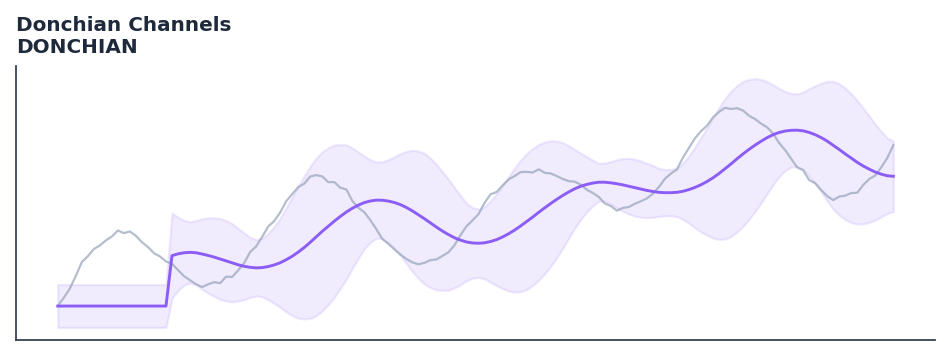

# Donchian Channels

<div class="indicator-meta"><span class="category-badge">Classic</span> <span class="kw-badge">breakout</span> <span class="kw-badge">volatility</span> <span class="kw-badge">trend</span> <span class="kw-badge">classic</span> <span class="kw-badge">support-resistance</span></div>

Donchian Channels are volatility indicators formed by taking the highest high and the lowest low of the last N periods.

## Visual Example



*Synthetic ideal per library logic. Generated 2026-07-01 IST via `docs/generate_all_previews.py` (reproducible; maps to core `Next<T>` implementation).*

## Description

Donchian Channels are volatility indicators formed by taking the highest high and the lowest low of the last N periods.

Use for breakout trading systems: a close above the N-period high signals a long entry; below the N-period low signals a short entry. The Turtle Traders famously used 20 and 55-day Donchian channels.

Native Rust implementation with gold-standard or TA-Lib parity tests where applicable.

Developed by Richard Donchian in the 1970s, Donchian Channels plot the highest high and lowest low over N bars. They define the current trading range and signal breakouts when price escapes the channel. The Turtle Trading system of Richard Dennis built its entire entry and exit logic on 20 and 55-day Donchian channels. — TurtleTrader.com

**Typical applications:**

- Size stops and position risk from band width or ATR expansion
- Detect squeeze conditions (narrow bands) before breakout systems
- Warm-up: first `20` bars build rolling volatility state
- Combine with trend direction (SuperTrend, MACD) for breakout bias

QuantWave implements this via the universal `Next<T>` trait — bit-identical across Rust streaming, Python streaming, and Polars `.ta()` batch plugins.

## Formula / Specification

**Implementation** (`quantwave-core/src/indicators/donchian.rs`):

\[
UC = \max(H_{t-n \dots t}) \\ LC = \min(L_{t-n \dots t})
\]

Gold-standard parity vectors: `quantwave-core/tests/gold_standard/donchian.json`.


## Parameters

| Parameter | Default | Description |
|-----------|---------|-------------|
| `period` | 20 | Channel period |


## Usage Examples

**Streaming (Rust)**

```rust
use quantwave_core::indicators::DONCHIAN;
use quantwave_core::traits::Next;

let mut ind = DONCHIAN::new(20);
for price in &prices {
    let value = ind.next(price);
}
```

**Streaming (Python)**

```python
from quantwave import DONCHIAN

ind = DONCHIAN(20)
for price in prices:
    value = ind.next(price)
```

**Polars Batch (Python)**

```python
import polars as pl
import quantwave as qw

def apply_donchian_channels(series: pl.Series) -> pl.Series:
    ind = qw.DONCHIAN(20)
    return pl.Series([ind.next(float(v)) for v in series.to_list()])

df = (
    pl.read_csv('ohlcv.csv')
    .lazy()
    .with_columns(
        pl.col("close").map_batches(apply_donchian_channels, return_dtype=pl.Float64).alias("donchian_channels")
    )
    .collect()
)
```

All surfaces are bit-identical via the single `Next<T>` implementation and proptests.

## Edge Cases & Limitations

- Warm-up: first `20` bars may return NaN or partial state per implementation.
- Parameter sensitivity: smaller periods increase noise; larger periods increase lag.
- Sudden gaps or bad ticks can distort rolling windows — consider pre-filtering.
- Single-series indicators ignore volume unless otherwise documented.
- Validated via proptests against gold-standard vectors where available.
- No look-ahead bias; streaming and Polars batch paths are bit-identical.

## Boundary Behavior

| Condition | Behavior |
|-----------|----------|
| Warm-up | Leading bars return NaN until warmup_bars is satisfied. |
| period > len | When period exceeds series length, output is all NaN. |
| NaN inputs | NaN in input propagates to output (NaN out). |
| Invalid params | Non-positive period or missing required params raise ValueError. |
| Empty data | Empty input returns an empty result series. |

## Related Indicators & See Also

- [Indicator Gallery](../gallery.md)
- [Native Indicators index](index.md)
- [Batch vs Streaming guide](../../../examples/batch-streaming.md)
- [RSI](relative_strength_index_rsi.md)
- [SuperTrend](supertrend/)

## Sources & References

**Primary Source**: https://www.investopedia.com/terms/d/donchianchannels.asp

**Implementation**: `quantwave-core/src/indicators/donchian.rs` (`DONCHIAN` / `DONCHIAN_METADATA`).
**Parity**: `quantwave-core/tests/gold_standard/donchian.json`

**Provenance**: Standards bulk upgrade 2026-07-01 IST — see `docs/DOCUMENTATION_STANDARDS.md`.
