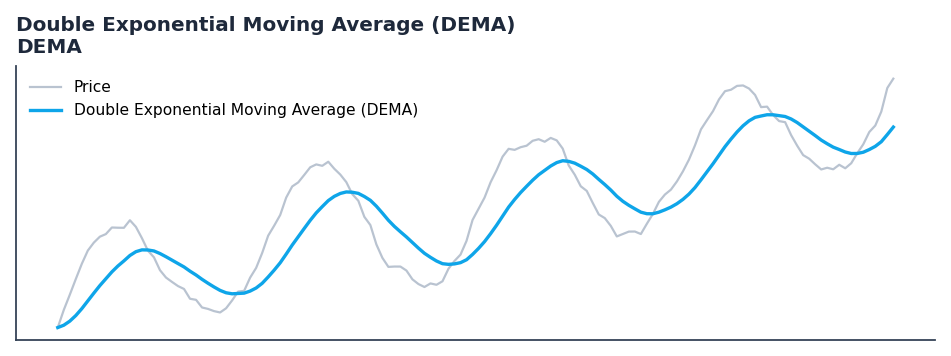

# Double Exponential Moving Average (DEMA)

<div class="indicator-meta"><span class="category-badge">Classic</span> <span class="kw-badge">moving-average</span> <span class="kw-badge">smoothing</span> <span class="kw-badge">lag-reduction</span> <span class="kw-badge">classic</span></div>

A fast-acting moving average that reduces lag by using two exponential moving averages.

## Visual Example



*Synthetic ideal per library logic. Generated 2026-07-01 IST via `docs/generate_all_previews.py` (reproducible; maps to core `Next<T>` implementation).*

## Description

A fast-acting moving average that reduces lag by using two exponential moving averages.

Use as a replacement for EMA when faster signal generation is required without excessive noise. DEMA reacts more quickly to price changes than a standard EMA.

Native Rust implementation with gold-standard or TA-Lib parity tests where applicable.

Developed by Patrick Mulloy in 1994, DEMA provides a less-laggy alternative to traditional moving averages. It is calculated by taking a single EMA and then subtracting it from a double EMA of the same period. This effectively cancels out some of the lag inherent in the EMA calculation. — StockCharts ChartSchool

**Typical applications:**

- Trend filter or signal line for systematic entries
- Default lookback `30` — tune per asset volatility
- Cross with faster oscillator for entry timing
- Streaming and Polars paths are bit-identical for production parity

QuantWave implements this via the universal `Next<T>` trait — bit-identical across Rust streaming, Python streaming, and Polars `.ta()` batch plugins.

## Formula / Specification

**Implementation** (`quantwave-core/src/indicators/overlap.rs`):

\[
DEMA = 2 \times EMA - EMA(EMA)
\]

Gold-standard parity vectors: `quantwave-core/tests/gold_standard/dema.json`.


## Parameters

| Parameter | Default | Description |
|-----------|---------|-------------|
| `timeperiod` | 30 | Smoothing period |


## Usage Examples

**Streaming (Rust)**

```rust
use quantwave_core::indicators::DEMA;
use quantwave_core::traits::Next;

let mut ind = DEMA::new(30);
for price in &prices {
    let value = ind.next(price);
}
```

**Streaming (Python)**

```python
from quantwave import DEMA

ind = DEMA(30)
for price in prices:
    value = ind.next(price)
```

**Polars Batch (Python)**

```python
import polars as pl
import quantwave  # registers pl.col().ta

df = (
    pl.read_csv('ohlcv.csv')
    .lazy()
    .with_columns(
        pl.col("close").ta.dema(30).alias("double_exponential_moving_average_dema")
    )
    .collect()
)
```

All surfaces are bit-identical via the single `Next<T>` implementation and proptests.

## Edge Cases & Limitations

- Warm-up: first `30` bars may return NaN or partial state per implementation.
- Parameter sensitivity: smaller periods increase noise; larger periods increase lag.
- Sudden gaps or bad ticks can distort rolling windows — consider pre-filtering.
- Single-series indicators ignore volume unless otherwise documented.
- Validated via proptests against gold-standard vectors where available.
- No look-ahead bias; streaming and Polars batch paths are bit-identical.

## Boundary Behavior

| Condition | Behavior |
|-----------|----------|
| Warm-up | Leading bars return NaN until warmup_bars is satisfied. |
| period > len | When period exceeds series length, output is all NaN. |
| NaN inputs | NaN in input propagates to output (NaN out). |
| Invalid params | Non-positive period or missing required params raise ValueError. |
| Empty data | Empty input returns an empty result series. |

## Related Indicators & See Also

- [Indicator Gallery](../gallery.md)
- [Native Indicators index](index.md)
- [Batch vs Streaming guide](../../../examples/batch-streaming.md)
- [RSI](relative_strength_index_rsi.md)
- [SuperTrend](../supertrend/)

## Sources & References

**Primary Source**: https://www.investopedia.com/terms/d/double-exponential-moving-average.asp

**Implementation**: `quantwave-core/src/indicators/overlap.rs` (`DEMA` / `DEMA_METADATA`).
**Parity**: `quantwave-core/tests/gold_standard/dema.json`

**Provenance**: Standards bulk upgrade 2026-07-01 IST — see `docs/DOCUMENTATION_STANDARDS.md`.
