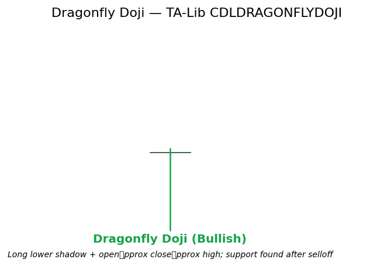

# Dragonfly Doji

Patterns candlestick indecision bullish

A Doji variant with a long lower wick, a very small body located near the high of the range, and little or no upper wick. It records a successful defense of lower prices and carries bullish implications after a decline.

## Visual Example

*Synthetic ideal matching TA-Lib CDLDRAGONFLYDOJI (long lower shadow + open\approx close\approx high). Generated 2026-05-31 IST via `docs/gen_candle_previews.py`.*

## Description

The Dragonfly Doji appears when sellers drive price sharply lower during the session but buyers step in aggressively and push the close back near the open/high. The long lower shadow is the visual footprint of that successful defense.

Most powerful after a downtrend or at support. As with all single-candle patterns, confirmation (next bar close above the Dragonfly high) is required for high-confidence use. It serves as an excellent sparse feature in ML models that already ingest Market Structure bias or Ehlers cycle regime.

## Formula / Specification

**Recognition Rules (exact implementation in QuantWave / TA-Lib CDLDRAGONFLYDOJI)**:

1. Body length negligible (Doji condition).
2. Lower shadow (min(open, close) − low) long relative to body/range.
3. Upper shadow (high − max(open, close)) negligible.
4. Output follows TA-Lib convention.
5. Single-bar stateless recognition after history buffering.

## Parameters

| Parameter | Default | Description |
|-----------|---------|-------------|
| (none) | — | Pattern recognition only; no tunable parameters. |

## Usage Examples

(Identical surface examples as Doji/Gravestone, substituting `CDLDRAGONFLYDOJI` / `.ta.cdl_dragonflydoji(...)`.)

**Streaming (Rust / Python / Polars)** — see Doji page for pattern; only the type/column name changes. Bit-identical parity holds.

## Edge Cases & Limitations

- First bar yields 0.
- Can be ignored in strong downtrends without confirmation.
- Low-range bars distort shadow significance; use ATR filter.
- Highest edge when occurring at structure support after established bearish bias.
- Confirmation bar strongly advised.

## Related Indicators & See Also

- [Doji](doji.md), [Gravestone Doji](gravestone_doji.md), [Hammer](hammer.md), [Takuri](takuri.md)
- [Market Structure](market_structure.md), [S/R Interactions](sr_monitor.md)
- Gallery, native index, PA strategy notebook

## Sources & References

**Primary Source**: TA-Lib CDLDRAGONFLYDOJI via `quantwave-core/src/indicators/pattern.rs`.

**Visual**: `docs/gen_candle_previews.py` 2026-05-31 IST.

**Context**: Nison (1991) psychology only; MQL5 PA for confluence usage.

**Provenance**: `Next<T>` + Polars parity contract.
