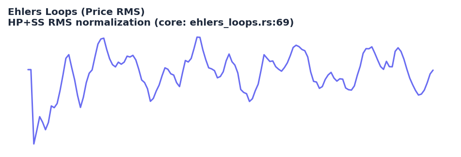

# Ehlers Loops

<div class="indicator-meta"><span class="category-badge">Ehlers DSP</span> <span class="kw-badge">cycle</span> <span class="kw-badge">phase</span> <span class="kw-badge">ehlers</span> <span class="kw-badge">dsp</span> <span class="kw-badge">visualization</span></div>

Converts price (and optionally volume) into RMS-normalized units via a high-pass + SuperSmoother cascade. Plotting the resulting series against its derivative (or price-RMS vs vol-RMS) produces characteristic "loops" in phase space that reveal cycle regime and turning points visually before they are obvious in the price chart.

## Visual Example



*Synthetic ideal price series with strong cycle component. The RMS normalization (HP Butterworth + SuperSmoother + running mean-square) matches the NormalizedRoofing internal struct and RMS output in `quantwave-core/src/indicators/ehlers_loops.rs` (lines 69-140+). Generated 2026-05-31 IST via `docs/gen_indicator_previews.py`.*

## Description

Ehlers Loops are a visualization and analysis technique rather than a single scalar trading signal. By normalizing price and volume into units of standard deviation (RMS) after removing trend with a high-pass filter and smoothing with a SuperSmoother, the resulting time series have stable statistical properties. When you plot the normalized price against its rate-of-change (or against normalized volume), the trajectory traces elliptical loops while the market is in a clean cycle regime. When a trend dominates, the loops collapse into a straight line or narrow band.

The indicator is primarily used for discretionary regime identification, for building custom scatter-plot features in ML pipelines, and as a diagnostic when tuning other Ehlers DSP parameters. The core `EhlersLoops` struct returns the price-RMS series (volume-RMS is computed identically on a separate channel). All computation is causal and participates in the universal parity contract.

## Formula / Specification

**Exact implementation in QuantWave** (`quantwave-core/src/indicators/ehlers_loops.rs`):

The `NormalizedRoofing` helper (used for both price and volume channels) implements:

1. 2-pole Butterworth high-pass (period = hp_period) with exact coefficients:
   `hpc1, hpc2, hpc3` derived from `exp(−1.414·π / hp)` and cosine term.
2. 2-pole SuperSmoother low-pass (period = lp_period) with analogous `ssc*` coefficients.
3. Recursive HP and SS state (order-2 histories).
4. Running mean-square `MS = α·SS² + (1−α)·MS` (α typically small).
5. Output `RMS = SS / √MS` (guarded against zero).

The public `EhlersLoops` maintains separate normalizers for price and volume and exposes the price RMS (volume RMS available via the same math).

## Parameters

| Parameter  | Default | Description |
|------------|---------|-------------|
| `lp_period`| 20      | Low-pass (SuperSmoother) period for the final smoothing stage. |
| `hp_period`| 125     | High-pass (Butterworth) period used to remove trend before normalization. |

## Usage Examples

**Streaming (Rust)**

```rust
use quantwave_core::indicators::EhlersLoops;
use quantwave_core::traits::Next;

let mut loops = EhlersLoops::new(20, 125);
for price in price_series {
    let rms = loops.next(price);  // price RMS; volume path separate if needed
    // Plot rms vs its derivative or feed to custom phase feature
}
```

**Streaming (Python)**

```python
from quantwave import EhlersLoops

loops = EhlersLoops(20, 125)
for price in price_series:
    rms = loops.next(price)
```

**Polars Batch (Python — primary research / feature surface)**

```python
import polars as pl
import quantwave as qw

def ehlers_loops_expr(col: str, lp=20, hp=125):
    el = qw.EhlersLoops(lp, hp)
    def _apply(s: pl.Series) -> pl.Series:
        return pl.Series([el.next(float(v)) for v in s.to_list()])
    return pl.col(col).map_batches(_apply, return_dtype=pl.Float64)

df = (
    pl.read_csv("ohlcv.csv")
    .lazy()
    .with_columns([ehlers_loops_expr("close").alias("price_rms")])
    .collect()
)
```

## Edge Cases & Limitations

- The first several bars return 0 while the order-2 filter states fill.
- In extremely low-volatility regimes MS can approach zero, producing large RMS spikes (implementation guards exist).
- The visualization power is highest when you actually render the phase plot (price-RMS vs d(RMS)/dt or vs vol-RMS); the scalar series alone is only an intermediate.
- hp_period = 125 is a long-term trend remover; shorter values leak trend into the loops and distort the ellipse geometry.
- Primarily a diagnostic and feature-engineering tool; it does not emit discrete buy/sell signals by itself.
- Volume channel (when used) must be supplied separately to a second instance or via the full struct API.
- No look-ahead bias; fully causal.

## Related Indicators & See Also

- [Cyber Cycle](cyber_cycle.md), [Homodyne Discriminator](homodyne_discriminator.md) — other tools for measuring dominant cycle and regime
- [Market Structure](market_structure.md) — combine loop shape with confirmed BOS for high-conviction regime calls
- [Indicator Gallery](../gallery.md) • [Native Indicators](native/index.md)
- Ehlers Loops are discussed in the June 2022 Traders' Tips and in *Cycle Analytics for Traders*.

## Sources & References

**Primary Source**: `quantwave-core/src/indicators/ehlers_loops.rs` (EHLERS_LOOPS_METADATA + NormalizedRoofing internals + proptest parity). Formula source: https://github.com/lavs9/quantwave/blob/main/references/traderstipsreference/TRADERS’%20TIPS%20-%20JUNE%202022.html (Ehlers Loops, Traders' Tips June 2022).

**Visual**: Generated 2026-05-31 IST via `docs/gen_indicator_previews.py`.

**Additional Context**: John Ehlers, *Cybernetic Analysis for Stocks and Futures* (2004) — the original source of the phase-space loop concept for market regime identification.

**Implementation Provenance**: Single `Next<f64>` truth in the core file; Python and Polars surfaces are thin delegates.
