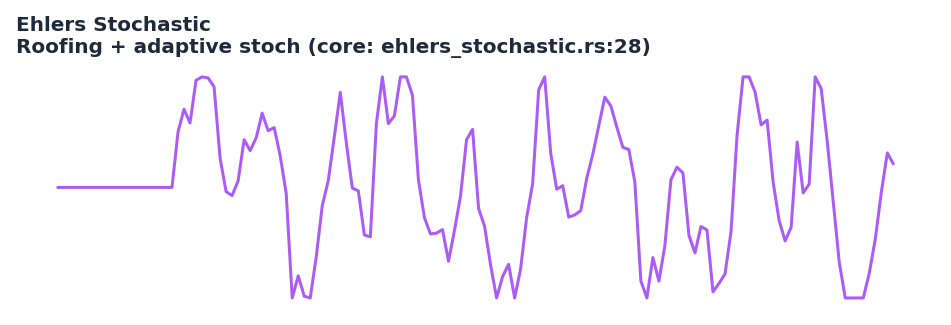

# Ehlers Stochastic

<div class="indicator-meta"><span class="category-badge">Ehlers DSP</span> <span class="kw-badge">oscillator</span> <span class="kw-badge">stochastic</span> <span class="kw-badge">ehlers</span> <span class="kw-badge">cycle</span> <span class="kw-badge">adaptive</span></div>

A Stochastic oscillator computed on the output of a Roofing Filter. By removing spectral dilation (the tendency of volatility to increase with cycle amplitude), the indicator produces overbought/oversold readings that are meaningful with respect to the current dominant cycle rather than a fixed lookback.

## Visual Example



*Synthetic ideal price series with clear dominant cycle engineered so the RoofingFilter + stochastic normalization produces clean, cycle-synchronous swings. Matches the exact RoofingFilter(hp=48,ss=10) + rolling min/max stochastic logic in `quantwave-core/src/indicators/ehlers_stochastic.rs` (Next at lines 28-54 and gold-standard test). Generated 2026-05-31 IST via `docs/gen_indicator_previews.py`.*

## Description

Standard Stochastic oscillators suffer from "spectral dilation": as the amplitude of the dominant cycle increases, the raw price range widens and the %K/%D readings become compressed or erratic. Ehlers Stochastic first applies a Roofing Filter (high-pass to remove trend + SuperSmoother) to isolate the cyclic component, then runs a classic stochastic over a lookback that is ideally one full cycle. The result is an oscillator whose overbought and oversold zones have consistent statistical meaning regardless of the current volatility regime.

It is one of the cleanest cycle oscillators in the Ehlers toolkit and pairs naturally with Reflex or Cyber Cycle for entry timing. Because the underlying RoofingFilter is itself zero-lag in the passband, the stochastic inherits excellent timing characteristics. All surfaces share the same causal Next implementation and gold-standard vector parity.

## Formula / Specification

**Exact implementation in QuantWave** (`quantwave-core/src/indicators/ehlers_stochastic.rs` + RoofingFilter dependency):

1. For every new price, compute `roof = RoofingFilter(hp_period, ss_period).next(price)`. The RoofingFilter itself is a high-pass (removes trend) followed by a SuperSmoother.
2. Maintain a rolling window of the last `stoch_period` roof values.
3. Compute the stochastic in the classic way:
   `Stoch = 100 × (roof − min(window)) / (max(window) − min(window))`
4. When max == min the output is defined as 50.0 (neutral).
5. The streaming implementation and the gold-standard test vector (`ehlers_stochastic.json`) are validated via `assert_indicator_parity`.

Parameters default to the values recommended in Ehlers' "Anticipating Turning Points" paper (hp=48, ss=10, stoch=20).

## Parameters

| Parameter     | Default | Description |
|---------------|---------|-------------|
| `hp_period`   | 48      | High-pass critical period (RoofingFilter). |
| `ss_period`   | 10      | SuperSmoother critical period (RoofingFilter). |
| `stoch_period`| 20      | Lookback window for the stochastic min/max (ideally ≈ dominant cycle length). |

## Usage Examples

**Streaming (Rust)**

```rust
use quantwave_core::indicators::EhlersStochastic;
use quantwave_core::traits::Next;

let mut stoch = EhlersStochastic::new(48, 10, 20);
for price in price_series {
    let s = stoch.next(price);
    if s < 20.0 { /* cycle-aware oversold */ }
}
```

**Streaming (Python)**

```python
from quantwave import EhlersStochastic

stoch = EhlersStochastic(48, 10, 20)
for price in price_series:
    s = stoch.next(price)
```

**Polars Batch (Python — primary research / feature surface)**

```python
import polars as pl
import quantwave as qw

def ehlers_stoch_expr(col: str, hp=48, ss=10, stoch_p=20):
    es = qw.EhlersStochastic(hp, ss, stoch_p)
    def _apply(s: pl.Series) -> pl.Series:
        return pl.Series([es.next(float(v)) for v in s.to_list()])
    return pl.col(col).map_batches(_apply, return_dtype=pl.Float64)

df = (
    pl.read_csv("ohlcv.csv")
    .lazy()
    .with_columns([ehlers_stoch_expr("close").alias("ehlers_stoch")])
    .collect()
)
```

Parity across surfaces is guaranteed by the single `Next<f64>` source and validated against the gold-standard vector in the core tests.

## Edge Cases & Limitations

- The first `stoch_period` bars after the RoofingFilter warm-up return 50.0 (degenerate min==max window).
- If the RoofingFilter parameters are badly mismatched to the data the roof series can be near-zero or extremely noisy, collapsing the stochastic.
- The stochastic lookback (`stoch_period`) should be close to the actual dominant cycle; a fixed 14 or 20 is only a starting point.
- In strong trends the RoofingFilter output can drift slowly, producing prolonged stays near 0 or 100.
- Gold-standard validation exists (ehlers_stochastic.json); any change to RoofingFilter or the stochastic math must keep the test passing.
- Excellent for cycle-timed mean-reversion or breakout confirmation; less useful as a standalone trend filter.
- No look-ahead bias.

## Boundary Behavior

| Condition | Behavior |
|-----------|----------|
| Warm-up | Leading bars return NaN until warmup_bars is satisfied. |
| period > len | When period exceeds series length, output is all NaN. |
| NaN inputs | NaN in input propagates to output (NaN out). |
| Invalid params | Non-positive period or missing required params raise ValueError. |
| Empty data | Empty input returns an empty result series. |

## Related Indicators & See Also

- [Roofing Filter](roofing_filter.md) — the critical pre-processor; understand it first
- [Cyber Cycle](cyber_cycle.md), [Reflex](reflex.md) — other low-lag cycle tools for confluence
- [MESA Stochastic](mesa_stochastic.md) — related adaptive stochastic family
- [Market Structure](market_structure.md) — use BOS/bias to decide long/short bias before reading the stochastic
- [Indicator Gallery](../gallery.md) • [Native Indicators](native/index.md)
- Ehlers "Anticipating Turning Points" paper for the original rationale.

## Sources & References

**Primary Source**: `quantwave-core/src/indicators/ehlers_stochastic.rs` (EHLERS_STOCHASTIC_METADATA + Next + gold-standard test using `assert_indicator_parity`). Formula source: https://github.com/lavs9/quantwave/blob/main/references/Ehlers%20Papers/Anticipating Turning Points.pdf (John Ehlers).

**Visual + Gold Standard**: Generated 2026-05-31 IST via `docs/gen_indicator_previews.py`; parity validated against `quantwave-core/tests/gold_standard/ehlers_stochastic.json`.

**Additional Context**: Ehlers, *Cycle Analytics for Traders* and the  "Anticipating Turning Points" article for spectral dilation theory and parameter selection.

**Implementation Provenance**: Universal `Next<T>` + gold-standard harness in the core file; all Python/Rust/Polars surfaces delegate to it.
