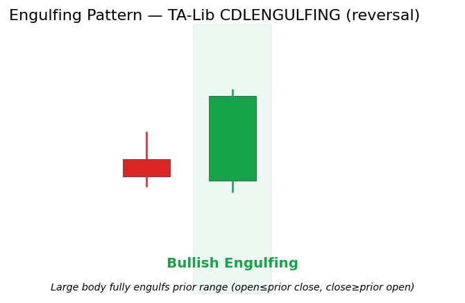

# Engulfing

<div class="indicator-meta"><span class="category-badge">Patterns</span> <span class="kw-badge">candlestick</span> <span class="kw-badge">reversal</span> <span class="kw-badge">momentum</span></div>

A two-candle reversal pattern in which a large candle body completely engulfs the entire range (or at minimum the body) of the preceding candle. It represents a decisive shift in control from one side to the other.

## Visual Example



*Synthetic ideal per TA-Lib CDLENGULFING body-containment rules (open \le prior close, close \ge prior open). Regenerated 2026-05-31 IST via `docs/gen_candle_previews.py` for p1k6 standards conformance.*

## Description

The Engulfing pattern is one of the most visually compelling and statistically frequent reversal signals. The second candle opens at or beyond the prior close and then closes decisively beyond the prior open, "swallowing" the previous period's action.

It is especially potent when it occurs at a Market Structure support/resistance level or after a prolonged trend. Quant developers use it both as a direct signal generator and as a high-signal binary feature in ML pipelines (often gated by volume expansion or regime filters).

## Formula / Specification

**Recognition Rules (exact implementation in QuantWave / TA-Lib CDLENGULFING)**:

1. Prior bar: close < open (red body) for bullish engulfing (symmetric for bearish).
2. Current bar: close > open (green body).
3. Current open \le prior close.
4. Current close \ge prior open.
5. The engulfing body covers the prior body (TA-Lib reference focuses on body containment; full range variants exist in literature).
6. Pattern completes on the second bar; stateless beyond the two-bar window in the wrapper.

## Parameters

| Parameter | Default | Description |
|-----------|---------|-------------|
| (none) | — | Pattern recognition only; no tunable parameters. Some higher-level consumers accept an optional volume-confirmation flag. |

## Usage Examples

**Streaming (Rust)**

```rust
use quantwave_core::indicators::CDLENGULFING;
use quantwave_core::traits::Next;

let mut eng = CDLENGULFING::new();
for (o, h, l, c) in &ohlcv {
    let sig = eng.next((o, h, l, c));
    if sig != 0.0 { /* engulfing reversal event */ }
}
```

**Streaming (Python)**

```python
from quantwave import CDLENGULFING
eng = CDLENGULFING()
for o, h, l, c in ohlcv:
    sig = eng.next((o, h, l, c))
```

**Polars Batch (Python)**

```python
import polars as pl
df.lazy().with_columns(
    pl.col("open").ta.cdl_engulfing("open", "high", "low", "close").alias("engulfing")
).collect()
```

All surfaces bit-identical (Next<T> contract + proptests).

## Edge Cases & Limitations

- Requires two complete bars.
- False positives common in chop; always require trend context or structure confirmation.
- Body-only vs. full-range engulfment definitions exist — QuantWave follows the TA-Lib body rule.
- Volume expansion on the engulfing bar materially improves reliability.
- Can be overridden by major news; combine with regime or liquidity filters.

## Related Indicators & See Also

- [Harami](harami.md) (opposite psychology), [Three Outside Up/Down](three_outside_up_down.md)
- [Market Structure](market_structure.md), [S/R Interactions](sr_monitor.md)
- [Gallery](../gallery.md), native patterns index, PA notebook

## Sources & References

**Primary Source**: TA-Lib CDLENGULFING via `quantwave-core/src/indicators/pattern.rs` (talib_cdl! macro).

**Visual**: `docs/gen_candle_previews.py` (enhanced/regenerated 2026-05-31 IST under p1k6).

**Context**: Nison (1991) for shift-of-control psychology (no duplicated boilerplate text). MQL5 PA articles for structure confluence.

**Provenance**: Universal `Next<T>` trait guarantees identical results between streaming and Polars `.ta.cdl_engulfing(...)`.
