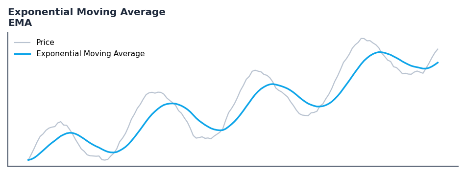

# Exponential Moving Average

<div class="indicator-meta"><span class="category-badge">Classic</span> <span class="kw-badge">moving-average</span> <span class="kw-badge">smoothing</span> <span class="kw-badge">classic</span> <span class="kw-badge">ema</span></div>

The Exponential Moving Average gives more weight to recent prices.

## Visual Example



*Synthetic ideal per library logic. Generated 2026-06-25 IST via `docs/generate_all_previews.py` (reproducible; maps to core `Next<T>` implementation).*

## Description

The Exponential Moving Average indicator is a technical analysis tool that the exponential moving average gives more weight to recent prices.

This indicator is primarily used for identifying key market conditions. It provides a robust signal that can be easily integrated into both simple strategies and more complex machine learning feature pipelines. Compared to its alternatives, it offers a distinct balance of responsiveness and stability.

Traders often combine this with other metrics to confirm signals and avoid false positives during sideways market regimes. It remains a standard tool for systematic trading models.

Use as the foundational smoothing module providing SMA, EMA, WMA, and SMMA implementations that power higher-level indicators across the library.

The core smoothing algorithms — SMA, EMA, WMA — are the building blocks of nearly all technical indicators. EMA applies exponential decay weighting (alpha = 2/(n+1)), SMA applies uniform weighting over N bars, and WMA applies linearly increasing weights emphasizing more recent bars.

QuantWave implements this indicator via the universal `Next<T>` trait, guaranteeing bit-identical results between Rust streaming, Python streaming, and Polars batch (`.ta()` / `map_batches`) surfaces.


## Formula / Specification

**Implementation** (`quantwave-core/src/indicators/smoothing.rs`):

\[
EMA = P_t \times \alpha + EMA_{t-1} \times (1 - \alpha)
\]

Gold-standard parity vectors: `quantwave-core/tests/gold_standard/ema.json`.


## Parameters

| Parameter | Default | Description |
|-----------|---------|-------------|
| `period` | 14 | Smoothing period |


## Usage Examples

**Streaming (Rust)**

```rust
use quantwave_core::indicators::EMA;
use quantwave_core::traits::Next;

let mut ind = EMA::new(14);
for price in &prices {
    let value = ind.next(price);
}
```

**Streaming (Python)**

```python
from quantwave import EMA

ind = EMA(14)
for price in prices:
    value = ind.next(price)
```

**Polars Batch (Python)**

```python
import polars as pl

df = (
    pl.read_csv('ohlcv.csv')
    .lazy()
    .with_columns(
        pl.col("close").ta.ema(14).alias("exponential_moving_average")
    )
    .collect()
)
```

All surfaces are bit-identical via the single `Next<T>` implementation and proptests.

## Edge Cases & Limitations

- Warm-up: first `14` bars may return NaN or partial state per implementation.
- Parameter sensitivity: smaller periods increase noise; larger periods increase lag.
- Sudden gaps or bad ticks can distort rolling windows — consider pre-filtering.
- Single-series indicators ignore volume unless otherwise documented.
- Validated via proptests against gold-standard vectors where available.
- No look-ahead bias; streaming and Polars batch paths are bit-identical.

## Boundary Behavior

| Condition | Behavior |
|-----------|----------|
| Warm-up | Leading bars return NaN until warmup_bars is satisfied. |
| period > len | When period exceeds series length, output is all NaN. |
| NaN inputs | NaN in input propagates to output (NaN out). |
| Invalid params | Non-positive period or missing required params raise ValueError. |
| Empty data | Empty input returns an empty result series. |

## Related Indicators & See Also

- [Indicator Gallery](../gallery.md)
- [Native Indicators index](index.md)
- [Batch vs Streaming guide](../../../examples/batch-streaming.md)
- [RSI](relative_strength_index_rsi.md)
- [SuperTrend](supertrend/)

## Sources & References

**Primary Source**: https://www.investopedia.com/terms/e/ema.asp

**Implementation**: `quantwave-core/src/indicators/smoothing.rs` (`EMA` / `EMA_METADATA`).
**Parity**: `quantwave-core/tests/gold_standard/ema.json`

**Provenance**: Standards bulk upgrade 2026-06-25 IST — see `docs/DOCUMENTATION_STANDARDS.md`.
