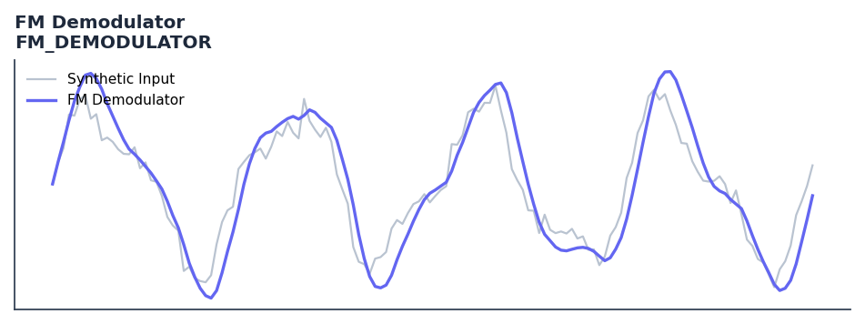

# FM Demodulator

<div class="indicator-meta"><span class="category-badge">Ehlers DSP</span> <span class="kw-badge">cycle</span> <span class="kw-badge">ehlers</span> <span class="kw-badge">dsp</span> <span class="kw-badge">amplitude</span> <span class="kw-badge">frequency</span></div>

Extracts market timing information by demodulating the frequency-modulated price spectrum.

## Visual Example



*Synthetic ideal per library logic. Generated 2026-06-25 IST via `docs/generate_all_previews.py` (reproducible; maps to core `Next<T>` implementation).*

## Description

The FM Demodulator indicator is a technical analysis tool that extracts market timing information by demodulating the frequency-modulated price spectrum.

This indicator is primarily used for identifying key market conditions. It provides a robust signal that can be easily integrated into both simple strategies and more complex machine learning feature pipelines. Compared to its alternatives, it offers a distinct balance of responsiveness and stability.

Traders often combine this with other metrics to confirm signals and avoid false positives during sideways market regimes. It remains a standard tool for systematic trading models.

Use to extract the instantaneous amplitude and frequency of market cycles. The AM output measures cycle energy for position sizing; the FM output tracks cycle period for adaptive indicator tuning.

Ehlers adapts AM and FM demodulation techniques from radio engineering in Cycle Analytics for Traders to extract cycle amplitude and instantaneous frequency from market data. The amplitude envelope measures how energetic the current cycle is, while FM reveals whether the cycle period is expanding or contracting.

QuantWave implements this indicator via the universal `Next<T>` trait, guaranteeing bit-identical results between Rust streaming, Python streaming, and Polars batch (`.ta()` / `map_batches`) surfaces.


## Formula / Specification

**Implementation** (`quantwave-core/src/indicators/amfm.rs`):

\[
Deriv = Close - Open, HL = \text{Clip}(10 \times Deriv, -1, 1)
\]
\[
SS = c_1 \frac{HL + HL_{t-1}}{2} + c_2 SS_{t-1} + c_3 SS_{t-2}
\]

Gold-standard parity vectors: `quantwave-core/tests/gold_standard/fm_demodulator.json`.


## Parameters

| Parameter | Default | Description |
|-----------|---------|-------------|
| `period` | 30 | SuperSmoother period |


## Usage Examples

**Streaming (Rust)**

```rust
use quantwave_core::indicators::FM_DEMODULATOR;
use quantwave_core::traits::Next;

let mut ind = FM_DEMODULATOR::new(30);
for price in &prices {
    let value = ind.next(price);
}
```

**Streaming (Python)**

```python
from quantwave import FM_DEMODULATOR

ind = FM_DEMODULATOR(30)
for price in prices:
    value = ind.next(price)
```

**Polars Batch (Python)**

```python
import polars as pl
import quantwave as qw

def apply_fm_demodulator(series: pl.Series) -> pl.Series:
    ind = qw.FM_DEMODULATOR(30)
    return pl.Series([ind.next(float(v)) for v in series.to_list()])

df = (
    pl.read_csv('ohlcv.csv')
    .lazy()
    .with_columns(
        pl.col("close").map_batches(apply_fm_demodulator, return_dtype=pl.Float64).alias("fm_demodulator")
    )
    .collect()
)
```

All surfaces are bit-identical via the single `Next<T>` implementation and proptests.

## Edge Cases & Limitations

- Recursive DSP filters require a warm-up period; first N bars may be unstable or raw-pass-through.
- Designed for cyclic/mean-reverting regimes; trending markets can produce lag or drift.
- Parameter `period` (or equivalent) controls cutoff — too small adds noise, too large adds lag.
- Prefer chaining with other Ehlers tools (Roofing Filter, SuperSmoother) on noisy inputs.
- Validated via proptests against gold-standard vectors where available.
- No look-ahead bias; suitable for live streaming and batch feature pipelines.

## Boundary Behavior

| Condition | Behavior |
|-----------|----------|
| Warm-up | Leading bars return NaN until warmup_bars is satisfied. |
| period > len | When period exceeds series length, output is all NaN. |
| NaN inputs | NaN in input propagates to output (NaN out). |
| Invalid params | Non-positive period or missing required params raise ValueError. |
| Empty data | Empty input returns an empty result series. |

## Related Indicators & See Also

- [Indicator Gallery](../gallery.md)
- [Native Indicators index](index.md)
- [Ehlers DSP guide](../ehlers/index.md)
- [Cyber Cycle](cyber_cycle.md)
- [SuperSmoother](supersmoother.md)

## Sources & References

**Primary Source**: https://github.com/lavs9/quantwave/blob/main/references/Ehlers%20Papers/AMFM.pdf

**Implementation**: `quantwave-core/src/indicators/amfm.rs` (`FM_DEMODULATOR` / `FM_DEMODULATOR_METADATA`).
**Parity**: `quantwave-core/tests/gold_standard/fm_demodulator.json`

**Provenance**: Standards bulk upgrade 2026-06-25 IST — see `docs/DOCUMENTATION_STANDARDS.md`.
