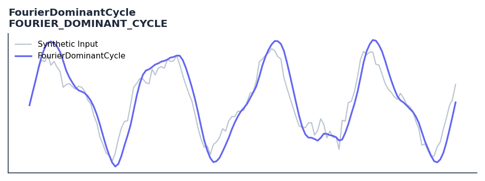

# FourierDominantCycle

<div class="indicator-meta"><span class="category-badge">Ehlers DSP</span> <span class="kw-badge">cycle</span> <span class="kw-badge">spectral</span> <span class="kw-badge">ehlers</span> <span class="kw-badge">dsp</span> <span class="kw-badge">dominant-cycle</span> <span class="kw-badge">fourier</span></div>

Dominant cycle period estimation using resolution-enhanced DFT and center of gravity.

## Visual Example



*Synthetic ideal per library logic. Generated 2026-07-01 IST via `docs/generate_all_previews.py` (reproducible; maps to core `Next<T>` implementation).*

## Description

Dominant cycle period estimation using resolution-enhanced DFT and center of gravity.

Use to compute the dominant market cycle period via DFT. Feed the output period into adaptive indicators like DSMA or Ehlers Stochastic to make them cycle-synchronized.

Part of QuantWave's Ehlers digital signal processing suite. Designed for low-lag cycle and trend work — pair with Roofing Filter or SuperSmoother on noisy inputs.

Ehlers implements a Discrete Fourier Transform cycle measurement in Cybernetic Analysis using a Hann-windowed data segment. The DFT computes power across periods from 6 to 50 bars, and the peak power identifies the dominant cycle period driving price movement.

**Typical applications:**

- Use for cycle timing in mean-reverting regimes
- Gate with Hurst exponent or ADX before taking cycle signals
- Allow `50`+ bars warm-up for filter state to stabilise
- Chain with Roofing Filter when input is noisy

QuantWave implements this via the universal `Next<T>` trait — bit-identical across Rust streaming, Python streaming, and Polars `.ta()` batch plugins.

## Formula / Specification

**Implementation** (`quantwave-core/src/indicators/fourier_transform.rs`):

\[
HP = \text{HighPass}(Price, 40)
\]
\[
Cleaned = \frac{HP + 2HP_{t-1} + 3HP_{t-2} + 3HP_{t-3} + 2HP_{t-4} + HP_{t-5}}{12}
\]
\[
Pwr(P) = \left(\sum_{n=0}^{W-1} Cleaned_{t-n} \cos\left(\frac{2\pi n}{P}\right)\right)^2 + \left(\sum_{n=0}^{W-1} Cleaned_{t-n} \sin\left(\frac{2\pi n}{P}\right)\right)^2
\]
\[
DB(P) = \min\left(20, -10 \log_{10}\left(\frac{0.01}{1 - 0.99 \frac{Pwr(P)}{\max(Pwr)}}\right)\right)
\]
\[
DC = \frac{\sum_{P=8}^{50} P \cdot (3 - DB(P)) \text{ where } DB(P) < 3}{\sum (3 - DB(P))}
\]

Gold-standard parity vectors: `quantwave-core/tests/gold_standard/fourier_dominant_cycle.json`.


## Parameters

| Parameter | Default | Description |
|-----------|---------|-------------|
| `window_len` | 50 | DFT window length |


## Usage Examples

**Streaming (Rust)**

```rust
use quantwave_core::indicators::FOURIER_DOMINANT_CYCLE;
use quantwave_core::traits::Next;

let mut ind = FOURIER_DOMINANT_CYCLE::new(50);
for price in &prices {
    let value = ind.next(price);
}
```

**Streaming (Python)**

```python
from quantwave import FOURIER_DOMINANT_CYCLE

ind = FOURIER_DOMINANT_CYCLE(50)
for price in prices:
    value = ind.next(price)
```

**Polars Batch (Python)**

```python
import polars as pl
import quantwave as qw

def apply_fourierdominantcycle(series: pl.Series) -> pl.Series:
    ind = qw.FOURIER_DOMINANT_CYCLE(50)
    return pl.Series([ind.next(float(v)) for v in series.to_list()])

df = (
    pl.read_csv('ohlcv.csv')
    .lazy()
    .with_columns(
        pl.col("close").map_batches(apply_fourierdominantcycle, return_dtype=pl.Float64).alias("fourierdominantcycle")
    )
    .collect()
)
```

All surfaces are bit-identical via the single `Next<T>` implementation and proptests.

## Edge Cases & Limitations

- Recursive DSP filters require a warm-up period; first N bars may be unstable or raw-pass-through.
- Designed for cyclic/mean-reverting regimes; trending markets can produce lag or drift.
- Parameter `period` (or equivalent) controls cutoff — too small adds noise, too large adds lag.
- Prefer chaining with other Ehlers tools (Roofing Filter, SuperSmoother) on noisy inputs.
- Validated via proptests against gold-standard vectors where available.
- No look-ahead bias; suitable for live streaming and batch feature pipelines.

## Boundary Behavior

| Condition | Behavior |
|-----------|----------|
| Warm-up | Leading bars return NaN until warmup_bars is satisfied. |
| period > len | When period exceeds series length, output is all NaN. |
| NaN inputs | NaN in input propagates to output (NaN out). |
| Invalid params | Non-positive period or missing required params raise ValueError. |
| Empty data | Empty input returns an empty result series. |

## Related Indicators & See Also

- [Indicator Gallery](../gallery.md)
- [Native Indicators index](index.md)
- [Ehlers DSP guide](../ehlers/index.md)
- [Cyber Cycle](cyber_cycle.md)
- [SuperSmoother](supersmoother.md)

## Sources & References

**Primary Source**: https://github.com/lavs9/quantwave/blob/main/references/Ehlers%20Papers/FourierTransformForTraders.pdf

**Implementation**: `quantwave-core/src/indicators/fourier_transform.rs` (`FOURIER_DOMINANT_CYCLE` / `FOURIER_DOMINANT_CYCLE_METADATA`).
**Parity**: `quantwave-core/tests/gold_standard/fourier_dominant_cycle.json`

**Provenance**: Standards bulk upgrade 2026-07-01 IST — see `docs/DOCUMENTATION_STANDARDS.md`.
