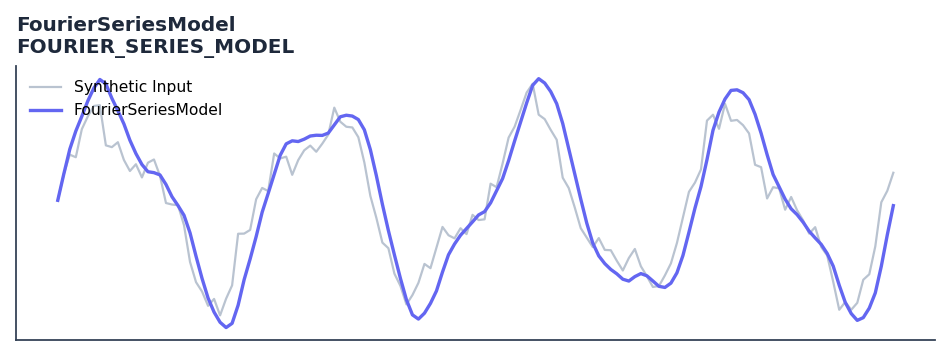

# FourierSeriesModel

<div class="indicator-meta"><span class="category-badge">Ehlers DSP</span> <span class="kw-badge">cycle</span> <span class="kw-badge">spectral</span> <span class="kw-badge">ehlers</span> <span class="kw-badge">prediction</span> <span class="kw-badge">fourier</span></div>

Synthesized market model using fundamental and harmonic frequency components.

## Visual Example



*Synthetic ideal per library logic. Generated 2026-06-25 IST via `docs/generate_all_previews.py` (reproducible; maps to core `Next<T>` implementation).*

## Description

Synthesized market model using fundamental and harmonic frequency components.

Use to model price as a sum of sine wave harmonics for short-term prediction. Most effective in clearly cyclical markets; combine with a cycle mode detector to disable it in trends.

The Fourier Series Model fits harmonically related sine waves to recent price history using least-squares coefficients. Ehlers shows that projecting this model one bar forward gives a price forecast useful for anticipatory entry timing at predicted cycle turns.

QuantWave implements this indicator via the universal `Next<T>` trait, guaranteeing bit-identical results between Rust streaming, Python streaming, and Polars batch (`.ta()` / `map_batches`) surfaces.

## Formula / Specification

**Implementation** (`quantwave-core/src/indicators/fourier_series.rs`):

\[
BP_k = \text{BandPass}(Price, Fundamental/k)
\]
\[
Q_k = \frac{Fundamental}{2\pi} (BP_{k} - BP_{k,t-1})
\]
\[
P_k = \sum_{n=0}^{F-1} (BP_{k,t-n}^2 + Q_{k,t-n}^2)
\]
\[
Wave = BP_1 + \sqrt{P_2/P_1}BP_2 + \sqrt{P_3/P_1}BP_3
\]

Gold-standard parity vectors: `quantwave-core/tests/gold_standard/fourier_series_model.json`.


## Parameters

| Parameter | Default | Description |
|-----------|---------|-------------|
| `fundamental` | 20 | Fundamental cycle period |


## Usage Examples

**Streaming (Rust)**

```rust
use quantwave_core::indicators::FOURIER_SERIES_MODEL;
use quantwave_core::traits::Next;

let mut ind = FOURIER_SERIES_MODEL::new(20);
for price in &prices {
    let value = ind.next(price);
}
```

**Streaming (Python)**

```python
from quantwave import FOURIER_SERIES_MODEL

ind = FOURIER_SERIES_MODEL(20)
for price in prices:
    value = ind.next(price)
```

**Polars Batch (Python)**

```python
import polars as pl
import quantwave as qw

def apply_fourierseriesmodel(series: pl.Series) -> pl.Series:
    ind = qw.FOURIER_SERIES_MODEL(20)
    return pl.Series([ind.next(float(v)) for v in series.to_list()])

df = (
    pl.read_csv('ohlcv.csv')
    .lazy()
    .with_columns(
        pl.col("close").map_batches(apply_fourierseriesmodel, return_dtype=pl.Float64).alias("fourierseriesmodel")
    )
    .collect()
)
```

All surfaces are bit-identical via the single `Next<T>` implementation and proptests.

## Edge Cases & Limitations

- Recursive DSP filters require a warm-up period; first N bars may be unstable or raw-pass-through.
- Designed for cyclic/mean-reverting regimes; trending markets can produce lag or drift.
- Parameter `period` (or equivalent) controls cutoff — too small adds noise, too large adds lag.
- Prefer chaining with other Ehlers tools (Roofing Filter, SuperSmoother) on noisy inputs.
- Validated via proptests against gold-standard vectors where available.
- No look-ahead bias; suitable for live streaming and batch feature pipelines.

## Related Indicators & See Also

- [Indicator Gallery](../gallery.md)
- [Native Indicators index](index.md)
- [Ehlers DSP guide](../ehlers/index.md)
- [Cyber Cycle](cyber_cycle.md)
- [SuperSmoother](supersmoother.md)

## Sources & References

**Primary Source**: https://github.com/lavs9/quantwave/blob/main/references/Ehlers%20Papers/FOURIER%20SERIES%20MODEL%20OF%20THE%20MARKET.pdf

**Implementation**: `quantwave-core/src/indicators/fourier_series.rs` (`FOURIER_SERIES_MODEL` / `FOURIER_SERIES_MODEL_METADATA`).
**Parity**: `quantwave-core/tests/gold_standard/fourier_series_model.json`

**Provenance**: Standards bulk upgrade 2026-06-25 IST — see `docs/DOCUMENTATION_STANDARDS.md`.
