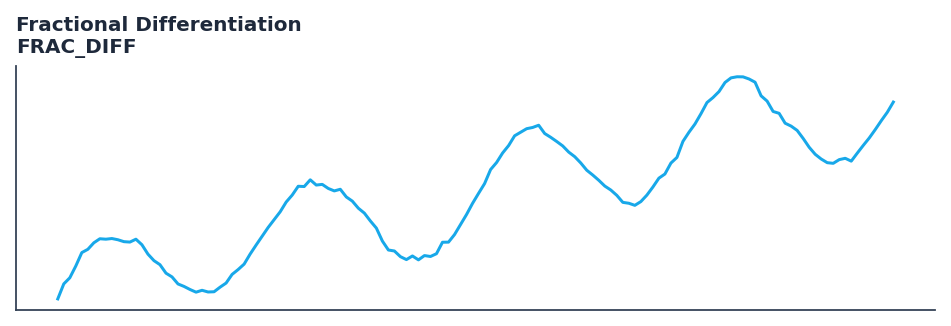

# Fractional Differentiation

<div class="indicator-meta"><span class="category-badge">ML Features</span> <span class="kw-badge">ml</span> <span class="kw-badge">stationarity</span> <span class="kw-badge">prado</span> <span class="kw-badge">feature-engineering</span> <span class="kw-badge">fractional</span></div>

Applies Prado-style fractional differencing to preserve memory while reducing non-stationarity in price series.

## Visual Example



*Synthetic ideal per library logic. Generated 2026-06-28 IST via `docs/generate_all_previews.py` (reproducible; maps to core `Next<T>` implementation).*

## Description

Fractional differentiation transforms a price or return series into a **partially stationary** feature while preserving long memory — the key insight from Marcos López de Prado's *Advances in Financial Machine Learning*. Integer differencing (d=1) removes autocorrelation but erases predictive structure; raw levels (d=0) are non-stationary. Fractional order d ∈ (0,1) sits between those extremes.

Practitioners typically apply this to **log-prices** or cumulative returns before tree models, neural nets, or cross-sectional factor research. Lower d (0.3–0.5) keeps more history in each bar; higher d approaches a first difference. The `threshold` parameter truncates the weight tail so the convolution window stays finite and streaming-friendly.

Compared to ad-hoc rolling z-scores or winsorization alone, frac-diff is a principled stationarity transform with a published weight recurrence. Pair with regime filters (Hurst, HMM) when building ML feature matrices.

QuantWave implements this indicator via the universal `Next<T>` trait, guaranteeing bit-identical results between Rust streaming, Python streaming, and Polars batch (`.ta.frac_diff()`) surfaces.

## Formula / Specification

**Implementation** (`frac_diff`):

\[
w_0 = 1,\quad w_k = -w_{k-1}\frac{d - k + 1}{k},\quad
\tilde{X}_t = \sum_{k=0}^{K} w_k X_{t-k}
\]

Gold-standard parity vectors: `quantwave-core/tests/gold_standard/frac_diff.json`.


## Parameters

| Parameter | Default | Description |
|-----------|---------|-------------|
| `d` | 0.4 | Fractional differentiation order (0 = identity, 1 = full integer diff) |
| `threshold` | 1e-5 | Truncate weights when |w_k| falls below this value |


## Usage Examples

**Streaming (Rust)**

```rust
use quantwave_core::indicators::FracDiff;
use quantwave_core::traits::Next;

let mut ind = FracDiff::new(0.4, 1e-5);
for price in &prices {
    let value = ind.next(price);
}
```

**Streaming (Python)**

```python
from quantwave import FracDiff

ind = FracDiff(0.4, 1e-5)
for price in prices:
    value = ind.next(price)
```

**Polars Batch (Python)**

```python
import polars as pl
import quantwave as qw  # registers LazyFrame.ta when using quantwave-polars plugin

df = (
    pl.read_csv('ohlcv.csv')
    .lazy()
    .ta.frac_diff("close", 0.4, 1e-5)
    .collect()
)
```

All surfaces are bit-identical via the single `Next<T>` implementation and proptests.

## Edge Cases & Limitations

- Warm-up: output is NaN until the full weight window fills (length depends on `d` and `threshold`; e.g. d=0.4, threshold=1e-5 may require 200+ bars).
- Very small `threshold` increases window length and memory; very large `threshold` truncates weights early and may under-difference.
- `d` outside [0,1] is clamped; d=0 approaches identity, d=1 approaches integer differencing.
- NaN inputs propagate NaN output for that bar; do not forward-fill before frac-diff without documenting bias.
- Sudden gaps or bad ticks distort the weighted sum — winsorize or filter outliers on illiquid names.
- Validated via proptests and `quantwave-core/tests/gold_standard/frac_diff.json`.
- No look-ahead bias; streaming and Polars batch paths are bit-identical.

## Boundary Behavior

| Condition | Behavior |
|-----------|----------|
| Warm-up | Leading bars return NaN until warmup_bars is satisfied. |
| period > len | When period exceeds series length, output is all NaN. |
| NaN inputs | NaN in input propagates to output (NaN out). |
| Invalid params | Non-positive period or missing required params raise ValueError. |
| Empty data | Empty input returns an empty result series. |

## Related Indicators & See Also

- [Indicator Gallery](../gallery.md)
- [Native Indicators index](index.md)
- [Batch vs Streaming guide](../../../examples/batch-streaming.md)
- [RSI](relative_strength_index_rsi.md)
- [SuperTrend](supertrend/)

## Sources & References

**Primary Source**: https://www.wiley.com/en-us/Advances+in+Financial+Machine+Learning-p-9781119482086

**Implementation**: `quantwave-core/src/indicators/frac_diff` (`FracDiff` / `_METADATA`).
**Parity**: `quantwave-core/tests/gold_standard/frac_diff.json`

**Provenance**: Standards bulk upgrade 2026-06-28 IST — see `docs/DOCUMENTATION_STANDARDS.md`.
