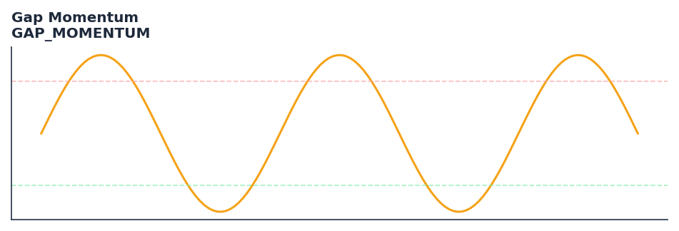

# Gap Momentum

<div class="indicator-meta"><span class="category-badge">Momentum</span> <span class="kw-badge">momentum</span> <span class="kw-badge">gap</span> <span class="kw-badge">kaufman</span> <span class="kw-badge">oscillator</span></div>

Accumulates positive and negative opening gaps to derive a cumulative gap ratio, smoothed by a signal line.

## Visual Example



*Synthetic ideal per library logic. Generated 2026-07-01 IST via `docs/generate_all_previews.py` (reproducible; maps to core `Next<T>` implementation).*

## Description

Accumulates positive and negative opening gaps to derive a cumulative gap ratio, smoothed by a signal line.

Used to identify momentum shifts based on price gaps. Buy when the signal line is rising and sell when it is falling.

Native Rust implementation with gold-standard or TA-Lib parity tests where applicable.

Perry J. Kaufman introduced Gap Momentum as a way to quantify price gaps relative to their cumulative volatility, similar to an On-Balance Volume (OBV) logic applied to opening gaps. It helps traders identify if gap-driven momentum is increasing or decreasing by comparing the sum of upward gaps against downward gaps over a rolling window. — Perry Kaufman, S&C 2024

**Typical applications:**

- Fade extremes in ranges; trade with trend on recoveries from oversold/overbought
- Use divergences as early warning — confirm with structure or volume
- Parameter default `40` — shorten for sensitivity, lengthen for stability
- Drop into `build_feature_matrix()` for ML research

QuantWave implements this via the universal `Next<T>` trait — bit-identical across Rust streaming, Python streaming, and Polars `.ta()` batch plugins.

## Formula / Specification

**Implementation** (`quantwave-core/src/indicators/gap_momentum.rs`):

\[
Gap = Open_t - Close_{t-1}
\]
\[
UpGaps = \sum_{i=0}^{Period-1} \max(0, Gap_{t-i})
\]
\[
DnGaps = \sum_{i=0}^{Period-1} \max(0, -Gap_{t-i})
\]
\[
GapRatio = \begin{cases} 1 & \text{if } DnGaps = 0 \\ 100 \times \frac{UpGaps}{DnGaps} & \text{otherwise} \end{cases}
\]
\[
Signal = SMA(GapRatio, SignalPeriod)
\]

Gold-standard parity vectors: `quantwave-core/tests/gold_standard/gap_momentum.json`.


## Parameters

| Parameter | Default | Description |
|-----------|---------|-------------|
| `period` | 40 | Rolling window for gap accumulation |
| `signal_period` | 20 | Smoothing period for the gap ratio |


## Usage Examples

**Streaming (Rust)**

```rust
use quantwave_core::indicators::GAP_MOMENTUM;
use quantwave_core::traits::Next;

let mut ind = GAP_MOMENTUM::new(40);
for price in &prices {
    let value = ind.next(price);
}
```

**Streaming (Python)**

```python
from quantwave import GAP_MOMENTUM

ind = GAP_MOMENTUM(40)
for price in prices:
    value = ind.next(price)
```

**Polars Batch (Python)**

```python
import polars as pl
import quantwave as qw

def apply_gap_momentum(series: pl.Series) -> pl.Series:
    ind = qw.GAP_MOMENTUM(40)
    return pl.Series([ind.next(float(v)) for v in series.to_list()])

df = (
    pl.read_csv('ohlcv.csv')
    .lazy()
    .with_columns(
        pl.col("close").map_batches(apply_gap_momentum, return_dtype=pl.Float64).alias("gap_momentum")
    )
    .collect()
)
```

All surfaces are bit-identical via the single `Next<T>` implementation and proptests.

## Edge Cases & Limitations

- Warm-up: first `40` bars may return NaN or partial state per implementation.
- Parameter sensitivity: smaller periods increase noise; larger periods increase lag.
- Sudden gaps or bad ticks can distort rolling windows — consider pre-filtering.
- Single-series indicators ignore volume unless otherwise documented.
- Validated via proptests against gold-standard vectors where available.
- No look-ahead bias; streaming and Polars batch paths are bit-identical.

## Boundary Behavior

| Condition | Behavior |
|-----------|----------|
| Warm-up | Leading bars return NaN until warmup_bars is satisfied. |
| period > len | When period exceeds series length, output is all NaN. |
| NaN inputs | NaN in input propagates to output (NaN out). |
| Invalid params | Non-positive period or missing required params raise ValueError. |
| Empty data | Empty input returns an empty result series. |

## Related Indicators & See Also

- [Indicator Gallery](../gallery.md)
- [Native Indicators index](index.md)
- [Batch vs Streaming guide](../../../examples/batch-streaming.md)
- [RSI](relative_strength_index_rsi.md)
- [SuperTrend](../supertrend/)

## Sources & References

**Primary Source**: https://github.com/lavs9/quantwave/blob/main/references/traderstipsreference/TRADERS%E2%80%99%20TIPS%20-%20JANUARY%202024.html

**Implementation**: `quantwave-core/src/indicators/gap_momentum.rs` (`GAP_MOMENTUM` / `GAP_MOMENTUM_METADATA`).
**Parity**: `quantwave-core/tests/gold_standard/gap_momentum.json`

**Provenance**: Standards bulk upgrade 2026-07-01 IST — see `docs/DOCUMENTATION_STANDARDS.md`.
