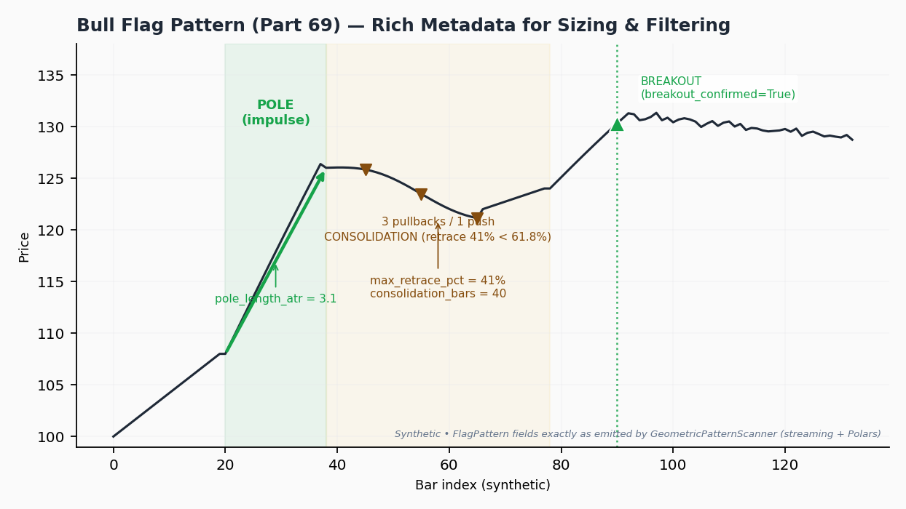
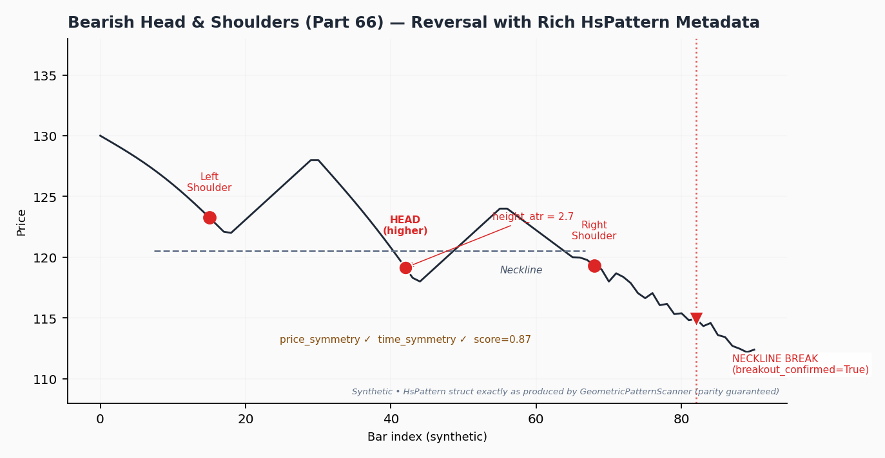

# Geometric Patterns (Flags + Head & Shoulders)

<div class="indicator-meta"><span class="category-badge">Price Action</span> <span class="kw-badge">patterns</span> <span class="kw-badge">flags</span> <span class="kw-badge">head-and-shoulders</span> <span class="kw-badge">continuation</span> <span class="kw-badge">reversal</span> <span class="kw-badge">mql5</span></div>

**Date**: 2026-05-31 IST  
**Sources**: MQL5 Price Action Analysis Toolkit  
- Flags (continuation): Part 69 — https://www.mql5.com/en/articles/22503 + `Flag_Pattern_Detector.mq5`  
- Head & Shoulders (reversal): Part 66 — https://www.mql5.com/en/articles/22194 + `HS_Indicator.mq5`  
Archived: `references/MQL5/lynnchris/implemented/Part69/` and `Part66/`.  
Built on the shared Market Structure foundation (Part 21). Core: `quantwave-core/src/indicators/geometric_patterns.rs`.

The `GeometricPatternScanner` (exposed as `.ta.geometric_patterns()` in Polars) detects two high-value classical price action patterns using the confirmed swings and bias from MarketStructure:

- **Bull / Bear Flags** — Powerful continuation patterns. A sharp impulse "pole" followed by a shallow, orderly consolidation (pullbacks dominate pushes, retrace typically ≤ 61.8%). Breakout in the pole direction is the trigger.
- **Head & Shoulders (and Inverse)** — Classic reversal patterns. A 5-swing formation with a dominant head, reasonable symmetry in price and time, and a decisive neckline breakout.

Both detectors emit **rich, machine-readable structs** (`FlagPattern`, `HsPattern`) instead of drawing objects. These structs contain exactly the quantitative fields you need for position sizing, quality filtering, and ML.

## When to Use

**Flags**:
- Trend-following continuation entries in the direction of established MarketStructure bias.
- Situations where you want **quantified risk** (the pole length gives you a natural ATR-multiple stop/target distance).

**Head & Shoulders**:
- Counter-trend reversal plays at major turning points.
- Only high-`score` / high-symmetry instances (filter aggressively).

**General**:
- As confluence with S/R levels (see sr_monitor).
- As sparse, high-signal labels or features for ML models.
- In event-driven backtesters that consume rich metadata for dynamic sizing.

The scanner only surfaces **breakout_confirmed** patterns in the current implementation, keeping signals clean.

## Rich Metadata — The Real Power

### FlagPattern (key fields)
- `pole_length_atr`: **The star field for strategies**. Pole height expressed in ATR units at detection time. Directly drives position sizing.
- `max_retrace_pct`: How far price pulled back during consolidation (as % of pole). Classic flags stay under 0.618.
- `pullbacks`, `pushes`: Count of counter-moves vs. continuation moves inside the flag. Good flags usually have more pullbacks than pushes.
- `consolidation_bars`: Duration of the flag (time consolidation).
- `breakout_confirmed`, `breakout_price`, `is_bull`

### HsPattern (key fields)
- `height_atr`: Head height in ATR units (analogous to pole_length_atr).
- `score`: Composite quality score (0–1+). Higher is better; combine with symmetry.
- `price_symmetry`, `time_symmetry`: How balanced the left/right shoulders are.
- `breakout_confirmed`, `breakout_price`, `is_bearish`

**Visual: Bull Flag**  
Sharp vertical impulse pole (e.g. bars 120–127), followed by 3 small pullbacks and 1 push inside a tight range (retracement 48%), then a decisive breakout candle above the pole high at bar 143. Annotations call out every FlagPattern field on the chart.



**Visual: Bearish Head & Shoulders**  
Left shoulder, higher head, lower right shoulder, roughly flat or slightly declining neckline, followed by a strong close below the neckline. Labels for all five swing points, measured head height, symmetry percentages, and score.



## Position Sizing Example Using Rich Metadata

```python
# After detecting a confirmed bull flag on bullish structure
current_atr = atr_series[bar]
risk_per_unit = 0.5 * flag.pole_length_atr * current_atr   # 0.5× pole as risk distance
account = 100_000.0
risk_pct = 0.01  # 1% account risk per trade

contracts = (account * risk_pct) / risk_per_unit if risk_per_unit > 0 else 0
print(f"Position size: {contracts:.1f} units (risk = {risk_per_unit:.2f})")
```

This produces consistent R-multiples across different instruments and volatility regimes because the risk distance is normalized by the actual pattern size.

## Practical Code Examples

### Rust Streaming

```rust
use quantwave_core::indicators::geometric_patterns::GeometricPatternScanner;
use quantwave_core::traits::Next;

let mut scanner = GeometricPatternScanner::new(3);

for (h, l) in data {
    let (ms_state, flag, hs) = scanner.next((h, l));
    
    if let Some(f) = flag {
        if f.breakout_confirmed && ms_state.bias == Bias::Bullish {
            let size = compute_size_from_pole(f.pole_length_atr, current_atr);
            // enter long...
        }
    }
    if let Some(hs_pat) = hs {
        if hs_pat.breakout_confirmed && hs_pat.score > 0.75 {
            // high-quality reversal setup
        }
    }
}
```

### Polars Batch (ideal for feature stores)

```python
df = (
    pl.DataFrame({"high": highs, "low": lows})
    .lazy()
    .ta.market_structure("high", "low", 3)
    .ta.geometric_patterns("high", "low", 3)
    .collect()
)

# Rich nested access for ML labels / features
bull_flag_events = df.filter(
    pl.col("geometric_patterns").struct.field("flag")
      .struct.field("breakout_confirmed") &
    (pl.col("market_structure").struct.field("bias") == "Bullish")
)

features = bull_flag_events.select([
    pl.col("geometric_patterns").struct.field("flag").struct.field("pole_length_atr").alias("pole_atr"),
    pl.col("geometric_patterns").struct.field("flag").struct.field("max_retrace_pct"),
    # ... join other indicators at these exact bars
])
```

### Python Streaming

```python
from quantwave import GeometricPatternScanner, MarketStructure

geo = GeometricPatternScanner(3)

for h, l in zip(highs, lows):
    # Note: in current Python surface the scanner also advances internal MS
    result = geo.next(h, l)  # returns GeometricNextResult
    flag = result.flag
    if flag and flag.breakout_confirmed:
        print(f"Flag pole_atr={flag.pole_length_atr:.2f}")
```

**Python note**: The streaming wrappers expose the core rich fields (including `pole_length_atr`, `score`, symmetry, breakout flags). For the absolute fullest metadata during research, use Polars or direct Rust.

## ML & Strategy Integration Ideas

- **Features**:
  - `flag_pole_atr_norm` (normalized by rolling ATR or recent range)
  - `flag_retrace_quality` (1 if max_retrace_pct < 0.55 else 0)
  - `hs_score`, `hs_symmetry_avg`
  - `pattern_on_bull_structure` (interaction feature)
  - Binary labels for "flag breakout occurred" aligned to future returns

- **Filters**: Only trade Flags when `pole_length_atr > 1.5` and structure bias agrees. Only trade H&S when `score > 0.8` and `time_symmetry > 0.7`.

- **Confluence**: Join geometric events with `SRInteraction` events on the same bar (flag breakout at major support = high edge).

- **Backtester consumption**: Pass the entire `FlagPattern` / `HsPattern` (or wrapped `PAEvent`) into your position sizer. The metadata travels with the signal.

Full end-to-end demonstration (including regime + Hurst filter + realistic equity curve sketch) lives in the runnable notebooks.

## Parameters

- `swing_strength` (default: 3–5): Passed through to the underlying `MarketStructure`. Controls swing granularity for both flags and H&S.

**Metadata source of truth**: `GEOMETRIC_PATTERNS_METADATA` constant (links directly to the two MQL5 parts).

## Related Pages

- [Market Structure](market_structure.md) — required foundation
- [S/R Interactions](sr_monitor.md) — confluence
- [Using Rich PA Events](pa_events_strategies.md)
- Strategy deep-dive notebook: [pa_flag_breakout_strategy.md](../../../examples/notebooks/pa_flag_breakout_strategy.md) and `pa_foundation_strategy.py`
- MQL5 Part 69 (Flags): https://www.mql5.com/en/articles/22503
- MQL5 Part 66 (H&S): https://www.mql5.com/en/articles/22194

All detectors maintain full streaming ↔ Polars batch parity via proptests.
