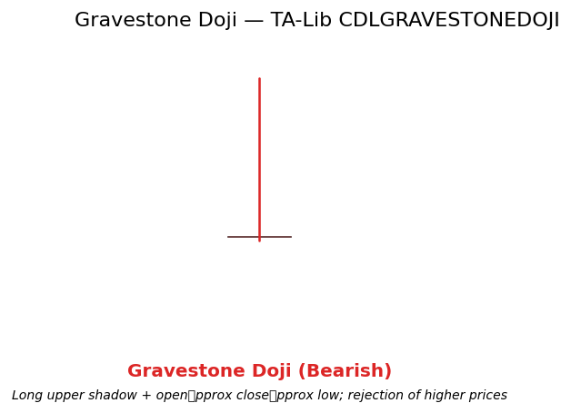

# Gravestone Doji

<div class="indicator-meta"><span class="category-badge">Patterns</span> <span class="kw-badge">candlestick</span> <span class="kw-badge">indecision</span> <span class="kw-badge">bearish</span></div>

A Doji variant with a long upper wick, a very small body located near the low of the range, and little or no lower wick. It represents a rejection of higher prices and carries bearish implications when appearing after an advance.

## Visual Example



*Synthetic ideal matching TA-Lib CDLGRAVESTONEDOJI logic (long upper shadow + open\approx close\approx low). Generated 2026-05-31 IST via `docs/gen_candle_previews.py`.*

## Description

The Gravestone Doji forms when buyers push price significantly higher during the period but are unable to sustain the advance; price collapses back to the opening level by the close. The long upper shadow visually records the failed attempt to move higher.

It is most meaningful after a sustained up-move or at resistance. Alone it is still only a warning; confirmation on the subsequent bar (close below the Gravestone low) materially increases its reliability. Quant developers frequently use it as a sparse directional feature in models that already contain Market Structure bias or ATR-based volatility regime.

## Formula / Specification

**Recognition Rules (exact implementation in QuantWave / TA-Lib CDLGRAVESTONEDOJI)**:

1. Body length = |close − open| is negligible (Doji condition).
2. Upper shadow (high − max(open, close)) is long relative to body and range.
3. Lower shadow (min(open, close) − low) is negligible or zero.
4. The pattern is identified when the above geometry holds; output follows TA-Lib sign convention (+100 / −100 / 0).
5. Stateless single-bar test after OHLC history buffering in the streaming wrapper.

## Parameters

| Parameter | Default | Description |
|-----------|---------|-------------|
| (none) | — | Pattern recognition only; no tunable parameters. |

## Usage Examples

**Streaming (Rust)**

```rust
use quantwave_core::indicators::CDLGRAVESTONEDOJI;
use quantwave_core::traits::Next;

let mut g = CDLGRAVESTONEDOJI::new();
for (o, h, l, c) in &ohlcv {
    let sig = g.next((o, h, l, c));
    if sig < 0.0 { /* bearish gravestone context */ }
}
```

**Streaming (Python)**

```python
from quantwave import CDLGRAVESTONEDOJI
g = CDLGRAVESTONEDOJI()
for o, h, l, c in ohlcv:
    sig = g.next((o, h, l, c))
```

**Polars Batch (Python)**

```python
df.lazy().with_columns(
    pl.col("open").ta.cdl_gravestonedoji("open", "high", "low", "close").alias("gravestone")
).collect()
```

Bit-identical across surfaces.

## Edge Cases & Limitations

- Requires a completed bar; first bar yields no signal.
- Can appear in strong uptrends without reversal follow-through (continuation risk).
- Very low range bars distort the "long shadow" perception; combine with ATR.
- TA-Lib tolerance for "long" vs. body is reference-implementation specific.
- Highest value when the prior trend was up and the pattern occurs at a known resistance or structure level.
- Confirmation on next bar strongly recommended; isolated Gravestones in chop are low-value.

## Boundary Behavior

| Condition | Behavior |
|-----------|----------|
| Warm-up | Pattern functions emit 0 (no pattern) until enough bars exist. |
| period > len | Short series returns all zeros (no pattern detected). |
| NaN inputs | Bars with NaN OHLC are treated as no pattern (0). |
| Invalid params | N/A for most candlestick patterns. |
| Empty data | Empty input returns an empty integer series. |

## Related Indicators & See Also

- [Doji](doji.md), [Dragonfly Doji](dragonfly_doji.md), [Shooting Star](shooting_star.md), [Inverted Hammer](inverted_hammer.md)
- [Market Structure](market_structure.md) for bias and resistance context
- [S/R Interactions](sr_monitor.md)
- [Gallery](../gallery.md), native patterns index, PA notebook examples

## Sources & References

**Primary Source**: TA-Lib CDLGRAVESTONEDOJI (ta-lib.org) wrapped in `quantwave-core/src/indicators/pattern.rs`.

**Visual**: `docs/gen_candle_previews.py`, 2026-05-31 IST.

**Context**: Nison (1991) for rejection psychology only. MQL5 PA series for confluence with confirmed structure levels.

**Provenance**: Universal Next trait + Polars parity.
