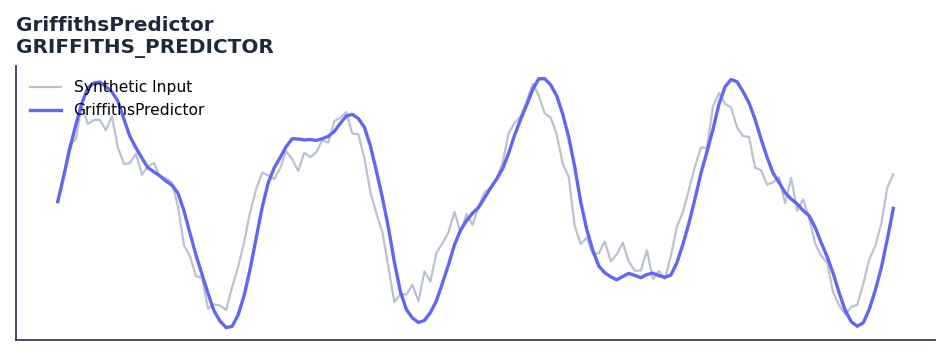

# GriffithsPredictor

<div class="indicator-meta"><span class="category-badge">Ehlers DSP</span> <span class="kw-badge">prediction</span> <span class="kw-badge">cycle</span> <span class="kw-badge">ehlers</span> <span class="kw-badge">dsp</span></div>

Adaptive LMS linear predictive filter for signal forecasting.

## Visual Example



*Synthetic ideal per library logic. Generated 2026-06-25 IST via `docs/generate_all_previews.py` (reproducible; maps to core `Next<T>` implementation).*

## Description

Adaptive LMS linear predictive filter for signal forecasting.

Use for short-horizon price prediction by projecting the dominant market cycle one or two bars forward. Works best in oscillating markets; disable in strong trends.

The Griffiths Predictor uses autoregressive coefficients from the Griffiths cycle measurement to extrapolate the current dominant cycle one bar ahead. By fitting an AR model to cycle-filtered price, it generates a one-step-ahead forecast useful for anticipatory entries at predicted cycle turns.

QuantWave implements this indicator via the universal `Next<T>` trait, guaranteeing bit-identical results between Rust streaming, Python streaming, and Polars batch (`.ta()` / `map_batches`) surfaces.

## Formula / Specification

**Implementation** (`quantwave-core/src/indicators/griffiths_predictor.rs`):

\[
\mu = 1/L
\]
\[
\bar{x} = \sum_{i=1}^L xx_{L-i} \cdot coef_i
\]
\[
coef_i = coef_i + \mu(xx_L - \bar{x})xx_{L-i}
\]

Gold-standard parity vectors: `quantwave-core/tests/gold_standard/griffiths_predictor.json`.


## Parameters

| Parameter | Default | Description |
|-----------|---------|-------------|
| `lower_bound` | 18 | Lower frequency bound (SS length) |
| `upper_bound` | 40 | Upper frequency bound (HP length) |
| `length` | 18 | LMS filter length |
| `bars_fwd` | 2 | Number of bars to predict forward |


## Usage Examples

**Streaming (Rust)**

```rust
use quantwave_core::indicators::GRIFFITHS_PREDICTOR;
use quantwave_core::traits::Next;

let mut ind = GRIFFITHS_PREDICTOR::new(18);
for price in &prices {
    let value = ind.next(price);
}
```

**Streaming (Python)**

```python
from quantwave import GRIFFITHS_PREDICTOR

ind = GRIFFITHS_PREDICTOR(18)
for price in prices:
    value = ind.next(price)
```

**Polars Batch (Python)**

```python
import polars as pl
import quantwave as qw

def apply_griffithspredictor(series: pl.Series) -> pl.Series:
    ind = qw.GRIFFITHS_PREDICTOR(18)
    return pl.Series([ind.next(float(v)) for v in series.to_list()])

df = (
    pl.read_csv('ohlcv.csv')
    .lazy()
    .with_columns(
        pl.col("close").map_batches(apply_griffithspredictor, return_dtype=pl.Float64).alias("griffithspredictor")
    )
    .collect()
)
```

All surfaces are bit-identical via the single `Next<T>` implementation and proptests.

## Edge Cases & Limitations

- Recursive DSP filters require a warm-up period; first N bars may be unstable or raw-pass-through.
- Designed for cyclic/mean-reverting regimes; trending markets can produce lag or drift.
- Parameter `period` (or equivalent) controls cutoff — too small adds noise, too large adds lag.
- Prefer chaining with other Ehlers tools (Roofing Filter, SuperSmoother) on noisy inputs.
- Validated via proptests against gold-standard vectors where available.
- No look-ahead bias; suitable for live streaming and batch feature pipelines.

## Related Indicators & See Also

- [Indicator Gallery](../gallery.md)
- [Native Indicators index](index.md)
- [Ehlers DSP guide](../ehlers/index.md)
- [Cyber Cycle](cyber_cycle.md)
- [SuperSmoother](supersmoother.md)

## Sources & References

**Primary Source**: https://github.com/lavs9/quantwave/blob/main/references/traderstipsreference/TRADERS’%20TIPS%20-%20JANUARY%202025.html

**Implementation**: `quantwave-core/src/indicators/griffiths_predictor.rs` (`GRIFFITHS_PREDICTOR` / `GRIFFITHS_PREDICTOR_METADATA`).
**Parity**: `quantwave-core/tests/gold_standard/griffiths_predictor.json`

**Provenance**: Standards bulk upgrade 2026-06-25 IST — see `docs/DOCUMENTATION_STANDARDS.md`.
