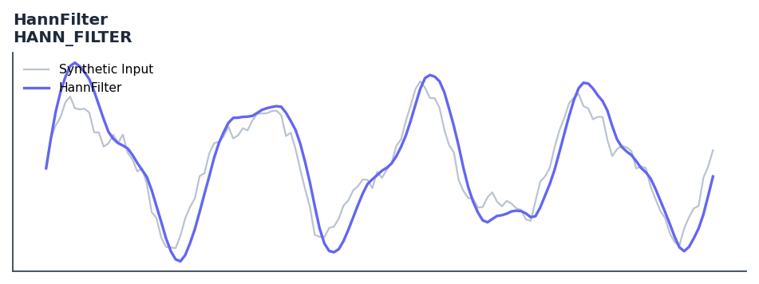

# HannFilter

<div class="indicator-meta"><span class="category-badge">Ehlers DSP</span> <span class="kw-badge">filter</span> <span class="kw-badge">ehlers</span> <span class="kw-badge">dsp</span> <span class="kw-badge">windowing</span> <span class="kw-badge">spectral</span></div>

Hann windowed lowpass FIR filter.

## Visual Example



*Synthetic ideal per library logic. Generated 2026-06-25 IST via `docs/generate_all_previews.py` (reproducible; maps to core `Next<T>` implementation).*

## Description

Hann windowed lowpass FIR filter.

Use as a windowing function before FFT-based dominant cycle measurement to achieve clean spectral separation between market cycles.

The Hann window provides a smooth bell-shaped taper achieving -31.5 dB first sidelobe suppression. Ehlers uses it in Cycle Analytics for Traders as the preferred DFT window because it offers the best trade-off between frequency resolution and leakage rejection.

QuantWave implements this indicator via the universal `Next<T>` trait, guaranteeing bit-identical results between Rust streaming, Python streaming, and Polars batch (`.ta()` / `map_batches`) surfaces.

## Formula / Specification

**Implementation** (`quantwave-core/src/indicators/hann.rs`):

\[
H(n) = 1 - \cos\left(\frac{2\pi n}{L+1}\right)
\]
\[
Filt = \frac{\sum_{n=1}^L H(n) \cdot Price_{t-n+1}}{\sum H(n)}
\]

Gold-standard parity vectors: `quantwave-core/tests/gold_standard/hann_filter.json`.


## Parameters

| Parameter | Default | Description |
|-----------|---------|-------------|
| `length` | 20 | Filter length |


## Usage Examples

**Streaming (Rust)**

```rust
use quantwave_core::indicators::HANN_FILTER;
use quantwave_core::traits::Next;

let mut ind = HANN_FILTER::new(20);
for price in &prices {
    let value = ind.next(price);
}
```

**Streaming (Python)**

```python
from quantwave import HANN_FILTER

ind = HANN_FILTER(20)
for price in prices:
    value = ind.next(price)
```

**Polars Batch (Python)**

```python
import polars as pl
import quantwave as qw

def apply_hannfilter(series: pl.Series) -> pl.Series:
    ind = qw.HANN_FILTER(20)
    return pl.Series([ind.next(float(v)) for v in series.to_list()])

df = (
    pl.read_csv('ohlcv.csv')
    .lazy()
    .with_columns(
        pl.col("close").map_batches(apply_hannfilter, return_dtype=pl.Float64).alias("hannfilter")
    )
    .collect()
)
```

All surfaces are bit-identical via the single `Next<T>` implementation and proptests.

## Edge Cases & Limitations

- Recursive DSP filters require a warm-up period; first N bars may be unstable or raw-pass-through.
- Designed for cyclic/mean-reverting regimes; trending markets can produce lag or drift.
- Parameter `period` (or equivalent) controls cutoff — too small adds noise, too large adds lag.
- Prefer chaining with other Ehlers tools (Roofing Filter, SuperSmoother) on noisy inputs.
- Validated via proptests against gold-standard vectors where available.
- No look-ahead bias; suitable for live streaming and batch feature pipelines.

## Related Indicators & See Also

- [Indicator Gallery](../gallery.md)
- [Native Indicators index](index.md)
- [Ehlers DSP guide](../ehlers/index.md)
- [Cyber Cycle](cyber_cycle.md)
- [SuperSmoother](supersmoother.md)

## Sources & References

**Primary Source**: https://github.com/lavs9/quantwave/blob/main/references/Ehlers%20Papers/JustIgnoreThem.pdf

**Implementation**: `quantwave-core/src/indicators/hann.rs` (`HANN_FILTER` / `HANN_FILTER_METADATA`).
**Parity**: `quantwave-core/tests/gold_standard/hann_filter.json`

**Provenance**: Standards bulk upgrade 2026-06-25 IST — see `docs/DOCUMENTATION_STANDARDS.md`.
