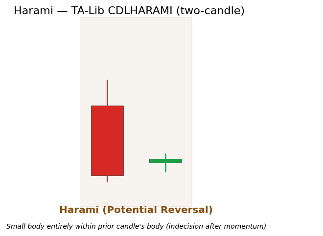

# Harami

<div class="indicator-meta"><span class="category-badge">Patterns</span> <span class="kw-badge">candlestick</span> <span class="kw-badge">reversal</span> <span class="kw-badge">exhaustion</span></div>

A two-candle pattern in which a small candle (the "baby") forms entirely within the body of the preceding large candle (the "mother"). It signals a potential pause or reversal after a strong directional move.

## Visual Example



*Synthetic ideal satisfying TA-Lib CDLHARAMI containment rules. Generated 2026-05-31 IST via `docs/gen_candle_previews.py`.*

## Description

The Harami reflects a sudden contraction in volatility and a loss of conviction by the dominant side. The small second candle demonstrates that the prior aggressive buying or selling has been contained.

It is a higher-probability warning when the first candle is a long body in the direction of the trend and the second candle is a Doji (Harami Cross). Traders and strategy developers use it as a trigger filter inside established Market Structure bias or as an ML feature indicating "volatility collapse after impulse."

## Formula / Specification

**Recognition Rules (exact implementation in QuantWave / TA-Lib CDLHARAMI)**:

1. Candle 1: large body (direction determines bullish/bearish context).
2. Candle 2: small body whose high and low (or at minimum open/close) lie strictly inside Candle 1's body.
3. The pattern completes on the close of the second bar.
4. Output follows TA-Lib +100/−100/0 convention.
5. Two-bar window; the streaming wrapper retains the necessary prior bar state.

## Parameters

| Parameter | Default | Description |
|-----------|---------|-------------|
| (none) | — | Pattern recognition only; no tunable parameters. |

## Usage Examples

**Streaming (Rust)**

```rust
use quantwave_core::indicators::CDLHARAMI;
use quantwave_core::traits::Next;

let mut h = CDLHARAMI::new();
for (o, h_, l, c) in &ohlcv {
    let sig = h.next((o, h_, l, c));
    ...
}
```

**Streaming (Python) / Polars Batch** — analogous to Doji examples, using `CDLHARAMI` / `.ta.cdl_harami("open","high","low","close")`.

Bit-identical results across all three surfaces.

## Edge Cases & Limitations

- Requires two completed bars.
- False positives frequent in low-volatility ranges; require trend context or volume confirmation.
- "Inside body" vs. "inside full range" definitions vary in literature — QuantWave follows the TA-Lib body-containment rule.
- Harami Cross (second candle is Doji) is generally stronger.
- Most useful after a clear impulse move, not in chop.

## Boundary Behavior

| Condition | Behavior |
|-----------|----------|
| Warm-up | Pattern functions emit 0 (no pattern) until enough bars exist. |
| period > len | Short series returns all zeros (no pattern detected). |
| NaN inputs | Bars with NaN OHLC are treated as no pattern (0). |
| Invalid params | N/A for most candlestick patterns. |
| Empty data | Empty input returns an empty integer series. |

## Related Indicators & See Also

- [Harami Cross](harami_cross.md), [Doji](doji.md) family, [Engulfing](engulfing.md)
- [Market Structure](market_structure.md), [Geometric Patterns](geometric_patterns.md)
- Gallery, native index, PA notebook

## Sources & References

**Primary Source**: TA-Lib CDLHARAMI via `quantwave-core/src/indicators/pattern.rs`.

**Visual**: `docs/gen_candle_previews.py`, 2026-05-31 IST.

**Context**: Nison (1991) for exhaustion psychology (no boilerplate duplication). MQL5 for structure confluence.

**Provenance**: Next<T> parity contract.
