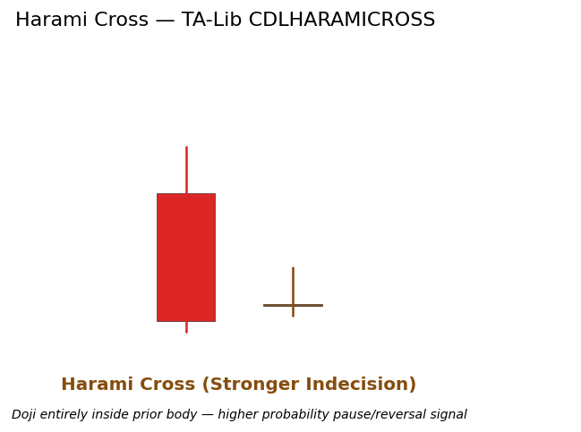

# Harami Cross

Patterns candlestick reversal indecision

A Harami in which the second ("baby") candle is a Doji. The combination of containment + perfect indecision produces one of the stronger two-candle warning signals in the classic candlestick vocabulary.

## Visual Example

*Synthetic ideal per library logic. Generated 2026-06-25 IST via `docs/generate_all_previews.py` (reproducible; maps to core `Next<T>` implementation).*

## Description

The Harami Cross merges the volatility contraction of a Harami with the equilibrium message of a Doji. It is interpreted as a higher-probability exhaustion signal than a regular Harami because the second bar shows zero net conviction.

Used by quant traders as a high-quality binary feature or as a precise entry filter once Market Structure bias has already flipped.

## Formula / Specification

**Recognition Rules (exact implementation in QuantWave / TA-Lib CDLHARAMICROSS)**:

1. Candle 1: large body.
2. Candle 2: qualifies as Doji AND lies entirely inside Candle 1 body.
3. Completes on bar 2 close; TA-Lib sign convention.
4. Two-bar state in streaming wrapper.

## Parameters

| Parameter | Default | Description |
|-----------|---------|-------------|
| (none) | — | Pattern recognition only; no tunable parameters. |

## Usage Examples

Streaming / Polars examples identical in structure to Harami (substitute `CDLHARAMICROSS` / `.ta.cdl_haramicross(...)`). Full parity guaranteed.

## Edge Cases & Limitations

- Two-bar requirement.
- Still benefits enormously from trend/structure context; isolated occurrences in ranges are low value.
- Stronger than plain Harami but not infallible — always seek confirmation.

## Related Indicators & See Also

- [Harami](harami.md), [Doji](doji.md), [Engulfing](engulfing.md)
- Rich PA tools: Market Structure, SR Monitor
- Gallery, native index, PA notebook

## Sources & References

**Primary Source**: TA-Lib CDLHARAMICROSS via core pattern.rs.

**Visual**: gen script, 2026-05-31 IST.

**Context**: Nison psychology only; MQL5 for practical application.

**Provenance**: Next + Polars fidelity.
