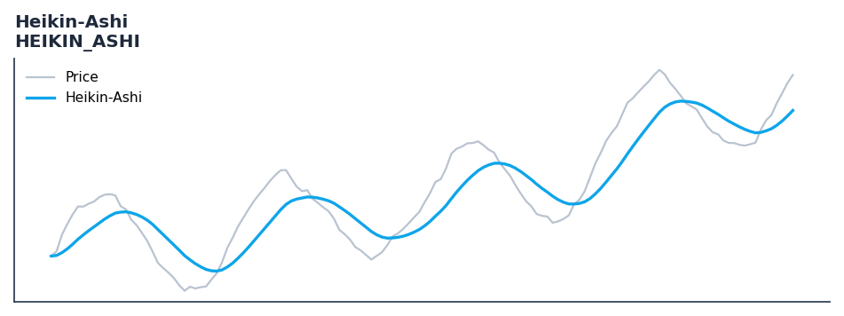

# Heikin-Ashi

<div class="indicator-meta"><span class="category-badge">Classic</span> <span class="kw-badge">trend</span> <span class="kw-badge">candlestick</span> <span class="kw-badge">smoothing</span> <span class="kw-badge">classic</span> <span class="kw-badge">visualization</span></div>

Heikin-Ashi candles filter market noise to reveal the underlying trend.

## Visual Example



*Synthetic ideal per library logic. Generated 2026-06-25 IST via `docs/generate_all_previews.py` (reproducible; maps to core `Next<T>` implementation).*

## Description

The Heikin-Ashi indicator is a technical analysis tool that heikin-ashi candles filter market noise to reveal the underlying trend.

This indicator is primarily used for identifying key market conditions. It provides a robust signal that can be easily integrated into both simple strategies and more complex machine learning feature pipelines. Compared to its alternatives, it offers a distinct balance of responsiveness and stability.

Traders often combine this with other metrics to confirm signals and avoid false positives during sideways market regimes. It remains a standard tool for systematic trading models.

Use to smooth candlestick charts and reduce noise for trend identification. Two or more consecutive same-colored HA candles with no lower/upper wicks confirm a strong trend.

Heikin-Ashi candles, developed by Munehisa Homma in the 18th century, use averaged OHLC values to produce smoother candles that better represent the prevailing trend. Each HA bar open equals the midpoint of the previous HA bar, while close equals the OHLC average, creating continuity that raw candles lack. — StockCharts ChartSchool

QuantWave implements this indicator via the universal `Next<T>` trait, guaranteeing bit-identical results between Rust streaming, Python streaming, and Polars batch (`.ta()` / `map_batches`) surfaces.


## Formula / Specification

**Implementation** (`quantwave-core/src/indicators/heikin_ashi.rs`):

\[
HA_{Close} = \frac{O + H + L + C}{4} \\ HA_{Open} = \frac{HA_{Open, t-1} + HA_{Close, t-1}}{2}
\]

Gold-standard parity vectors: `quantwave-core/tests/gold_standard/heikin_ashi.json`.


## Parameters

| Parameter | Default | Description |
|-----------|---------|-------------|
| (none) | — | No tunable parameters for this detector. |

## Usage Examples

**Streaming (Rust)**

```rust
use quantwave_core::indicators::HEIKIN_ASHI;
use quantwave_core::traits::Next;

let mut ind = HEIKIN_ASHI::new(14);
for price in &prices {
    let value = ind.next(price);
}
```

**Streaming (Python)**

```python
from quantwave import HEIKIN_ASHI

ind = HEIKIN_ASHI(14)
for price in prices:
    value = ind.next(price)
```

**Polars Batch (Python)**

```python
import polars as pl
import quantwave as qw

def apply_heikin_ashi(series: pl.Series) -> pl.Series:
    ind = qw.HEIKIN_ASHI(14)
    return pl.Series([ind.next(float(v)) for v in series.to_list()])

df = (
    pl.read_csv('ohlcv.csv')
    .lazy()
    .with_columns(
        pl.col("close").map_batches(apply_heikin_ashi, return_dtype=pl.Float64).alias("heikin_ashi")
    )
    .collect()
)
```

All surfaces are bit-identical via the single `Next<T>` implementation and proptests.

## Edge Cases & Limitations

- Warm-up: first `N` bars may return NaN or partial state per implementation.
- Parameter sensitivity: smaller periods increase noise; larger periods increase lag.
- Sudden gaps or bad ticks can distort rolling windows — consider pre-filtering.
- Single-series indicators ignore volume unless otherwise documented.
- Validated via proptests against gold-standard vectors where available.
- No look-ahead bias; streaming and Polars batch paths are bit-identical.

## Boundary Behavior

| Condition | Behavior |
|-----------|----------|
| Warm-up | Leading bars return NaN until warmup_bars is satisfied. |
| period > len | When period exceeds series length, output is all NaN. |
| NaN inputs | NaN in input propagates to output (NaN out). |
| Invalid params | Non-positive period or missing required params raise ValueError. |
| Empty data | Empty input returns an empty result series. |

## Related Indicators & See Also

- [Indicator Gallery](../gallery.md)
- [Native Indicators index](index.md)
- [Batch vs Streaming guide](../../../examples/batch-streaming.md)
- [RSI](relative_strength_index_rsi.md)
- [SuperTrend](supertrend.md)

## Sources & References

**Primary Source**: https://www.investopedia.com/trading/heikin-ashi-better-candlestick/

**Implementation**: `quantwave-core/src/indicators/heikin_ashi.rs` (`HEIKIN_ASHI` / `HEIKIN_ASHI_METADATA`).
**Parity**: `quantwave-core/tests/gold_standard/heikin_ashi.json`

**Provenance**: Standards bulk upgrade 2026-06-25 IST — see `docs/DOCUMENTATION_STANDARDS.md`.
