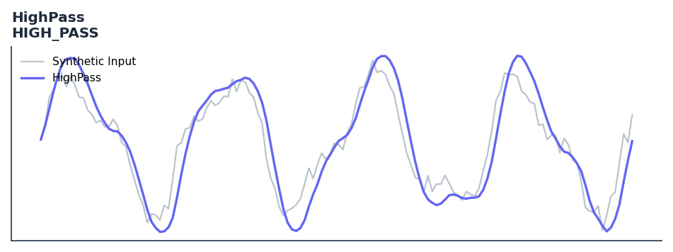

# HighPass

<div class="indicator-meta"><span class="category-badge">Ehlers DSP</span> <span class="kw-badge">filter</span> <span class="kw-badge">ehlers</span> <span class="kw-badge">dsp</span> <span class="kw-badge">high-pass</span> <span class="kw-badge">cycle</span></div>

A second-order High Pass filter that rejects low-frequency components.

## Visual Example



*Synthetic ideal per library logic. Generated 2026-06-25 IST via `docs/generate_all_previews.py` (reproducible; maps to core `Next<T>` implementation).*

## Description

A second-order High Pass filter that rejects low-frequency components.

Apply to price to isolate the cyclical component by attenuating the low-frequency trend. Use as the first stage before an oscillator or spectrum analyser.

Ehlers derives the one-pole high-pass filter in Cycle Analytics for Traders analogously to EMA derivation, but applied to price differences rather than levels. It removes the DC component and low-frequency trend, leaving the cyclical content for downstream analysis.

QuantWave implements this indicator via the universal `Next<T>` trait, guaranteeing bit-identical results between Rust streaming, Python streaming, and Polars batch (`.ta()` / `map_batches`) surfaces.

## Formula / Specification

**Implementation** (`quantwave-core/src/indicators/high_pass.rs`):

\[
a_1 = \exp\left(-\frac{1.414\pi}{Period}\right)
\]
\[
c_2 = 2a_1 \cos\left(\frac{1.414\pi}{Period}\right)
\]
\[
c_3 = -a_1^2
\]
\[
c_1 = (1 + c_2 - c_3) / 4
\]
\[
HP = c_1 (Price - 2 Price_{t-1} + Price_{t-2}) + c_2 HP_{t-1} + c_3 HP_{t-2}
\]

Gold-standard parity vectors: `quantwave-core/tests/gold_standard/high_pass.json`.


## Parameters

| Parameter | Default | Description |
|-----------|---------|-------------|
| `period` | 20 | Critical period (wavelength) |


## Usage Examples

**Streaming (Rust)**

```rust
use quantwave_core::indicators::HIGH_PASS;
use quantwave_core::traits::Next;

let mut ind = HIGH_PASS::new(20);
for price in &prices {
    let value = ind.next(price);
}
```

**Streaming (Python)**

```python
from quantwave import HIGH_PASS

ind = HIGH_PASS(20)
for price in prices:
    value = ind.next(price)
```

**Polars Batch (Python)**

```python
import polars as pl
import quantwave as qw

def apply_highpass(series: pl.Series) -> pl.Series:
    ind = qw.HIGH_PASS(20)
    return pl.Series([ind.next(float(v)) for v in series.to_list()])

df = (
    pl.read_csv('ohlcv.csv')
    .lazy()
    .with_columns(
        pl.col("close").map_batches(apply_highpass, return_dtype=pl.Float64).alias("highpass")
    )
    .collect()
)
```

All surfaces are bit-identical via the single `Next<T>` implementation and proptests.

## Edge Cases & Limitations

- Recursive DSP filters require a warm-up period; first N bars may be unstable or raw-pass-through.
- Designed for cyclic/mean-reverting regimes; trending markets can produce lag or drift.
- Parameter `period` (or equivalent) controls cutoff — too small adds noise, too large adds lag.
- Prefer chaining with other Ehlers tools (Roofing Filter, SuperSmoother) on noisy inputs.
- Validated via proptests against gold-standard vectors where available.
- No look-ahead bias; suitable for live streaming and batch feature pipelines.

## Related Indicators & See Also

- [Indicator Gallery](../gallery.md)
- [Native Indicators index](index.md)
- [Ehlers DSP guide](../ehlers/index.md)
- [Cyber Cycle](cyber_cycle.md)
- [SuperSmoother](supersmoother.md)

## Sources & References

**Primary Source**: https://github.com/lavs9/quantwave/blob/main/references/Ehlers%20Papers/implemented/UltimateSmoother.pdf

**Implementation**: `quantwave-core/src/indicators/high_pass.rs` (`HIGH_PASS` / `HIGH_PASS_METADATA`).
**Parity**: `quantwave-core/tests/gold_standard/high_pass.json`

**Provenance**: Standards bulk upgrade 2026-06-25 IST — see `docs/DOCUMENTATION_STANDARDS.md`.
