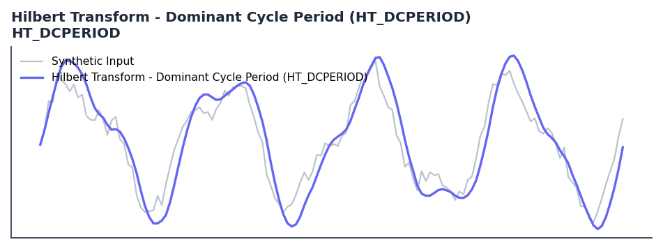

# Hilbert Transform - Dominant Cycle Period (HT_DCPERIOD)

<div class="indicator-meta"><span class="category-badge">Ehlers DSP</span> <span class="kw-badge">cycle</span> <span class="kw-badge">hilbert</span> <span class="kw-badge">adaptive</span> <span class="kw-badge">dsp</span></div>

Identifies the period of the dominant cycle in the price data using the Hilbert Transform.

## Visual Example



*Synthetic ideal per library logic. Generated 2026-07-01 IST via `docs/generate_all_previews.py` (reproducible; maps to core `Next<T>` implementation).*

## Description

Identifies the period of the dominant cycle in the price data using the Hilbert Transform.

Use to dynamically adjust the lookback periods of other indicators (e.g., adaptive moving averages). Knowing the current dominant cycle length allows for more accurate smoothing and trend detection.

Part of QuantWave's Ehlers digital signal processing suite. Designed for low-lag cycle and trend work — pair with Roofing Filter or SuperSmoother on noisy inputs.

John Ehlers popularized the use of the Hilbert Transform to identify the dominant cycle in financial time series. The DCPERIOD indicator tracks the length of this cycle in bars, providing a crucial parameter for creating market-responsive technical indicators that adapt to changing volatility. — Rocket Science for Traders

**Typical applications:**

- Use for cycle timing in mean-reverting regimes
- Gate with Hurst exponent or ADX before taking cycle signals
- Allow `N`+ bars warm-up for filter state to stabilise
- Chain with Roofing Filter when input is noisy

QuantWave implements this via the universal `Next<T>` trait — bit-identical across Rust streaming, Python streaming, and Polars `.ta()` batch plugins.

## Formula / Specification

**Implementation** (`quantwave-core/src/indicators/cycle.rs`):

\[
\text{DCPERIOD}_t = \text{Recalculated Dominant Cycle using Hilbert Transform}
\]

Gold-standard parity vectors: `quantwave-core/tests/gold_standard/ht_dcperiod.json`.


## Parameters

| Parameter | Default | Description |
|-----------|---------|-------------|
| (none) | — | No tunable parameters for this detector. |

## Usage Examples

**Streaming (Rust)**

```rust
use quantwave_core::indicators::HT_DCPERIOD;
use quantwave_core::traits::Next;

let mut ind = HT_DCPERIOD::new(14);
for price in &prices {
    let value = ind.next(price);
}
```

**Streaming (Python)**

```python
from quantwave import HT_DCPERIOD

ind = HT_DCPERIOD(14)
for price in prices:
    value = ind.next(price)
```

**Polars Batch (Python)**

```python
import polars as pl
import quantwave  # registers pl.col().ta

df = (
    pl.read_csv('ohlcv.csv')
    .lazy()
    .with_columns(
        pl.col("close").ta.ht_dcperiod(14).alias("hilbert_transform_dominant_cycle_period_ht_dcperiod")
    )
    .collect()
)
```

All surfaces are bit-identical via the single `Next<T>` implementation and proptests.

## Edge Cases & Limitations

- Recursive DSP filters require a warm-up period; first N bars may be unstable or raw-pass-through.
- Designed for cyclic/mean-reverting regimes; trending markets can produce lag or drift.
- Parameter `period` (or equivalent) controls cutoff — too small adds noise, too large adds lag.
- Prefer chaining with other Ehlers tools (Roofing Filter, SuperSmoother) on noisy inputs.
- Validated via proptests against gold-standard vectors where available.
- No look-ahead bias; suitable for live streaming and batch feature pipelines.

## Boundary Behavior

| Condition | Behavior |
|-----------|----------|
| Warm-up | Leading bars return NaN until warmup_bars is satisfied. |
| period > len | When period exceeds series length, output is all NaN. |
| NaN inputs | NaN in input propagates to output (NaN out). |
| Invalid params | Non-positive period or missing required params raise ValueError. |
| Empty data | Empty input returns an empty result series. |

## Related Indicators & See Also

- [Indicator Gallery](../gallery.md)
- [Native Indicators index](index.md)
- [Ehlers DSP guide](../ehlers/index.md)
- [Cyber Cycle](cyber_cycle.md)
- [SuperSmoother](supersmoother.md)

## Sources & References

**Primary Source**: https://www.tradingview.com/support/solutions/43000502011-hilbert-transform-dominant-cycle-period-ht-dcperiod/

**Implementation**: `quantwave-core/src/indicators/cycle.rs` (`HT_DCPERIOD` / `HT_DCPERIOD_METADATA`).
**Parity**: `quantwave-core/tests/gold_standard/ht_dcperiod.json`

**Provenance**: Standards bulk upgrade 2026-07-01 IST — see `docs/DOCUMENTATION_STANDARDS.md`.
