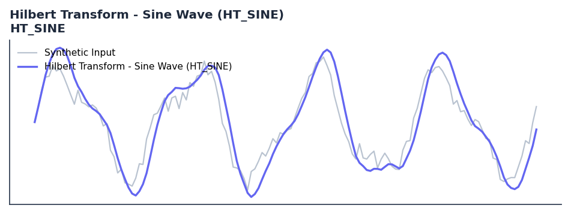

# Hilbert Transform - Sine Wave (HT_SINE)

<div class="indicator-meta"><span class="category-badge">Ehlers DSP</span> <span class="kw-badge">cycle</span> <span class="kw-badge">hilbert</span> <span class="kw-badge">sine</span> <span class="kw-badge">dsp</span></div>

An indicator that plots a sine wave and a lead-sine wave (shifted by 45 degrees) to identify cyclical turns.

## Visual Example



*Synthetic ideal per library logic. Generated 2026-07-01 IST via `docs/generate_all_previews.py` (reproducible; maps to core `Next<T>` implementation).*

## Description

An indicator that plots a sine wave and a lead-sine wave (shifted by 45 degrees) to identify cyclical turns.

Use to identify cycle turning points and trend regimes. When the two waves are separated and rhythmic, the market is in a cycle; when they are compressed or crossover erratically, the market is in a trend.

Part of QuantWave's Ehlers digital signal processing suite. Designed for low-lag cycle and trend work — pair with Roofing Filter or SuperSmoother on noisy inputs.

The Hilbert Sine Wave is one of John Ehlers' most famous contributions. It provides a clear visual indication of market cycles. Crossovers of the Sine and Lead-Sine waves provide high-probability entry points in ranging markets while identifying when a strong trend has taken over. — Rocket Science for Traders

**Typical applications:**

- Use for cycle timing in mean-reverting regimes
- Gate with Hurst exponent or ADX before taking cycle signals
- Allow `N`+ bars warm-up for filter state to stabilise
- Chain with Roofing Filter when input is noisy

QuantWave implements this via the universal `Next<T>` trait — bit-identical across Rust streaming, Python streaming, and Polars `.ta()` batch plugins.

## Formula / Specification

**Implementation** (`quantwave-core/src/indicators/cycle.rs`):

\[
Sine = \sin(Phase) \\ LeadSine = \sin(Phase + 45^\circ)
\]

Gold-standard parity vectors: `quantwave-core/tests/gold_standard/ht_sine.json`.


## Parameters

| Parameter | Default | Description |
|-----------|---------|-------------|
| (none) | — | No tunable parameters for this detector. |

## Usage Examples

**Streaming (Rust)**

```rust
use quantwave_core::indicators::HT_SINE;
use quantwave_core::traits::Next;

let mut ind = HT_SINE::new(14);
for price in &prices {
    let value = ind.next(price);
}
```

**Streaming (Python)**

```python
from quantwave import HT_SINE

ind = HT_SINE(14)
for price in prices:
    value = ind.next(price)
```

**Polars Batch (Python)**

```python
import polars as pl
import quantwave as qw

def apply_hilbert_transform_sine_wave_ht_sine(series: pl.Series) -> pl.Series:
    ind = qw.HT_SINE(14)
    return pl.Series([ind.next(float(v)) for v in series.to_list()])

df = (
    pl.read_csv('ohlcv.csv')
    .lazy()
    .with_columns(
        pl.col("close").map_batches(apply_hilbert_transform_sine_wave_ht_sine, return_dtype=pl.Float64).alias("hilbert_transform_sine_wave_ht_sine")
    )
    .collect()
)
```

All surfaces are bit-identical via the single `Next<T>` implementation and proptests.

## Edge Cases & Limitations

- Recursive DSP filters require a warm-up period; first N bars may be unstable or raw-pass-through.
- Designed for cyclic/mean-reverting regimes; trending markets can produce lag or drift.
- Parameter `period` (or equivalent) controls cutoff — too small adds noise, too large adds lag.
- Prefer chaining with other Ehlers tools (Roofing Filter, SuperSmoother) on noisy inputs.
- Validated via proptests against gold-standard vectors where available.
- No look-ahead bias; suitable for live streaming and batch feature pipelines.

## Boundary Behavior

| Condition | Behavior |
|-----------|----------|
| Warm-up | Leading bars return NaN until warmup_bars is satisfied. |
| period > len | When period exceeds series length, output is all NaN. |
| NaN inputs | NaN in input propagates to output (NaN out). |
| Invalid params | Non-positive period or missing required params raise ValueError. |
| Empty data | Empty input returns an empty result series. |

## Related Indicators & See Also

- [Indicator Gallery](../gallery.md)
- [Native Indicators index](index.md)
- [Ehlers DSP guide](../ehlers/index.md)
- [Cyber Cycle](cyber_cycle.md)
- [SuperSmoother](supersmoother.md)

## Sources & References

**Primary Source**: https://www.tradingview.com/support/solutions/43000502013-hilbert-transform-sine-wave-ht-sine/

**Implementation**: `quantwave-core/src/indicators/cycle.rs` (`HT_SINE` / `HT_SINE_METADATA`).
**Parity**: `quantwave-core/tests/gold_standard/ht_sine.json`

**Provenance**: Standards bulk upgrade 2026-07-01 IST — see `docs/DOCUMENTATION_STANDARDS.md`.
