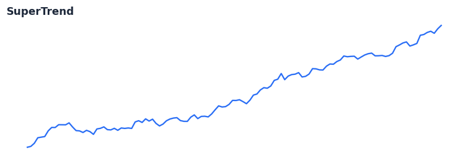

# hmm_forecast

<div class="indicator-meta"><span class="category-badge">Regime</span> <span class="kw-badge">regime</span> <span class="kw-badge">hmm</span> <span class="kw-badge">forecast</span> <span class="kw-badge">volatility</span> <span class="kw-badge">pseudo_residuals</span> <span class="kw-badge">ldhmm</span></div>

HMM forecasting and diagnostics: state/vol/probability forecasts, pseudo-residuals, decode stats.

## Visual Example



*Post-fit analytics: π_{t+h|t}=π_t·Γ^h state forecasts and mixture volatility from filtered state weights.*

## Description

**Post-fit HMM analytics** aligned with ldhmm / SSRN 2979516: multi-step **state probability forecasts** (π_{t+h|t} = π_t · Γ^h), **mixture volatility** forecasts using lambda-aware emission variances, **pseudo-residuals** for model checking via the probability integral transform, and **decode_stats_history** (per-bar weighted mean, vol, λ).

Apply after fitting a [gaussian_hmm](gaussian_hmm/) or [lambda_hmm](lambda_hmm/) model. Polars exposes `.hmm_forecast_vol`, `.hmm_pseudo_residuals`, and `.hmm_decode_stats`; Python exposes `gaussian_hmm_diagnostics` and point forecast helpers. Gold-standard parity on `hmm_lambda_2state.json` locks forecast_state, vol, and pseudo-residuals. Use pseudo-residuals to assess calibration; under a well-specified model they should be approximately standard normal.

## Formula / Specification

**Implementation** (`quantwave-core/src/regimes/hmm_forecast.rs`):

See the `Next<T>` implementation and `METADATA` in the core module.

Gold-standard parity vectors: `quantwave-core/tests/gold_standard/hmm_lambda_2state.json`.


## Parameters

| Parameter | Default | Description |
|-----------|---------|-------------|
| `horizon` | 1 | Forecast horizon h (bars ahead). |


## Usage Examples

**Python (diagnostics bundle after fit)**

```python
import quantwave as qw

fit = qw.fit_gaussian_hmm(returns, n_states=2, max_iter=100, fit_lambdas=True)
diag = qw.gaussian_hmm_diagnostics(fit.params, returns)
vol_h1 = qw.gaussian_hmm_forecast_vol(fit.params, diag.forecast_state_h1, horizon=1)
```

**Polars**

```python
df = (
    df.lazy()
    .ta()
    .hmm_forecast_vol("returns", n_states=2, max_iter=100, fit_lambdas=True, horizon=1)
    .hmm_pseudo_residuals("returns", n_states=2, max_iter=100, fit_lambdas=True)
    .hmm_decode_stats("returns", n_states=2, max_iter=100, fit_lambdas=True)
    .collect()
)
```

**Rust**

```rust
use quantwave_core::regimes::hmm_forecast::{forecast_state, forecast_volatility, pseudo_residuals};

let decode = params.decode(&observations)?;
let last = decode.forward_filter.iter().map(|row| row[n - 1]).collect();
let pi_h1 = forecast_state(&params, &last, 1)?;
let vol_h1 = forecast_volatility(&params, &last, 1)?;
```

## Edge Cases & Limitations

- Warm-up: first `1` bars may return NaN or partial state per implementation.
- Parameter sensitivity: smaller periods increase noise; larger periods increase lag.
- Sudden gaps or bad ticks can distort rolling windows — consider pre-filtering.
- Single-series indicators ignore volume unless otherwise documented.
- Validated via proptests against gold-standard vectors where available.
- No look-ahead bias; streaming and Polars batch paths are bit-identical.

## Boundary Behavior

| Condition | Behavior |
|-----------|----------|
| Warm-up | Leading bars return NaN until warmup_bars is satisfied. |
| period > len | When period exceeds series length, output is all NaN. |
| NaN inputs | NaN in input propagates to output (NaN out). |
| Invalid params | Non-positive period or missing required params raise ValueError. |
| Empty data | Empty input returns an empty result series. |

## Related Indicators & See Also

- [Indicator Gallery](../gallery.md)
- [Native Indicators index](index.md)
- [Batch vs Streaming guide](../../../examples/batch-streaming.md)
- [RSI](relative_strength_index_rsi.md)
- [SuperTrend](supertrend/)

## Sources & References

**Primary Source**: references/ldhmm/ldhmm-cran-reference.pdf; references/ldhmm/ssrn-2979516.pdf

**Implementation**: `quantwave-core/src/indicators/hmm_forecast.rs` (`HMM_FORECAST` / `HMM_FORECAST_METADATA`).
**Parity**: `quantwave-core/tests/gold_standard/hmm_lambda_2state.json`

**Provenance**: Standards bulk upgrade 2026-07-04 IST — see `docs/DOCUMENTATION_STANDARDS.md`.
