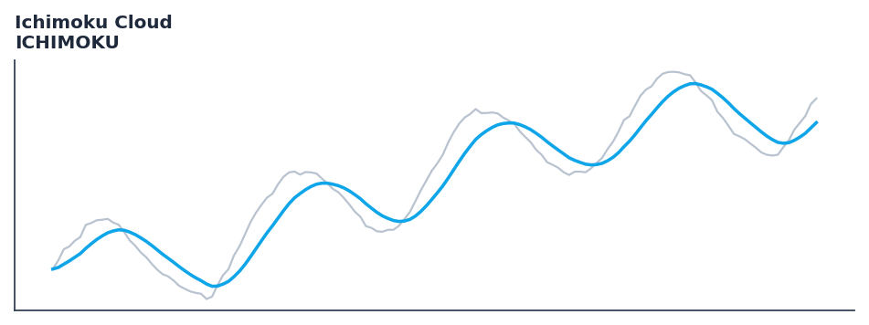

# Ichimoku Cloud

<div class="indicator-meta"><span class="category-badge">Classic</span> <span class="kw-badge">trend</span> <span class="kw-badge">support-resistance</span> <span class="kw-badge">classic</span> <span class="kw-badge">japanese</span> <span class="kw-badge">momentum</span></div>

Ichimoku Kinko Hyo is a comprehensive indicator that defines support and resistance, identifies trend direction, gauges momentum and provides trading signals.

## Visual Example



*Synthetic ideal per library logic. Generated 2026-07-01 IST via `docs/generate_all_previews.py` (reproducible; maps to core `Next<T>` implementation).*

## Description

Ichimoku Kinko Hyo is a comprehensive indicator that defines support and resistance, identifies trend direction, gauges momentum and provides trading signals.

Use as a complete trend system providing support, resistance, momentum, and cloud-based bias in a single indicator. The Kumo cloud thickness indicates trend strength.

Native Rust implementation with gold-standard or TA-Lib parity tests where applicable.

Ichimoku Kinko Hyo was developed by Goichi Hosoda in the 1960s. The system comprises five components: Tenkan-sen (9-period midpoint), Kijun-sen (26-period midpoint), Senkou Span A and B (cloud), and Chikou Span (lagged close). Price above the cloud is bullish; the cloud thickness quantifies the strength of support or resistance. — Ichimoku Charts, Nicole Elliott

**Typical applications:**

- Fade extremes in ranges; trade with trend on recoveries from oversold/overbought
- Use divergences as early warning — confirm with structure or volume
- Parameter default `9` — shorten for sensitivity, lengthen for stability
- Drop into `build_feature_matrix()` for ML research

QuantWave implements this via the universal `Next<T>` trait — bit-identical across Rust streaming, Python streaming, and Polars `.ta()` batch plugins.

## Formula / Specification

**Implementation** (`quantwave-core/src/indicators/ichimoku.rs`):

\[
\text{Tenkan-sen} = \frac{\text{Highest High} + \text{Lowest Low}}{2} \text{ for past 9 periods}
\]

Gold-standard parity vectors: `quantwave-core/tests/gold_standard/ichimoku.json`.


## Parameters

| Parameter | Default | Description |
|-----------|---------|-------------|
| `tenkan_period` | 9 | Tenkan-sen period |
| `kijun_period` | 26 | Kijun-sen period |
| `senkou_span_b_period` | 52 | Senkou Span B period |


## Usage Examples

**Streaming (Rust)**

```rust
use quantwave_core::indicators::ICHIMOKU;
use quantwave_core::traits::Next;

let mut ind = ICHIMOKU::new(9);
for price in &prices {
    let value = ind.next(price);
}
```

**Streaming (Python)**

```python
from quantwave import ICHIMOKU

ind = ICHIMOKU(9)
for price in prices:
    value = ind.next(price)
```

**Polars Batch (Python)**

```python
import polars as pl
import quantwave as qw

def apply_ichimoku_cloud(series: pl.Series) -> pl.Series:
    ind = qw.ICHIMOKU(9)
    return pl.Series([ind.next(float(v)) for v in series.to_list()])

df = (
    pl.read_csv('ohlcv.csv')
    .lazy()
    .with_columns(
        pl.col("close").map_batches(apply_ichimoku_cloud, return_dtype=pl.Float64).alias("ichimoku_cloud")
    )
    .collect()
)
```

All surfaces are bit-identical via the single `Next<T>` implementation and proptests.

## Edge Cases & Limitations

- Warm-up: first `9` bars may return NaN or partial state per implementation.
- Parameter sensitivity: smaller periods increase noise; larger periods increase lag.
- Sudden gaps or bad ticks can distort rolling windows — consider pre-filtering.
- Single-series indicators ignore volume unless otherwise documented.
- Validated via proptests against gold-standard vectors where available.
- No look-ahead bias; streaming and Polars batch paths are bit-identical.

## Boundary Behavior

| Condition | Behavior |
|-----------|----------|
| Warm-up | Leading bars return NaN until warmup_bars is satisfied. |
| period > len | When period exceeds series length, output is all NaN. |
| NaN inputs | NaN in input propagates to output (NaN out). |
| Invalid params | Non-positive period or missing required params raise ValueError. |
| Empty data | Empty input returns an empty result series. |

## Related Indicators & See Also

- [Indicator Gallery](../gallery.md)
- [Native Indicators index](index.md)
- [Batch vs Streaming guide](../../../examples/batch-streaming.md)
- [RSI](relative_strength_index_rsi.md)
- [SuperTrend](supertrend/)

## Sources & References

**Primary Source**: https://www.investopedia.com/terms/i/ichimoku-cloud.asp

**Implementation**: `quantwave-core/src/indicators/ichimoku.rs` (`ICHIMOKU` / `ICHIMOKU_METADATA`).
**Parity**: `quantwave-core/tests/gold_standard/ichimoku.json`

**Provenance**: Standards bulk upgrade 2026-07-01 IST — see `docs/DOCUMENTATION_STANDARDS.md`.
